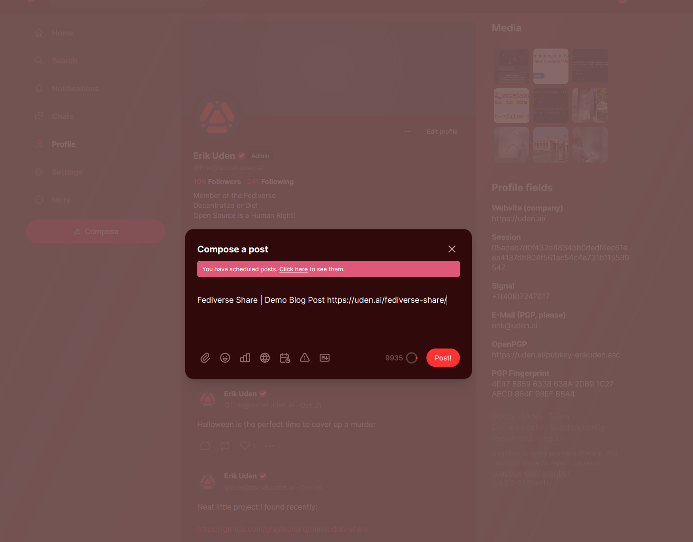

<p align="center">
    <a href="https://uden.ai/fediverse-share/" target="_blank" rel="noopener noreferrer"></a>
<h1 align="center">Share</h1>
</p>


<p align="center">
    <a href="https://github.com/Uden-AI/fediverse-share/blob/master/LICENSE" alt="License">
        </a>
    <a href="https://github.com/Uden-AI/fediverse-share/graphs/contributors" alt="Contributors">
        </a>
    <a href="https://github.com/Uden-AI/fediverse-share/graphs/commit-activity" alt="Activity">
        </a>
    <br>
    <b>Put Buttons That Directly Share Your Website to the Fediverse Everywhere!</b>   
    <br>
    <i>Made for <a href="https://theinternetportal.net/" target="_blank" rel="noopener noreferrer">The Internet Portal</a></i>
    <br>
</p>


## This Repo Hosts:

- 32+ Newly Made Fediverse-Logos That Can be Used for the Buttons (*but also anything else!*)
  - [Logo-Gallery](#logo-gallery)
    - [Original Fediverse Logos by Eukombos](#original-fediverse-logos-by-eukombos)
    - [Newly Made Fediverse Logos by Erik Uden](#newly-made-fediverse-logos-by-erik-uden)
- [What is Fediverse Share?](#what-is-fediverse-share)
- [How does Fediverse Share Work?](#how-does-fediverse-share-work)
- [Similar Projects To Compare To](#similar-projects-to-compare-to)
- [What does Fediverse Share Work With?](#what-does-fediverse-share-work-with)
- [How To Embed a Fediverse Share Button](#how-to-embed-a-fediverse-share-button)
  - [Embed Without External Resources](#the-first-embed-without-external-resources)
  - [Embed With External Resources (GitHub Pages)](#the-second-to-embed-with-external-resources)
  - [Download JS/CSS and Keep as Separate Files](#the-third-download-the-css-and-js-files-and-host-them-yourself-seperately)
    - [How To Enter Your Own Images Into The Buttons](#how-to-enter-your-own-image-into-the-buttons)
- [Licenses](#licenses)
  - [AGPLv3.0](https://github.com/Uden-AI/fediverse-share/blob/master/LICENSE) for the Code
  - [CC-BY-SA 4.0](https://creativecommons.org/licenses/by-sa/4.0/) for the images made by me
  - [CC0 1.0](https://creativecommons.org/publicdomain/zero/1.0/deed.en) for the images made by [Eukombos](https://commons.wikimedia.org/wiki/User:Eukombos)

<br>
<br>


# What is Fediverse Share?
Share buttons for the Fediverse that work on static pages. Before you read any further **[TRY IT OUT HERE](https://uden.ai/fediverse-share/)**. It is an HTML+CSS+JS-Button that can be put on **any** webpage that any user can click on, enter the Fediverse instance of their choice, then be teleported to that instance posting text specified by YOU. Essentially the share button for Twitter but for the whole Fediverse! You can copy the code that is found inside of this repository, put it onto your webpage, then, if a user presses this button (*example of a button, the logo exists in this repository in various forms/colors/etc.*):
<br>

[](https://uden.ai/fediverse-share)

Then enters the domain of an instance they are logged into (*or can login to*), they will immediately see this:
<br>
<br>
[](https://social.uden.ai/)
*Example of a Pleroma+Soapbox-FE Instance of this button sharing the specified text. Instance displayed: social.uden.ai*

<br>
<br>
<br>
<br>

# How does Fediverse Share Work?

The page title and URL are pulled from `document.title` and `location.href`, copying the behavior of www.addtoany.com. We've included three options: 
- [The First](#the-first-embed-without-external-resources) for embedding all additional CSS/JS in the one piece of code that you can copy (for security reasons)
- [The Second](#the-second-to-embed-with-external-resources) for linking to the JS/CSS hosted here via [GitHub Pages](https://pages.github.com/). The files fedi-share.min.css, as well as fedi-share.min.js were created using the [CSS Minifier](https://cssminifier.org/).
- [The Third](#the-third-download-the-css-and-js-files-and-host-them-yourself-seperately) for simply downloading the CSS/JS from this repository and putting it in your websites root and linking to it via the `<link rel="stylesheet" href="fedi-share.css">` tag, to make it easily modifiable in the future!

Live-Demo: https://uden.ai/fediverse-share/

**Contributions are welcome!**

<br>
<br>
<br>
<br>

# What does Fediverse Share Work With?

- [ ] [Bonfire](https://bonfirenetworks.org/)
- [x] [Diaspora](https://diasporafoundation.org/)
- [x] [Ecko](https://magicstone.dev/) 
- [ ] [Epicyon](https://epicyon.net/)
- [ ] [Flockingbird](https://flockingbird.social/)
- [x] [Friendica](https://friendi.ca/)
- [x] [Glitch](https://glitch-soc.github.io/docs/) 
- [x] [Gnusocial](https://gnusocial.network/)
- [x] [GoToSocial](https://docs.gotosocial.org/en/latest/)
- [x] [Groundpolis](https://github.com/Groundpolis/Groundpolis) 
- [x] [Hometown](https://github.com/hometown-fork/hometown) 
- [ ] [Honk](https://humungus.tedunangst.com/r/honk)
- [x] [Hubzilla](https://hubzilla.org/)
- [x] [Kepi](https://gitlab.com/marnanel/chapeau)
- [ ] [Ktistec](https://github.com/toddsundsted/ktistec)
- [x] [Lemmy](https://join-lemmy.org/)
- [x] [Mastodon](https://joinmastodon.org/)
- [x] [Misskey](https://misskey-hub.net/en/) 
- [x] [Misty](https://zotlabs.com/misty/) 
- [ ] [Mobilizon](https://joinmobilizon.org/en/)
- [ ] [NextCloud](https://nextcloud.com/)
- [x] [Osada](https://codeberg.org/zot/osada) 
- [ ] [Pjuu](https://pjuu.com/) *1
- [x] [Pleroma](https://pleroma.social/)
- [ ] [Pump.io](http://pump.io/) *2
- [ ] [Smithereen](https://github.com/grishka/Smithereen)
- [x] [Socialhome](https://socialhome.network/)
- [x] [XMPP](https://xmpp.org/)
- [x] [Zap](https://zotlabs.com/zap/) 

- *1 It doesn't have a public API
- *2 Conflicts with the [API](https://github.com/pump-io/pump.io/blob/master/API.md)

<br>
<br>
<br>
<br>

# Similar Projects To Compare To

### 1. Share/Connect/Support Buttons by [distributopia](https://github.com/distributopia) & [lostinlight](https://github.com/lostinlight)
**GitLab**: https://gitlab.com/distributopia/share-connect-support <br>
**GitHub**: https://github.com/distributopia/share-connect-support (*mirror*) <br>
*Description*:
Embed buttons on your webpage that allow you to share any specified text with any Fediverse instance. 
> These are social buttons for your personal blog, profile. They can be added to any page, including static websites.
<br>


### 2. sharetomastodon.github.io by [leonekmi](https://github.com/leonekmi) & [skid9000](https://github.com/skid9000) & [clerie](https://github.com/clerie) <br>
**GitHub**: https://github.com/sharetomastodon/sharetomastodon.github.io <br>
*Description*:
Embed buttons on your webpage that allow you to share any specified text with any Mastodon instance. 
> Advanced Sharer is a tool able to share links to any Mastodon instance. Learn more.

*Which is a fork of: https://github.com/sharetodiaspora/sharetodiaspora.github.io*
<br>
<br>

### 3. Fedishare by [meztli](https://codeberg.org/meztli) & [mugcake](https://gitlab.com/mugcake)
**Codeberg**: https://codeberg.org/meztli/fedishare <br>
**GitLab**:   https://gitlab.com/mugcake/fedishare (*depricated*) <br>
*Description*: A browser addon that, when pressed, allows you to share the current tab-link on a Fediverse instance of your choice. 
> Share the current tab on the fediverse.
<br>

### 4. Mastodon-Share by [greyleonhard](https://github.com/grayleonard)
**GitHub**: https://github.com/grayleonard/mastodon-share <br>
*Description*: The exact same as this repository just with mastodon branding
> Share buttons for Mastodon that work on static pages
<br>
<br>
<br>
<br>
<br>

# How To Embed a Fediverse Share Button

These Large/Medium/Small examples always only use the same logo (`logotype-full-large-color-white-text-fedi-logo-foreground-normal-yellow-on-top-simplified.svg`), which is the one used at the top of this repository, or the original Fediverse logo. If you wish to use any of the other logos as seen in the [Logo-Gallery](#logo-gallery) (*or any SVG file you can think of*), you need to use this built-in tool called SVG Encoder: [https://uden.ai/fediverse-share/svg-encoder/](https://uden.ai/fediverse-share/svg-encoder/). The code for this was kindly gifted by [Santiago Becerra](https://dinerologo.com/) from this [Codepen](https://codepen.io/sanbec/pen/yLpZgJw). This tool will be able to turn any SVG file into the necessary encoded / CSS format which can be easily inserted into the code of the following buttons. 


<p align="center">
    <a href="https://whyare.you/looking/at/this?lol" alt="What are you doing?"></a>
    <a href="https://going.through/the#source-code-of" alt="a-small-developer?"></a>
    <a href="gopher://do.something/better-with-your?time" alt="please!"></a>
    <br>
    <b>These are your three buttons!</b>
</p>


<p align="center">
    <a href="https://uden.ai/fediverse-share/buttons/button-3-large.html" target="_blank" rel="noopener noreferrer" alt="Example of a Large Button Opening and Closing">
        </a>
    <a href="https://uden.ai/fediverse-share/buttons/button-3-medium.html" target="_blank" rel="noopener noreferrer" alt="Example of a Medium Button Opening and Closing">
        </a>
    <a href="https://uden.ai/fediverse-share/buttons/button-3-small.html" target="_blank" rel="noopener noreferrer" alt="Example of a Small Button Opening and Closing">
        </a>
	<br>
	<b>Click them to try out for yourself!</b>
</p>


<br>
<br>

The only difference between the HTML of the three buttons is that the large button is of the class of `fedi-share-lg`, the medium button `fedi-share-md`, and the small button `fedi-share-sm`, in the main div starting in line 3. The CSS hence changes the way these three buttons look according to their class. Additionally, only the large version has the `<span>` of "Share on" as obviously the medium and small version do not include those words. The last difference is the encoded SVG / image file which the large and medium version have the same of, whilst the small version uses the original Fediverse logo by Eukombos. 

<br>

A tutorial on how to enter your own images into these buttons can be found [HERE](#how-to-enter-your-own-image-into-the-buttons)

<br>
<br>

## The First: Embed Without External Resources

*Advantages/Caveats*:
- Most Secure
- Most Reliable
- May Be Slower (*load speed depends on your own webhost*)
- All In One Solution

### Large:
Try out [HERE](https://uden.ai/fediverse-share/buttons/button-1-large.html)
```html
<!--  Large Fediverse Share -->
<!--        AGPLv3.0        -->
<div class="fedi-share fedi-share-lg">
	<input type="checkbox" class="fedi-check-toggle">
	<div class="fedi-instance">
		<span>Instance: </span>
		<input type="textbox" name="fedi-instance-input" placeholder="social.uden.ai">
		<button class="fedi-share-button">Share</button>
	</div>
	<label class="fedi-top fedi-check-label"><span>Share on</span>
		<!-- CC BY-SA 4.0 - Erik Uden -->
		<img src="data:image/svg+xml,%3C%3Fxml version='1.0' encoding='UTF-8'%3F%3E%3Csvg width='761' height='188' version='1.1' viewBox='0 0 713 176' xmlns='http://www.w3.org/2000/svg'%3E%3Cg%3E%3Cg transform='matrix(1.0065 0 0 1.0126 -4.299 -8.0083)'%3E%3Cg transform='translate(6.679 -32.496)' shape-rendering='auto'%3E%3Cpath transform='matrix(.26458 0 0 .26458 -6.679 32.496)' d='m181.13 275.14a68.892 68.892 0 0 1-29.465 29.328l161.76 162.39 38.998-19.764zm213.36 214.19-38.998 19.764 81.963 82.283a68.892 68.892 0 0 1 29.471-29.332z' color='%23000000' color-rendering='auto' dominant-baseline='auto' fill='%23a730b8' image-rendering='auto' solid-color='%23000000' style='font-feature-settings:normal;font-variant-alternates:normal;font-variant-caps:normal;font-variant-ligatures:normal;font-variant-numeric:normal;font-variant-position:normal;isolation:auto;mix-blend-mode:normal;shape-padding:0;text-decoration-color:%23000000;text-decoration-line:none;text-decoration-style:solid;text-indent:0;text-orientation:mixed;text-transform:none;white-space:normal'/%3E%3Cpath transform='matrix(.26458 0 0 .26458 -6.679 32.496)' d='m581.65 339.39-91.576 46.41 6.752 43.189 103.62-52.514a68.892 68.892 0 0 1-18.791-37.086zm-144.74 73.352-216.53 109.73a68.892 68.892 0 0 1 18.795 37.09l204.48-103.63z' color='%23000000' color-rendering='auto' dominant-baseline='auto' fill='%235496be' image-rendering='auto' solid-color='%23000000' style='font-feature-settings:normal;font-variant-alternates:normal;font-variant-caps:normal;font-variant-ligatures:normal;font-variant-numeric:normal;font-variant-position:normal;isolation:auto;mix-blend-mode:normal;shape-padding:0;text-decoration-color:%23000000;text-decoration-line:none;text-decoration-style:solid;text-indent:0;text-orientation:mixed;text-transform:none;white-space:normal'/%3E%3Cpath transform='matrix(.26458 0 0 .26458 -6.679 32.496)' d='m367.28 142.44-104.48 203.97 30.848 30.967 110.62-215.96a68.892 68.892 0 0 1-36.99-18.98zm-131.65 257.02-52.922 103.31a68.892 68.892 0 0 1 36.986 18.979l46.781-91.328z' color='%23000000' color-rendering='auto' dominant-baseline='auto' fill='%23ce3d1a' image-rendering='auto' solid-color='%23000000' style='font-feature-settings:normal;font-variant-alternates:normal;font-variant-caps:normal;font-variant-ligatures:normal;font-variant-numeric:normal;font-variant-position:normal;isolation:auto;mix-blend-mode:normal;shape-padding:0;text-decoration-color:%23000000;text-decoration-line:none;text-decoration-style:solid;text-indent:0;text-orientation:mixed;text-transform:none;white-space:normal'/%3E%3Cpath transform='matrix(.26458 0 0 .26458 -6.679 32.496)' d='m150.77 304.92a68.892 68.892 0 0 1-34.416 7.1953 68.892 68.892 0 0 1-6.6504-0.69531l30.902 197.66a68.892 68.892 0 0 1 34.416-7.1953 68.892 68.892 0 0 1 6.6465 0.69531z' color='%23000000' color-rendering='auto' dominant-baseline='auto' fill='%23d0188f' image-rendering='auto' solid-color='%23000000' style='font-feature-settings:normal;font-variant-alternates:normal;font-variant-caps:normal;font-variant-ligatures:normal;font-variant-numeric:normal;font-variant-position:normal;isolation:auto;mix-blend-mode:normal;shape-padding:0;text-decoration-color:%23000000;text-decoration-line:none;text-decoration-style:solid;text-indent:0;text-orientation:mixed;text-transform:none;white-space:normal'/%3E%3Cpath transform='matrix(.26458 0 0 .26458 -6.679 32.496)' d='m239.34 560.54a68.892 68.892 0 0 1 0.7207 13.877 68.892 68.892 0 0 1-7.2676 27.18l197.63 31.713a68.892 68.892 0 0 1-0.72266-13.879 68.892 68.892 0 0 1 7.2695-27.178z' color='%23000000' color-rendering='auto' dominant-baseline='auto' fill='%235b36e9' image-rendering='auto' solid-color='%23000000' style='font-feature-settings:normal;font-variant-alternates:normal;font-variant-caps:normal;font-variant-ligatures:normal;font-variant-numeric:normal;font-variant-position:normal;isolation:auto;mix-blend-mode:normal;shape-padding:0;text-decoration-color:%23000000;text-decoration-line:none;text-decoration-style:solid;text-indent:0;text-orientation:mixed;text-transform:none;white-space:normal'/%3E%3Cpath transform='matrix(.26458 0 0 .26458 -6.679 32.496)' d='m601.13 377.2-91.219 178.08a68.892 68.892 0 0 1 36.994 18.982l91.217-178.08a68.892 68.892 0 0 1-36.992-18.984z' color='%23000000' color-rendering='auto' dominant-baseline='auto' fill='%2330b873' image-rendering='auto' solid-color='%23000000' style='font-feature-settings:normal;font-variant-alternates:normal;font-variant-caps:normal;font-variant-ligatures:normal;font-variant-numeric:normal;font-variant-position:normal;isolation:auto;mix-blend-mode:normal;shape-padding:0;text-decoration-color:%23000000;text-decoration-line:none;text-decoration-style:solid;text-indent:0;text-orientation:mixed;text-transform:none;white-space:normal'/%3E%3Cpath transform='matrix(.26458 0 0 .26458 -6.679 32.496)' d='m347.79 104.63-178.58 90.498a68.892 68.892 0 0 1 18.793 37.086l178.57-90.502a68.892 68.892 0 0 1-18.791-37.082z' color='%23000000' color-rendering='auto' dominant-baseline='auto' fill='%23f47601' image-rendering='auto' solid-color='%23000000' style='font-feature-settings:normal;font-variant-alternates:normal;font-variant-caps:normal;font-variant-ligatures:normal;font-variant-numeric:normal;font-variant-position:normal;isolation:auto;mix-blend-mode:normal;shape-padding:0;text-decoration-color:%23000000;text-decoration-line:none;text-decoration-style:solid;text-indent:0;text-orientation:mixed;text-transform:none;white-space:normal'/%3E%3Cpath transform='matrix(.26458 0 0 .26458 -6.679 32.496)' d='m188.13 232.97a68.892 68.892 0 0 1 0.75781 14.096 68.892 68.892 0 0 1-7.1602 26.982l101.37 16.281 19.924-38.908zm173.74 27.9-19.926 38.912 239.51 38.467a68.892 68.892 0 0 1-0.69531-13.719 68.892 68.892 0 0 1 7.3496-27.324z' color='%23000000' color-rendering='auto' dominant-baseline='auto' fill='%23dbb210' image-rendering='auto' solid-color='%23000000' style='font-feature-settings:normal;font-variant-alternates:normal;font-variant-caps:normal;font-variant-ligatures:normal;font-variant-numeric:normal;font-variant-position:normal;isolation:auto;mix-blend-mode:normal;shape-padding:0;text-decoration-color:%23000000;text-decoration-line:none;text-decoration-style:solid;text-indent:0;text-orientation:mixed;text-transform:none;white-space:normal'/%3E%3C/g%3E%3Cg transform='translate(6.679 -32.496)' fill-opacity='.99597'%3E%3Ccircle transform='rotate(3.1178)' cx='106.27' cy='51.536' r='16.571' fill='%23ffca00'/%3E%3Cellipse transform='rotate(3.1178)' cx='171.43' cy='110.19' rx='16.571' ry='16.571' fill='%2364ff00'/%3E%3Ccircle transform='rotate(3.1178)' cx='135.76' cy='190.28' r='16.571' fill='%2300a3ff'/%3E%3Ccircle transform='rotate(3.1178)' cx='48.559' cy='181.11' r='16.571' fill='%239500ff'/%3E%3Ccircle transform='rotate(3.1178)' cx='30.329' cy='95.367' r='16.571' fill='%23f00'/%3E%3C/g%3E%3C/g%3E%3C/g%3E%3Cg%3E%3Cpath d='m278.65 36.85c0.0288 10.885-0.0659 21.771 0.0645 32.656-3.996-4.827-10.049-7.6252-16.212-8.3057-6.8052-0.77851-14.056 0.21213-19.867 4.0309-5.9801 3.8707-9.9252 10.248-11.993 16.958-2.411 7.794-2.802 16.066-2.3596 24.165 0.48519 7.9431 2.177 16.054 6.5016 22.847 3.067 4.8895 7.7698 8.8212 13.323 10.532 5.2205 1.6423 10.847 1.565 16.19 0.60228 5.4256-1.0214 10.628-3.7058 14.176-7.9988 0.42516-0.62893 0.69809-0.84874 0.62923 0.0916 0.23019 2.4246 0.452 4.8647 1.0894 7.2237h21.965c-0.43701-7.3688-0.72844-14.749-0.64844-22.132v-82.544h-22.857v1.873zm38.562 0v9.3927a6.5585 6.5585 45 0 0 6.5585 6.5585h10.092a6.2071 6.2071 135 0 0 6.2071-6.2071v-5.0001a6.617 6.617 45 0 0-6.617-6.617h-14.367a1.873 1.873 135 0 0-1.873 1.873zm-248.04 5.0996v89.464a8.2395 8.2395 45 0 0 8.2395 8.2395h7.8625a7.7066 7.7066 135 0 0 7.7066-7.7066v-22.255a5.2001 5.2001 135 0 1 5.2001-5.2001h37.059a6.778 6.778 135 0 0 6.778-6.778v-5.6833a6.7907 6.7907 45 0 0-6.7907-6.7907h-37.36a4.886 4.886 45 0 1-4.886-4.886v-17.479a3.5427 3.5427 135 0 1 3.5427-3.5427h38.695a8.3641 8.3641 135 0 0 8.3641-8.3641v-2.7356a8.1542 8.1542 45 0 0-8.1542-8.1542h-64.383a1.873 1.873 135 0 0-1.873 1.873zm479.96 18.939c-3.7809-0.0275-7.6926 0.88342-10.686 3.2949-2.5218 1.9808-4.2834 4.7458-5.6172 7.625-0.17472-3.1697-0.33016-6.3442-0.75976-9.4922h-21.885c0.4839 7.509 0.72676 15.033 0.66211 22.558v54.778h22.857c0.0148-13.173-0.0297-26.347 0.0225-39.52 0.15909-4.7901 0.74175-9.7851 3.2328-13.982 1.7322-2.9181 4.775-5.0812 8.1895-5.418 3.9852-0.42238 7.9412 0.52408 11.815 1.3439v-19.553c-2.0484-0.96187-4.2674-1.5417-6.5346-1.6028-0.43172-0.0285-0.86523-0.023-1.2975-0.032zm45.18 0.0234c-7.1066 0.20062-14.439 1.386-20.605 5.123-4.3887 2.6295-7.9783 6.7396-9.4823 11.678-1.3642 4.4444-1.4253 9.2816-0.27163 13.779 0.98425 3.8299 3.3142 7.2225 6.3588 9.7155 3.1621 2.6705 6.9918 4.4071 10.94 5.5613 6.2111 1.9276 12.615 3.1099 18.96 4.4934 2.8017 0.73524 5.7948 1.4686 7.9974 3.4645 1.6718 1.6133 1.6811 4.4079 0.55407 6.3256-1.3829 2.0894-4.026 2.6986-6.3399 3.1192-3.1029 0.48988-6.2605 0.50696-9.3923 0.36917-0.46482-0.0248-1.2762-0.0815-1.8748-0.14163-2.679-0.32171-5.6459-0.69427-7.6486-2.6943-1.87-1.845-2.5943-4.4445-3.2715-6.9004-6.8411 1.025-13.683 2.048-20.523 3.0742 0.92636 3.482 1.9879 6.9846 3.9419 10.047 2.8838 4.7706 7.5191 8.3679 12.758 10.216 6.9578 2.5152 14.46 2.9735 21.799 2.8405 7.4178-0.23023 15.054-1.4978 21.504-5.3659 4.6991-2.7748 8.5968-7.1418 10.139-12.443 1.2719-4.2984 1.2565-8.9379 0.25399-13.289-1.3731-5.6352-5.4925-10.357-10.55-13.067-5.0852-2.7758-10.788-4.0639-16.354-5.4924-3.9266-0.99991-7.909-1.7089-11.832-2.66-2.0101-0.59619-4.1818-1.1425-5.7565-2.6068-1.4918-1.5032-1.5101-4.0729-0.42383-5.8047 1.2851-1.6472 3.4802-2.1179 5.4269-2.4963 3.5021-0.52049 7.102-0.57889 10.6 1.8e-4 2.4824 0.40383 5.0254 1.6144 6.2258 3.9389 0.83078 1.4492 1.0345 3.1282 1.3739 4.7349 6.9101-0.72299 13.82-1.445 20.73-2.166-0.68806-3.3149-1.5142-6.6597-3.243-9.6066-3.1178-5.6459-8.7232-9.5645-14.768-11.55-5.5293-1.8534-11.426-2.328-17.225-2.1966zm-408.42 0.0547c-7.485 0.10988-15.168 1.8683-21.325 6.29-5.8963 4.1572-10.023 10.506-12.049 17.38-2.2278 7.449-2.4929 15.354-1.8048 23.056 0.74978 7.6806 3.0085 15.462 7.9093 21.557 4.2287 5.3446 10.395 8.9711 16.994 10.527 6.1192 1.4521 12.524 1.5682 18.735 0.67726 6.6654-0.9776 13.189-3.7434 18.029-8.5121 3.7515-3.6248 6.3679-8.2558 8.1993-13.104 0.0269-0.44397 0.97206-1.4482 0.14968-1.374-7.2167-0.62715-14.434-1.2534-21.65-1.8794-0.68894 2.3846-1.5805 4.8733-3.5636 6.5004-2.7449 2.2858-6.5647 2.6407-9.9891 2.2571-3.5258-0.37323-6.7616-2.5475-8.4636-5.6537-2.0819-3.6841-2.6672-7.9893-2.8352-12.157h47.162c0.11311-8.616-0.55604-17.426-3.7422-25.514-2.5945-6.6573-7.2591-12.661-13.602-16.1-5.5124-3.0466-11.916-4.0884-18.154-3.9512zm278.72 0c-7.452 0.1102-15.1 1.8499-21.243 6.233-5.9136 4.1357-10.061 10.476-12.104 17.346-2.2512 7.4753-2.5258 15.414-1.8318 23.147 0.74916 7.7216 3.036 15.545 7.9866 21.654 4.2446 5.3188 10.414 8.9151 17.007 10.452 6.0925 1.4298 12.464 1.5421 18.646 0.65501 6.8103-0.99732 13.482-3.869 18.343-8.8306 3.6239-3.5894 6.1239-8.1403 7.9227-12.876 0.0677-0.46893 0.96045-1.4402 0.016-1.2929-7.1849-0.62374-14.37-1.2477-21.555-1.8708-0.69773 2.4333-1.6275 4.9789-3.6856 6.5995-2.7405 2.1997-6.4918 2.5339-9.8672 2.1585-3.5311-0.37168-6.7689-2.5551-8.4722-5.6646-2.0694-3.6853-2.6639-7.9812-2.8266-12.146h47.162c0.10933-8.648-0.55685-17.496-3.7822-25.606-2.6478-6.7618-7.4566-12.84-13.966-16.222-5.4195-2.8878-11.665-3.8673-17.75-3.7365zm209.14 0c-7.452 0.11027-15.1 1.85-21.243 6.233-5.8855 4.1165-10.023 10.417-12.074 17.251-2.2716 7.4701-2.5505 15.409-1.8719 23.143 0.73712 7.6607 2.9634 15.424 7.8185 21.527 4.2089 5.3868 10.383 9.0552 16.999 10.631 6.148 1.4772 12.588 1.5965 18.832 0.70182 6.778-0.99269 13.416-3.8407 18.273-8.759 3.6322-3.5797 6.1545-8.1192 7.9546-12.855 0.0284-0.44503 0.97526-1.4492 0.15367-1.3767-7.2181-0.62663-14.436-1.2535-21.654-1.8794-0.69216 2.4027-1.5973 4.9112-3.6074 6.5371-2.7442 2.2535-6.5386 2.601-9.9453 2.2209-3.5607-0.37443-6.8187-2.5932-8.5147-5.7393-2.0347-3.6705-2.6226-7.9343-2.7841-12.071h47.162c0.10966-8.6467-0.55731-17.493-3.78-25.602-2.6598-6.7936-7.5024-12.899-14.057-16.272-5.3993-2.8536-11.609-3.8196-17.661-3.6902zm-356.53 3.2227v75.463h22.857v-77.336h-22.857zm29.627 0.63086c8.9216 24.944 17.845 49.887 26.766 74.832h25.479c9.5051-25.779 19.012-51.557 28.518-77.336h-24.043c-5.2971 16.266-10.669 32.508-15.811 48.824-0.43805 1.4104-0.84917 2.8293-1.2729 4.2443-1.622-5.8564-3.3118-11.693-5.1741-17.478-3.7067-11.863-7.4098-23.728-11.119-35.59h-24.238c0.29882 0.83463 0.59765 1.6693 0.89648 2.5039zm-159.48 11.936c3.1341 0.078 6.23 1.5203 8.1292 4.0465 2.2354 2.8425 3.0748 6.4904 3.4861 10.012-8.1836-3e-3 -16.378 5e-3 -24.555-4e-3 0.33069-3.9958 1.3492-8.2392 4.2754-11.16 3.5473-3.5875 8.6641-2.8949 8.6641-2.8948zm278.72 0c3.1098 0.079 6.1866 1.4951 8.0852 3.9926 2.2658 2.849 3.1153 6.522 3.53 10.066-8.1836-3e-3 -16.378 5e-3 -24.555-4e-3 0.33062-4.0285 1.3676-8.3104 4.3458-11.231 2.2513-2.2254 5.516-2.9656 8.5936-2.824zm209.14 0c3.11 0.0796 6.1864 1.495 8.0852 3.9926 2.2694 2.8479 3.1147 6.522 3.53 10.066-8.1836-3e-3 -16.378 5e-3 -24.555-4e-3 0.3324-4.0275 1.3678-8.3108 4.3458-11.231 2.2528-2.2238 5.5153-2.9664 8.5936-2.824zm-409.28 0.96096c3.1544 0.11035 6.2726 1.5401 8.2082 4.0704 3.2364 4.1401 4.247 9.5064 4.6356 14.625 0.3299 5.9758 0.14275 12.112-1.7528 17.84-1.2693 3.7404-3.5836 7.4896-7.3718 9.0641-2.9443 1.185-6.3692 1.1951-9.329 0.0568-3.5008-1.3736-5.6197-4.8241-6.7234-8.2616-1.7782-5.5693-1.9299-11.501-1.7467-17.298 0.25062-4.8469 0.79941-9.8603 3.0928-14.218 1.4456-2.8214 4.1085-5.0568 7.2697-5.621 1.2197-0.25702 2.4748-0.30763 3.7175-0.25787z' fill='%23fff'/%3E%3C/g%3E%3Cg%3E%3Cellipse transform='matrix(.9985 .054721 -.05406 .99854 0 0)' cx='172.74' cy='70.595' rx='16.678' ry='16.779' fill='%2364ff00' fill-opacity='.99597'/%3E%3Cpath d='m150.59 82.92-24.386 12.434 1.798 11.571 27.592-14.069a18.345 18.457 0 0 1-5.0039-9.936zm-38.542 19.652-57.659 29.4a18.345 18.457 0 0 1 5.0049 9.937l54.452-27.765z' color='%23000000' color-rendering='auto' dominant-baseline='auto' fill='%235496be' image-rendering='auto' shape-rendering='auto' solid-color='%23000000' style='font-feature-settings:normal;font-variant-alternates:normal;font-variant-caps:normal;font-variant-ligatures:normal;font-variant-numeric:normal;font-variant-position:normal;isolation:auto;mix-blend-mode:normal;shape-padding:0;text-decoration-color:%23000000;text-decoration-line:none;text-decoration-style:solid;text-indent:0;text-orientation:mixed;text-transform:none;white-space:normal'/%3E%3C/g%3E%3Cg%3E%3Cpath d='m69.169 41.959v89.464a8.2395 8.2395 45 0 0 8.2395 8.2395h7.8625a7.7066 7.7066 135 0 0 7.7066-7.7066v-22.255a5.2001 5.2001 135 0 1 5.2001-5.2001h37.059a6.778 6.778 135 0 0 6.778-6.778v-5.6833a6.7907 6.7907 45 0 0-6.7907-6.7907h-37.36a4.886 4.886 45 0 1-4.886-4.886v-17.479a3.5427 3.5427 135 0 1 3.5427-3.5427h38.695a8.3641 8.3641 135 0 0 8.3641-8.3641v-2.7356a8.1542 8.1542 45 0 0-8.1542-8.1542h-64.383a1.873 1.873 135 0 0-1.873 1.873z' fill='%23fff'/%3E%3Cpath d='m155.65 93.024-24.291 47.711a18.345 18.457 0 0 1 9.8512 5.0857l24.29-47.711a18.345 18.457 0 0 1-9.8506-5.0862z' color='%23000000' color-rendering='auto' dominant-baseline='auto' fill='%2330b873' image-rendering='auto' shape-rendering='auto' solid-color='%23000000' style='font-feature-settings:normal;font-variant-alternates:normal;font-variant-caps:normal;font-variant-ligatures:normal;font-variant-numeric:normal;font-variant-position:normal;isolation:auto;mix-blend-mode:normal;shape-padding:0;text-decoration-color:%23000000;text-decoration-line:none;text-decoration-style:solid;text-indent:0;text-orientation:mixed;text-transform:none;white-space:normal'/%3E%3C/g%3E%3Cpath transform='matrix(.26629 0 0 .26792 -4.299 -8.0083)' d='m476.72 125.33a68.892 68.892 0 0 1-29.471 29.332l141.27 141.81a68.892 68.892 0 0 1 29.469-29.332z' color='%23000000' color-rendering='auto' dominant-baseline='auto' fill='%23ebe305' image-rendering='auto' shape-rendering='auto' solid-color='%23000000' style='font-feature-settings:normal;font-variant-alternates:normal;font-variant-caps:normal;font-variant-ligatures:normal;font-variant-numeric:normal;font-variant-position:normal;isolation:auto;mix-blend-mode:normal;shape-padding:0;text-decoration-color:%23000000;text-decoration-line:none;text-decoration-style:solid;text-indent:0;text-orientation:mixed;text-transform:none;white-space:normal'/%3E%3Cpath transform='matrix(.26629 0 0 .26792 -4.299 -8.0083)' d='m446.93 154.83a68.892 68.892 0 0 1-34.982 7.4824 68.892 68.892 0 0 1-6.0293-0.63281l15.818 101.29 43.162 6.9258zm-16 167.03 37.4 239.48a68.892 68.892 0 0 1 33.914-6.9434 68.892 68.892 0 0 1 7.207 0.79101l-35.357-226.41z' color='%23000000' color-rendering='auto' dominant-baseline='auto' fill='%2357c115' image-rendering='auto' shape-rendering='auto' solid-color='%23000000' style='font-feature-settings:normal;font-variant-alternates:normal;font-variant-caps:normal;font-variant-ligatures:normal;font-variant-numeric:normal;font-variant-position:normal;isolation:auto;mix-blend-mode:normal;shape-padding:0;text-decoration-color:%23000000;text-decoration-line:none;text-decoration-style:solid;text-indent:0;text-orientation:mixed;text-transform:none;white-space:normal'/%3E%3C/svg%3E%0A">
		<!-- CC BY-SA 4.0 - Erik Uden -->
	</label>
</div>
<script>Array.prototype.forEach||(Array.prototype.forEach=function(e){var t,o;if(null==this)throw new TypeError("this is null or not defined");var n=Object(this),r=n.length>>>0;if("function"!=typeof e)throw new TypeError(e+" is not a function");for(arguments.length>1&&(t=arguments[1]),o=0;o<r;){var i;o in n&&(i=n[o],e.call(t,i,o,n)),o++}}),document.addEventListener("DOMContentLoaded",(function(){document.querySelectorAll(".fedi-share").forEach((function(e,t){e.querySelector(".fedi-check-toggle").id="fedi-check-toggle-"+t,e.querySelector(".fedi-check-label").htmlFor="fedi-check-toggle-"+t,e.querySelector(".fedi-share-button").addEventListener("click",(function(t){var o=new RegExp("^(?:(?:https?|ftp)://)?(?:\\S+(?::\\S*)?@|\\d{1,3}(?:\\.\\d{1,3}){3}|(?:(?:[a-z\\d\\u00a1-\\uffff]+-?)*[a-z\\d\\u00a1-\\uffff]+)(?:\\.(?:[a-z\\d\\u00a1-\\uffff]+-?)*[a-z\\d\\u00a1-\\uffff]+)*(?:\\.[a-z\\u00a1-\\uffff]{2,6}))(?::\\d+)?(?:[^\\s]*)?$","i"),n=e.querySelector('input[name="fedi-instance-input"]');if(o.test(n.value)){var r=`http://${n.value.replace(/(^\w+:|^)\/\//,"")}/share?text=${encodeURIComponent(document.title)} ${encodeURIComponent(location.href)}`;window.open(r,"new","toolbar=no,location=no,status=yes,resizable=yes,scrollbars=yes,height=600,width=400")}else n.classList.add("invalid"),setTimeout((function(){n.classList.remove("invalid")}),300)})),e.addEventListener("mouseleave",(function(t){e.querySelector(".fedi-check-toggle").checked=!1}))}))}));</script>
<style>.fedi-check-toggle{height:0;width:0;padding:0;margin:0;visibility:hidden;display:none}.fedi-check-toggle:checked + .fedi-instance{display:block !important}.fedi-check-toggle:not(:checked) + .fedi-instance{display:none}.fedi-share.active{padding-bottom:10px}.fedi-share-lg .fedi-top{cursor:pointer;position:absolute;width:142px;top:0;left:0;padding:4px 8px;z-index:1}.fedi-share-md .fedi-top,.fedi-share-sm .fedi-top{cursor:pointer;position:absolute;width:18px;height:15px;top:0;left:0;padding:4px 8px;z-index:1}.fedi-share-lg,.fedi-share-md,.fedi-share-sm{color:white;display:inline-block;height:23px;background-color:#292D37;border-radius:3px;position:relative}.fedi-share-lg{width:157px}.fedi-share-md{width:93px}.fedi-share-sm{width:34px}.fedi-share-sm .fedi-logo{background:url("data:image/svg+xml,%3C%3Fxml version='1.0' encoding='UTF-8'%3F%3E%3Csvg width='196.52mm' height='196.52mm' version='1.1' viewBox='0 0 196.52 196.52' xmlns='http://www.w3.org/2000/svg' xmlns:cc='http://creativecommons.org/ns%23' xmlns:dc='http://purl.org/dc/elements/1.1/' xmlns:rdf='http://www.w3.org/1999/02/22-rdf-syntax-ns%23'%3E%3Cmetadata%3E%3Crdf:RDF%3E%3Ccc:Work rdf:about=''%3E%3Cdc:format%3Eimage/svg+xml%3C/dc:format%3E%3Cdc:type rdf:resource='http://purl.org/dc/dcmitype/StillImage'/%3E%3Cdc:title/%3E%3C/cc:Work%3E%3C/rdf:RDF%3E%3C/metadata%3E%3Cg transform='translate(6.679 -32.496)' shape-rendering='auto'%3E%3Cpath transform='matrix(.26458 0 0 .26458 -6.679 32.496)' d='m181.13 275.14a68.892 68.892 0 0 1-29.465 29.328l161.76 162.39 38.998-19.764zm213.36 214.19-38.998 19.764 81.963 82.283a68.892 68.892 0 0 1 29.471-29.332z' color='%23000000' color-rendering='auto' dominant-baseline='auto' fill='%23a730b8' image-rendering='auto' solid-color='%23000000' style='font-feature-settings:normal;font-variant-alternates:normal;font-variant-caps:normal;font-variant-ligatures:normal;font-variant-numeric:normal;font-variant-position:normal;isolation:auto;mix-blend-mode:normal;shape-padding:0;text-decoration-color:%23000000;text-decoration-line:none;text-decoration-style:solid;text-indent:0;text-orientation:mixed;text-transform:none;white-space:normal'/%3E%3Cpath transform='matrix(.26458 0 0 .26458 -6.679 32.496)' d='m581.65 339.39-91.576 46.41 6.752 43.189 103.62-52.514a68.892 68.892 0 0 1-18.791-37.086zm-144.74 73.352-216.53 109.73a68.892 68.892 0 0 1 18.795 37.09l204.48-103.63z' color='%23000000' color-rendering='auto' dominant-baseline='auto' fill='%235496be' image-rendering='auto' solid-color='%23000000' style='font-feature-settings:normal;font-variant-alternates:normal;font-variant-caps:normal;font-variant-ligatures:normal;font-variant-numeric:normal;font-variant-position:normal;isolation:auto;mix-blend-mode:normal;shape-padding:0;text-decoration-color:%23000000;text-decoration-line:none;text-decoration-style:solid;text-indent:0;text-orientation:mixed;text-transform:none;white-space:normal'/%3E%3Cpath transform='matrix(.26458 0 0 .26458 -6.679 32.496)' d='m367.28 142.44-104.48 203.97 30.848 30.967 110.62-215.96a68.892 68.892 0 0 1-36.99-18.98zm-131.65 257.02-52.922 103.31a68.892 68.892 0 0 1 36.986 18.979l46.781-91.328z' color='%23000000' color-rendering='auto' dominant-baseline='auto' fill='%23ce3d1a' image-rendering='auto' solid-color='%23000000' style='font-feature-settings:normal;font-variant-alternates:normal;font-variant-caps:normal;font-variant-ligatures:normal;font-variant-numeric:normal;font-variant-position:normal;isolation:auto;mix-blend-mode:normal;shape-padding:0;text-decoration-color:%23000000;text-decoration-line:none;text-decoration-style:solid;text-indent:0;text-orientation:mixed;text-transform:none;white-space:normal'/%3E%3Cpath transform='matrix(.26458 0 0 .26458 -6.679 32.496)' d='m150.77 304.92a68.892 68.892 0 0 1-34.416 7.1953 68.892 68.892 0 0 1-6.6504-0.69531l30.902 197.66a68.892 68.892 0 0 1 34.416-7.1953 68.892 68.892 0 0 1 6.6465 0.69531z' color='%23000000' color-rendering='auto' dominant-baseline='auto' fill='%23d0188f' image-rendering='auto' solid-color='%23000000' style='font-feature-settings:normal;font-variant-alternates:normal;font-variant-caps:normal;font-variant-ligatures:normal;font-variant-numeric:normal;font-variant-position:normal;isolation:auto;mix-blend-mode:normal;shape-padding:0;text-decoration-color:%23000000;text-decoration-line:none;text-decoration-style:solid;text-indent:0;text-orientation:mixed;text-transform:none;white-space:normal'/%3E%3Cpath transform='matrix(.26458 0 0 .26458 -6.679 32.496)' d='m239.34 560.54a68.892 68.892 0 0 1 0.7207 13.877 68.892 68.892 0 0 1-7.2676 27.18l197.63 31.713a68.892 68.892 0 0 1-0.72266-13.879 68.892 68.892 0 0 1 7.2695-27.178z' color='%23000000' color-rendering='auto' dominant-baseline='auto' fill='%235b36e9' image-rendering='auto' solid-color='%23000000' style='font-feature-settings:normal;font-variant-alternates:normal;font-variant-caps:normal;font-variant-ligatures:normal;font-variant-numeric:normal;font-variant-position:normal;isolation:auto;mix-blend-mode:normal;shape-padding:0;text-decoration-color:%23000000;text-decoration-line:none;text-decoration-style:solid;text-indent:0;text-orientation:mixed;text-transform:none;white-space:normal'/%3E%3Cpath transform='matrix(.26458 0 0 .26458 -6.679 32.496)' d='m601.13 377.2-91.219 178.08a68.892 68.892 0 0 1 36.994 18.982l91.217-178.08a68.892 68.892 0 0 1-36.992-18.984z' color='%23000000' color-rendering='auto' dominant-baseline='auto' fill='%2330b873' image-rendering='auto' solid-color='%23000000' style='font-feature-settings:normal;font-variant-alternates:normal;font-variant-caps:normal;font-variant-ligatures:normal;font-variant-numeric:normal;font-variant-position:normal;isolation:auto;mix-blend-mode:normal;shape-padding:0;text-decoration-color:%23000000;text-decoration-line:none;text-decoration-style:solid;text-indent:0;text-orientation:mixed;text-transform:none;white-space:normal'/%3E%3Cpath transform='matrix(.26458 0 0 .26458 -6.679 32.496)' d='m476.72 125.33a68.892 68.892 0 0 1-29.471 29.332l141.27 141.81a68.892 68.892 0 0 1 29.469-29.332z' color='%23000000' color-rendering='auto' dominant-baseline='auto' fill='%23ebe305' image-rendering='auto' solid-color='%23000000' style='font-feature-settings:normal;font-variant-alternates:normal;font-variant-caps:normal;font-variant-ligatures:normal;font-variant-numeric:normal;font-variant-position:normal;isolation:auto;mix-blend-mode:normal;shape-padding:0;text-decoration-color:%23000000;text-decoration-line:none;text-decoration-style:solid;text-indent:0;text-orientation:mixed;text-transform:none;white-space:normal'/%3E%3Cpath transform='matrix(.26458 0 0 .26458 -6.679 32.496)' d='m347.79 104.63-178.58 90.498a68.892 68.892 0 0 1 18.793 37.086l178.57-90.502a68.892 68.892 0 0 1-18.791-37.082z' color='%23000000' color-rendering='auto' dominant-baseline='auto' fill='%23f47601' image-rendering='auto' solid-color='%23000000' style='font-feature-settings:normal;font-variant-alternates:normal;font-variant-caps:normal;font-variant-ligatures:normal;font-variant-numeric:normal;font-variant-position:normal;isolation:auto;mix-blend-mode:normal;shape-padding:0;text-decoration-color:%23000000;text-decoration-line:none;text-decoration-style:solid;text-indent:0;text-orientation:mixed;text-transform:none;white-space:normal'/%3E%3Cpath transform='matrix(.26458 0 0 .26458 -6.679 32.496)' d='m446.93 154.83a68.892 68.892 0 0 1-34.982 7.4824 68.892 68.892 0 0 1-6.0293-0.63281l15.818 101.29 43.162 6.9258zm-16 167.03 37.4 239.48a68.892 68.892 0 0 1 33.914-6.9434 68.892 68.892 0 0 1 7.207 0.79101l-35.357-226.41z' color='%23000000' color-rendering='auto' dominant-baseline='auto' fill='%2357c115' image-rendering='auto' solid-color='%23000000' style='font-feature-settings:normal;font-variant-alternates:normal;font-variant-caps:normal;font-variant-ligatures:normal;font-variant-numeric:normal;font-variant-position:normal;isolation:auto;mix-blend-mode:normal;shape-padding:0;text-decoration-color:%23000000;text-decoration-line:none;text-decoration-style:solid;text-indent:0;text-orientation:mixed;text-transform:none;white-space:normal'/%3E%3Cpath transform='matrix(.26458 0 0 .26458 -6.679 32.496)' d='m188.13 232.97a68.892 68.892 0 0 1 0.75781 14.096 68.892 68.892 0 0 1-7.1602 26.982l101.37 16.281 19.924-38.908zm173.74 27.9-19.926 38.912 239.51 38.467a68.892 68.892 0 0 1-0.69531-13.719 68.892 68.892 0 0 1 7.3496-27.324z' color='%23000000' color-rendering='auto' dominant-baseline='auto' fill='%23dbb210' image-rendering='auto' solid-color='%23000000' style='font-feature-settings:normal;font-variant-alternates:normal;font-variant-caps:normal;font-variant-ligatures:normal;font-variant-numeric:normal;font-variant-position:normal;isolation:auto;mix-blend-mode:normal;shape-padding:0;text-decoration-color:%23000000;text-decoration-line:none;text-decoration-style:solid;text-indent:0;text-orientation:mixed;text-transform:none;white-space:normal'/%3E%3C/g%3E%3Cg transform='translate(6.679 -32.496)' fill-opacity='.99597'%3E%3Ccircle transform='rotate(3.1178)' cx='106.27' cy='51.536' r='16.571' fill='%23ffca00'/%3E%3Ccircle transform='rotate(3.1178)' cx='171.43' cy='110.19' r='16.571' fill='%2364ff00'/%3E%3Ccircle transform='rotate(3.1178)' cx='135.76' cy='190.28' r='16.571' fill='%2300a3ff'/%3E%3Ccircle transform='rotate(3.1178)' cx='48.559' cy='181.11' r='16.571' fill='%239500ff'/%3E%3Ccircle transform='rotate(3.1178)' cx='30.329' cy='95.367' r='16.571' fill='%23f00'/%3E%3C/g%3E%3C/svg%3E%0A")}.fedi-share-md .fedi-instance,.fedi-share-sm .fedi-instance{border-radius:0 3px 3px 3px;z-index:0}.fedi-instance{background-color:#292D37;padding:8px;position:absolute;top:20px;left:0;margin:0 auto;border-radius:0 0 3px 3px}.fedi-share span{vertical-align:top;font-family:sans-serif;font-weight:700;font-size:12.5px}.fedi-share img{max-height:19px;margin-top:-2px;margin-left:-0.5px}.fedi-instance input[name="fedi-instance-input"]{background-color:#00000000;border:none;color:white;border-bottom:2px solid #3087D5;font-size:14px;font-weight:700;max-width:130px}.fedi-instance input[name="fedi-instance-input"][class="invalid"]{border-bottom:2px solid red;animation-name:shake;animation-duration:100ms;animation-timing-function:ease-in-out;animation-iteration-count:infinite}@-webkit-keyframes shake{41%,8%{-webkit-transform:translateX(-10px)}25%,58%{-webkit-transform:translateX(10px)}75%{-webkit-transform:translateX(-5px)}92%{-webkit-transform:translateX(5px)}0%,100%{-webkit-transform:translateX(0)}}.fedi-share input::placeholder{color:#C7C7CD}.fedi-share input:focus{outline:none}.fedi-share button{background-color:#00000000;color:white;border:none;font-size:14px;font-weight:700;padding:0;margin:8px 0 0;cursor:pointer}.fedi-share button:hover{color:#3087d5}</style>
<!--        AGPLv3.0        -->
<!--  Large Fediverse Share -->
```
HTML file of the button [HERE](https://github.com/Uden-AI/fediverse-share/blob/master/buttons/button-1-large.html)
<br>

### Medium:
Try out [HERE](https://uden.ai/fediverse-share/buttons/button-1-medium.html)
```html
<!-- Medium Fediverse Share -->
<!--        AGPLv3.0        -->
<div class="fedi-share fedi-share-md">
	<input type="checkbox" class="fedi-check-toggle">
	<div class="fedi-instance">
		<span>Instance: </span>
		<input type="textbox" name="fedi-instance-input" placeholder="social.uden.ai">
		<button class="fedi-share-button">Share</button>
	</div>
	<label class="fedi-top fedi-check-label">
		<!-- CC BY-SA 4.0 - Erik Uden -->
		<img src="data:image/svg+xml,%3C%3Fxml version='1.0' encoding='UTF-8'%3F%3E%3Csvg width='761' height='188' version='1.1' viewBox='0 0 713 176' xmlns='http://www.w3.org/2000/svg'%3E%3Cg%3E%3Cg transform='matrix(1.0065 0 0 1.0126 -4.299 -8.0083)'%3E%3Cg transform='translate(6.679 -32.496)' shape-rendering='auto'%3E%3Cpath transform='matrix(.26458 0 0 .26458 -6.679 32.496)' d='m181.13 275.14a68.892 68.892 0 0 1-29.465 29.328l161.76 162.39 38.998-19.764zm213.36 214.19-38.998 19.764 81.963 82.283a68.892 68.892 0 0 1 29.471-29.332z' color='%23000000' color-rendering='auto' dominant-baseline='auto' fill='%23a730b8' image-rendering='auto' solid-color='%23000000' style='font-feature-settings:normal;font-variant-alternates:normal;font-variant-caps:normal;font-variant-ligatures:normal;font-variant-numeric:normal;font-variant-position:normal;isolation:auto;mix-blend-mode:normal;shape-padding:0;text-decoration-color:%23000000;text-decoration-line:none;text-decoration-style:solid;text-indent:0;text-orientation:mixed;text-transform:none;white-space:normal'/%3E%3Cpath transform='matrix(.26458 0 0 .26458 -6.679 32.496)' d='m581.65 339.39-91.576 46.41 6.752 43.189 103.62-52.514a68.892 68.892 0 0 1-18.791-37.086zm-144.74 73.352-216.53 109.73a68.892 68.892 0 0 1 18.795 37.09l204.48-103.63z' color='%23000000' color-rendering='auto' dominant-baseline='auto' fill='%235496be' image-rendering='auto' solid-color='%23000000' style='font-feature-settings:normal;font-variant-alternates:normal;font-variant-caps:normal;font-variant-ligatures:normal;font-variant-numeric:normal;font-variant-position:normal;isolation:auto;mix-blend-mode:normal;shape-padding:0;text-decoration-color:%23000000;text-decoration-line:none;text-decoration-style:solid;text-indent:0;text-orientation:mixed;text-transform:none;white-space:normal'/%3E%3Cpath transform='matrix(.26458 0 0 .26458 -6.679 32.496)' d='m367.28 142.44-104.48 203.97 30.848 30.967 110.62-215.96a68.892 68.892 0 0 1-36.99-18.98zm-131.65 257.02-52.922 103.31a68.892 68.892 0 0 1 36.986 18.979l46.781-91.328z' color='%23000000' color-rendering='auto' dominant-baseline='auto' fill='%23ce3d1a' image-rendering='auto' solid-color='%23000000' style='font-feature-settings:normal;font-variant-alternates:normal;font-variant-caps:normal;font-variant-ligatures:normal;font-variant-numeric:normal;font-variant-position:normal;isolation:auto;mix-blend-mode:normal;shape-padding:0;text-decoration-color:%23000000;text-decoration-line:none;text-decoration-style:solid;text-indent:0;text-orientation:mixed;text-transform:none;white-space:normal'/%3E%3Cpath transform='matrix(.26458 0 0 .26458 -6.679 32.496)' d='m150.77 304.92a68.892 68.892 0 0 1-34.416 7.1953 68.892 68.892 0 0 1-6.6504-0.69531l30.902 197.66a68.892 68.892 0 0 1 34.416-7.1953 68.892 68.892 0 0 1 6.6465 0.69531z' color='%23000000' color-rendering='auto' dominant-baseline='auto' fill='%23d0188f' image-rendering='auto' solid-color='%23000000' style='font-feature-settings:normal;font-variant-alternates:normal;font-variant-caps:normal;font-variant-ligatures:normal;font-variant-numeric:normal;font-variant-position:normal;isolation:auto;mix-blend-mode:normal;shape-padding:0;text-decoration-color:%23000000;text-decoration-line:none;text-decoration-style:solid;text-indent:0;text-orientation:mixed;text-transform:none;white-space:normal'/%3E%3Cpath transform='matrix(.26458 0 0 .26458 -6.679 32.496)' d='m239.34 560.54a68.892 68.892 0 0 1 0.7207 13.877 68.892 68.892 0 0 1-7.2676 27.18l197.63 31.713a68.892 68.892 0 0 1-0.72266-13.879 68.892 68.892 0 0 1 7.2695-27.178z' color='%23000000' color-rendering='auto' dominant-baseline='auto' fill='%235b36e9' image-rendering='auto' solid-color='%23000000' style='font-feature-settings:normal;font-variant-alternates:normal;font-variant-caps:normal;font-variant-ligatures:normal;font-variant-numeric:normal;font-variant-position:normal;isolation:auto;mix-blend-mode:normal;shape-padding:0;text-decoration-color:%23000000;text-decoration-line:none;text-decoration-style:solid;text-indent:0;text-orientation:mixed;text-transform:none;white-space:normal'/%3E%3Cpath transform='matrix(.26458 0 0 .26458 -6.679 32.496)' d='m601.13 377.2-91.219 178.08a68.892 68.892 0 0 1 36.994 18.982l91.217-178.08a68.892 68.892 0 0 1-36.992-18.984z' color='%23000000' color-rendering='auto' dominant-baseline='auto' fill='%2330b873' image-rendering='auto' solid-color='%23000000' style='font-feature-settings:normal;font-variant-alternates:normal;font-variant-caps:normal;font-variant-ligatures:normal;font-variant-numeric:normal;font-variant-position:normal;isolation:auto;mix-blend-mode:normal;shape-padding:0;text-decoration-color:%23000000;text-decoration-line:none;text-decoration-style:solid;text-indent:0;text-orientation:mixed;text-transform:none;white-space:normal'/%3E%3Cpath transform='matrix(.26458 0 0 .26458 -6.679 32.496)' d='m347.79 104.63-178.58 90.498a68.892 68.892 0 0 1 18.793 37.086l178.57-90.502a68.892 68.892 0 0 1-18.791-37.082z' color='%23000000' color-rendering='auto' dominant-baseline='auto' fill='%23f47601' image-rendering='auto' solid-color='%23000000' style='font-feature-settings:normal;font-variant-alternates:normal;font-variant-caps:normal;font-variant-ligatures:normal;font-variant-numeric:normal;font-variant-position:normal;isolation:auto;mix-blend-mode:normal;shape-padding:0;text-decoration-color:%23000000;text-decoration-line:none;text-decoration-style:solid;text-indent:0;text-orientation:mixed;text-transform:none;white-space:normal'/%3E%3Cpath transform='matrix(.26458 0 0 .26458 -6.679 32.496)' d='m188.13 232.97a68.892 68.892 0 0 1 0.75781 14.096 68.892 68.892 0 0 1-7.1602 26.982l101.37 16.281 19.924-38.908zm173.74 27.9-19.926 38.912 239.51 38.467a68.892 68.892 0 0 1-0.69531-13.719 68.892 68.892 0 0 1 7.3496-27.324z' color='%23000000' color-rendering='auto' dominant-baseline='auto' fill='%23dbb210' image-rendering='auto' solid-color='%23000000' style='font-feature-settings:normal;font-variant-alternates:normal;font-variant-caps:normal;font-variant-ligatures:normal;font-variant-numeric:normal;font-variant-position:normal;isolation:auto;mix-blend-mode:normal;shape-padding:0;text-decoration-color:%23000000;text-decoration-line:none;text-decoration-style:solid;text-indent:0;text-orientation:mixed;text-transform:none;white-space:normal'/%3E%3C/g%3E%3Cg transform='translate(6.679 -32.496)' fill-opacity='.99597'%3E%3Ccircle transform='rotate(3.1178)' cx='106.27' cy='51.536' r='16.571' fill='%23ffca00'/%3E%3Cellipse transform='rotate(3.1178)' cx='171.43' cy='110.19' rx='16.571' ry='16.571' fill='%2364ff00'/%3E%3Ccircle transform='rotate(3.1178)' cx='135.76' cy='190.28' r='16.571' fill='%2300a3ff'/%3E%3Ccircle transform='rotate(3.1178)' cx='48.559' cy='181.11' r='16.571' fill='%239500ff'/%3E%3Ccircle transform='rotate(3.1178)' cx='30.329' cy='95.367' r='16.571' fill='%23f00'/%3E%3C/g%3E%3C/g%3E%3C/g%3E%3Cg%3E%3Cpath d='m278.65 36.85c0.0288 10.885-0.0659 21.771 0.0645 32.656-3.996-4.827-10.049-7.6252-16.212-8.3057-6.8052-0.77851-14.056 0.21213-19.867 4.0309-5.9801 3.8707-9.9252 10.248-11.993 16.958-2.411 7.794-2.802 16.066-2.3596 24.165 0.48519 7.9431 2.177 16.054 6.5016 22.847 3.067 4.8895 7.7698 8.8212 13.323 10.532 5.2205 1.6423 10.847 1.565 16.19 0.60228 5.4256-1.0214 10.628-3.7058 14.176-7.9988 0.42516-0.62893 0.69809-0.84874 0.62923 0.0916 0.23019 2.4246 0.452 4.8647 1.0894 7.2237h21.965c-0.43701-7.3688-0.72844-14.749-0.64844-22.132v-82.544h-22.857v1.873zm38.562 0v9.3927a6.5585 6.5585 45 0 0 6.5585 6.5585h10.092a6.2071 6.2071 135 0 0 6.2071-6.2071v-5.0001a6.617 6.617 45 0 0-6.617-6.617h-14.367a1.873 1.873 135 0 0-1.873 1.873zm-248.04 5.0996v89.464a8.2395 8.2395 45 0 0 8.2395 8.2395h7.8625a7.7066 7.7066 135 0 0 7.7066-7.7066v-22.255a5.2001 5.2001 135 0 1 5.2001-5.2001h37.059a6.778 6.778 135 0 0 6.778-6.778v-5.6833a6.7907 6.7907 45 0 0-6.7907-6.7907h-37.36a4.886 4.886 45 0 1-4.886-4.886v-17.479a3.5427 3.5427 135 0 1 3.5427-3.5427h38.695a8.3641 8.3641 135 0 0 8.3641-8.3641v-2.7356a8.1542 8.1542 45 0 0-8.1542-8.1542h-64.383a1.873 1.873 135 0 0-1.873 1.873zm479.96 18.939c-3.7809-0.0275-7.6926 0.88342-10.686 3.2949-2.5218 1.9808-4.2834 4.7458-5.6172 7.625-0.17472-3.1697-0.33016-6.3442-0.75976-9.4922h-21.885c0.4839 7.509 0.72676 15.033 0.66211 22.558v54.778h22.857c0.0148-13.173-0.0297-26.347 0.0225-39.52 0.15909-4.7901 0.74175-9.7851 3.2328-13.982 1.7322-2.9181 4.775-5.0812 8.1895-5.418 3.9852-0.42238 7.9412 0.52408 11.815 1.3439v-19.553c-2.0484-0.96187-4.2674-1.5417-6.5346-1.6028-0.43172-0.0285-0.86523-0.023-1.2975-0.032zm45.18 0.0234c-7.1066 0.20062-14.439 1.386-20.605 5.123-4.3887 2.6295-7.9783 6.7396-9.4823 11.678-1.3642 4.4444-1.4253 9.2816-0.27163 13.779 0.98425 3.8299 3.3142 7.2225 6.3588 9.7155 3.1621 2.6705 6.9918 4.4071 10.94 5.5613 6.2111 1.9276 12.615 3.1099 18.96 4.4934 2.8017 0.73524 5.7948 1.4686 7.9974 3.4645 1.6718 1.6133 1.6811 4.4079 0.55407 6.3256-1.3829 2.0894-4.026 2.6986-6.3399 3.1192-3.1029 0.48988-6.2605 0.50696-9.3923 0.36917-0.46482-0.0248-1.2762-0.0815-1.8748-0.14163-2.679-0.32171-5.6459-0.69427-7.6486-2.6943-1.87-1.845-2.5943-4.4445-3.2715-6.9004-6.8411 1.025-13.683 2.048-20.523 3.0742 0.92636 3.482 1.9879 6.9846 3.9419 10.047 2.8838 4.7706 7.5191 8.3679 12.758 10.216 6.9578 2.5152 14.46 2.9735 21.799 2.8405 7.4178-0.23023 15.054-1.4978 21.504-5.3659 4.6991-2.7748 8.5968-7.1418 10.139-12.443 1.2719-4.2984 1.2565-8.9379 0.25399-13.289-1.3731-5.6352-5.4925-10.357-10.55-13.067-5.0852-2.7758-10.788-4.0639-16.354-5.4924-3.9266-0.99991-7.909-1.7089-11.832-2.66-2.0101-0.59619-4.1818-1.1425-5.7565-2.6068-1.4918-1.5032-1.5101-4.0729-0.42383-5.8047 1.2851-1.6472 3.4802-2.1179 5.4269-2.4963 3.5021-0.52049 7.102-0.57889 10.6 1.8e-4 2.4824 0.40383 5.0254 1.6144 6.2258 3.9389 0.83078 1.4492 1.0345 3.1282 1.3739 4.7349 6.9101-0.72299 13.82-1.445 20.73-2.166-0.68806-3.3149-1.5142-6.6597-3.243-9.6066-3.1178-5.6459-8.7232-9.5645-14.768-11.55-5.5293-1.8534-11.426-2.328-17.225-2.1966zm-408.42 0.0547c-7.485 0.10988-15.168 1.8683-21.325 6.29-5.8963 4.1572-10.023 10.506-12.049 17.38-2.2278 7.449-2.4929 15.354-1.8048 23.056 0.74978 7.6806 3.0085 15.462 7.9093 21.557 4.2287 5.3446 10.395 8.9711 16.994 10.527 6.1192 1.4521 12.524 1.5682 18.735 0.67726 6.6654-0.9776 13.189-3.7434 18.029-8.5121 3.7515-3.6248 6.3679-8.2558 8.1993-13.104 0.0269-0.44397 0.97206-1.4482 0.14968-1.374-7.2167-0.62715-14.434-1.2534-21.65-1.8794-0.68894 2.3846-1.5805 4.8733-3.5636 6.5004-2.7449 2.2858-6.5647 2.6407-9.9891 2.2571-3.5258-0.37323-6.7616-2.5475-8.4636-5.6537-2.0819-3.6841-2.6672-7.9893-2.8352-12.157h47.162c0.11311-8.616-0.55604-17.426-3.7422-25.514-2.5945-6.6573-7.2591-12.661-13.602-16.1-5.5124-3.0466-11.916-4.0884-18.154-3.9512zm278.72 0c-7.452 0.1102-15.1 1.8499-21.243 6.233-5.9136 4.1357-10.061 10.476-12.104 17.346-2.2512 7.4753-2.5258 15.414-1.8318 23.147 0.74916 7.7216 3.036 15.545 7.9866 21.654 4.2446 5.3188 10.414 8.9151 17.007 10.452 6.0925 1.4298 12.464 1.5421 18.646 0.65501 6.8103-0.99732 13.482-3.869 18.343-8.8306 3.6239-3.5894 6.1239-8.1403 7.9227-12.876 0.0677-0.46893 0.96045-1.4402 0.016-1.2929-7.1849-0.62374-14.37-1.2477-21.555-1.8708-0.69773 2.4333-1.6275 4.9789-3.6856 6.5995-2.7405 2.1997-6.4918 2.5339-9.8672 2.1585-3.5311-0.37168-6.7689-2.5551-8.4722-5.6646-2.0694-3.6853-2.6639-7.9812-2.8266-12.146h47.162c0.10933-8.648-0.55685-17.496-3.7822-25.606-2.6478-6.7618-7.4566-12.84-13.966-16.222-5.4195-2.8878-11.665-3.8673-17.75-3.7365zm209.14 0c-7.452 0.11027-15.1 1.85-21.243 6.233-5.8855 4.1165-10.023 10.417-12.074 17.251-2.2716 7.4701-2.5505 15.409-1.8719 23.143 0.73712 7.6607 2.9634 15.424 7.8185 21.527 4.2089 5.3868 10.383 9.0552 16.999 10.631 6.148 1.4772 12.588 1.5965 18.832 0.70182 6.778-0.99269 13.416-3.8407 18.273-8.759 3.6322-3.5797 6.1545-8.1192 7.9546-12.855 0.0284-0.44503 0.97526-1.4492 0.15367-1.3767-7.2181-0.62663-14.436-1.2535-21.654-1.8794-0.69216 2.4027-1.5973 4.9112-3.6074 6.5371-2.7442 2.2535-6.5386 2.601-9.9453 2.2209-3.5607-0.37443-6.8187-2.5932-8.5147-5.7393-2.0347-3.6705-2.6226-7.9343-2.7841-12.071h47.162c0.10966-8.6467-0.55731-17.493-3.78-25.602-2.6598-6.7936-7.5024-12.899-14.057-16.272-5.3993-2.8536-11.609-3.8196-17.661-3.6902zm-356.53 3.2227v75.463h22.857v-77.336h-22.857zm29.627 0.63086c8.9216 24.944 17.845 49.887 26.766 74.832h25.479c9.5051-25.779 19.012-51.557 28.518-77.336h-24.043c-5.2971 16.266-10.669 32.508-15.811 48.824-0.43805 1.4104-0.84917 2.8293-1.2729 4.2443-1.622-5.8564-3.3118-11.693-5.1741-17.478-3.7067-11.863-7.4098-23.728-11.119-35.59h-24.238c0.29882 0.83463 0.59765 1.6693 0.89648 2.5039zm-159.48 11.936c3.1341 0.078 6.23 1.5203 8.1292 4.0465 2.2354 2.8425 3.0748 6.4904 3.4861 10.012-8.1836-3e-3 -16.378 5e-3 -24.555-4e-3 0.33069-3.9958 1.3492-8.2392 4.2754-11.16 3.5473-3.5875 8.6641-2.8949 8.6641-2.8948zm278.72 0c3.1098 0.079 6.1866 1.4951 8.0852 3.9926 2.2658 2.849 3.1153 6.522 3.53 10.066-8.1836-3e-3 -16.378 5e-3 -24.555-4e-3 0.33062-4.0285 1.3676-8.3104 4.3458-11.231 2.2513-2.2254 5.516-2.9656 8.5936-2.824zm209.14 0c3.11 0.0796 6.1864 1.495 8.0852 3.9926 2.2694 2.8479 3.1147 6.522 3.53 10.066-8.1836-3e-3 -16.378 5e-3 -24.555-4e-3 0.3324-4.0275 1.3678-8.3108 4.3458-11.231 2.2528-2.2238 5.5153-2.9664 8.5936-2.824zm-409.28 0.96096c3.1544 0.11035 6.2726 1.5401 8.2082 4.0704 3.2364 4.1401 4.247 9.5064 4.6356 14.625 0.3299 5.9758 0.14275 12.112-1.7528 17.84-1.2693 3.7404-3.5836 7.4896-7.3718 9.0641-2.9443 1.185-6.3692 1.1951-9.329 0.0568-3.5008-1.3736-5.6197-4.8241-6.7234-8.2616-1.7782-5.5693-1.9299-11.501-1.7467-17.298 0.25062-4.8469 0.79941-9.8603 3.0928-14.218 1.4456-2.8214 4.1085-5.0568 7.2697-5.621 1.2197-0.25702 2.4748-0.30763 3.7175-0.25787z' fill='%23fff'/%3E%3C/g%3E%3Cg%3E%3Cellipse transform='matrix(.9985 .054721 -.05406 .99854 0 0)' cx='172.74' cy='70.595' rx='16.678' ry='16.779' fill='%2364ff00' fill-opacity='.99597'/%3E%3Cpath d='m150.59 82.92-24.386 12.434 1.798 11.571 27.592-14.069a18.345 18.457 0 0 1-5.0039-9.936zm-38.542 19.652-57.659 29.4a18.345 18.457 0 0 1 5.0049 9.937l54.452-27.765z' color='%23000000' color-rendering='auto' dominant-baseline='auto' fill='%235496be' image-rendering='auto' shape-rendering='auto' solid-color='%23000000' style='font-feature-settings:normal;font-variant-alternates:normal;font-variant-caps:normal;font-variant-ligatures:normal;font-variant-numeric:normal;font-variant-position:normal;isolation:auto;mix-blend-mode:normal;shape-padding:0;text-decoration-color:%23000000;text-decoration-line:none;text-decoration-style:solid;text-indent:0;text-orientation:mixed;text-transform:none;white-space:normal'/%3E%3C/g%3E%3Cg%3E%3Cpath d='m69.169 41.959v89.464a8.2395 8.2395 45 0 0 8.2395 8.2395h7.8625a7.7066 7.7066 135 0 0 7.7066-7.7066v-22.255a5.2001 5.2001 135 0 1 5.2001-5.2001h37.059a6.778 6.778 135 0 0 6.778-6.778v-5.6833a6.7907 6.7907 45 0 0-6.7907-6.7907h-37.36a4.886 4.886 45 0 1-4.886-4.886v-17.479a3.5427 3.5427 135 0 1 3.5427-3.5427h38.695a8.3641 8.3641 135 0 0 8.3641-8.3641v-2.7356a8.1542 8.1542 45 0 0-8.1542-8.1542h-64.383a1.873 1.873 135 0 0-1.873 1.873z' fill='%23fff'/%3E%3Cpath d='m155.65 93.024-24.291 47.711a18.345 18.457 0 0 1 9.8512 5.0857l24.29-47.711a18.345 18.457 0 0 1-9.8506-5.0862z' color='%23000000' color-rendering='auto' dominant-baseline='auto' fill='%2330b873' image-rendering='auto' shape-rendering='auto' solid-color='%23000000' style='font-feature-settings:normal;font-variant-alternates:normal;font-variant-caps:normal;font-variant-ligatures:normal;font-variant-numeric:normal;font-variant-position:normal;isolation:auto;mix-blend-mode:normal;shape-padding:0;text-decoration-color:%23000000;text-decoration-line:none;text-decoration-style:solid;text-indent:0;text-orientation:mixed;text-transform:none;white-space:normal'/%3E%3C/g%3E%3Cpath transform='matrix(.26629 0 0 .26792 -4.299 -8.0083)' d='m476.72 125.33a68.892 68.892 0 0 1-29.471 29.332l141.27 141.81a68.892 68.892 0 0 1 29.469-29.332z' color='%23000000' color-rendering='auto' dominant-baseline='auto' fill='%23ebe305' image-rendering='auto' shape-rendering='auto' solid-color='%23000000' style='font-feature-settings:normal;font-variant-alternates:normal;font-variant-caps:normal;font-variant-ligatures:normal;font-variant-numeric:normal;font-variant-position:normal;isolation:auto;mix-blend-mode:normal;shape-padding:0;text-decoration-color:%23000000;text-decoration-line:none;text-decoration-style:solid;text-indent:0;text-orientation:mixed;text-transform:none;white-space:normal'/%3E%3Cpath transform='matrix(.26629 0 0 .26792 -4.299 -8.0083)' d='m446.93 154.83a68.892 68.892 0 0 1-34.982 7.4824 68.892 68.892 0 0 1-6.0293-0.63281l15.818 101.29 43.162 6.9258zm-16 167.03 37.4 239.48a68.892 68.892 0 0 1 33.914-6.9434 68.892 68.892 0 0 1 7.207 0.79101l-35.357-226.41z' color='%23000000' color-rendering='auto' dominant-baseline='auto' fill='%2357c115' image-rendering='auto' shape-rendering='auto' solid-color='%23000000' style='font-feature-settings:normal;font-variant-alternates:normal;font-variant-caps:normal;font-variant-ligatures:normal;font-variant-numeric:normal;font-variant-position:normal;isolation:auto;mix-blend-mode:normal;shape-padding:0;text-decoration-color:%23000000;text-decoration-line:none;text-decoration-style:solid;text-indent:0;text-orientation:mixed;text-transform:none;white-space:normal'/%3E%3C/svg%3E%0A">
		<!-- CC BY-SA 4.0 - Erik Uden -->
	</label>
</div>
<script>Array.prototype.forEach||(Array.prototype.forEach=function(e){var t,o;if(null==this)throw new TypeError("this is null or not defined");var n=Object(this),r=n.length>>>0;if("function"!=typeof e)throw new TypeError(e+" is not a function");for(arguments.length>1&&(t=arguments[1]),o=0;o<r;){var i;o in n&&(i=n[o],e.call(t,i,o,n)),o++}}),document.addEventListener("DOMContentLoaded",(function(){document.querySelectorAll(".fedi-share").forEach((function(e,t){e.querySelector(".fedi-check-toggle").id="fedi-check-toggle-"+t,e.querySelector(".fedi-check-label").htmlFor="fedi-check-toggle-"+t,e.querySelector(".fedi-share-button").addEventListener("click",(function(t){var o=new RegExp("^(?:(?:https?|ftp)://)?(?:\\S+(?::\\S*)?@|\\d{1,3}(?:\\.\\d{1,3}){3}|(?:(?:[a-z\\d\\u00a1-\\uffff]+-?)*[a-z\\d\\u00a1-\\uffff]+)(?:\\.(?:[a-z\\d\\u00a1-\\uffff]+-?)*[a-z\\d\\u00a1-\\uffff]+)*(?:\\.[a-z\\u00a1-\\uffff]{2,6}))(?::\\d+)?(?:[^\\s]*)?$","i"),n=e.querySelector('input[name="fedi-instance-input"]');if(o.test(n.value)){var r=`http://${n.value.replace(/(^\w+:|^)\/\//,"")}/share?text=${encodeURIComponent(document.title)} ${encodeURIComponent(location.href)}`;window.open(r,"new","toolbar=no,location=no,status=yes,resizable=yes,scrollbars=yes,height=600,width=400")}else n.classList.add("invalid"),setTimeout((function(){n.classList.remove("invalid")}),300)})),e.addEventListener("mouseleave",(function(t){e.querySelector(".fedi-check-toggle").checked=!1}))}))}));</script>
<style>.fedi-check-toggle{height:0;width:0;padding:0;margin:0;visibility:hidden;display:none}.fedi-check-toggle:checked + .fedi-instance{display:block !important}.fedi-check-toggle:not(:checked) + .fedi-instance{display:none}.fedi-share.active{padding-bottom:10px}.fedi-share-lg .fedi-top{cursor:pointer;position:absolute;width:142px;top:0;left:0;padding:4px 8px;z-index:1}.fedi-share-md .fedi-top,.fedi-share-sm .fedi-top{cursor:pointer;position:absolute;width:18px;height:15px;top:0;left:0;padding:4px 8px;z-index:1}.fedi-share-lg,.fedi-share-md,.fedi-share-sm{color:white;display:inline-block;height:23px;background-color:#292D37;border-radius:3px;position:relative}.fedi-share-lg{width:157px}.fedi-share-md{width:93px}.fedi-share-sm{width:34px}.fedi-share-sm .fedi-logo{background:url("data:image/svg+xml,%3C%3Fxml version='1.0' encoding='UTF-8'%3F%3E%3Csvg width='196.52mm' height='196.52mm' version='1.1' viewBox='0 0 196.52 196.52' xmlns='http://www.w3.org/2000/svg' xmlns:cc='http://creativecommons.org/ns%23' xmlns:dc='http://purl.org/dc/elements/1.1/' xmlns:rdf='http://www.w3.org/1999/02/22-rdf-syntax-ns%23'%3E%3Cmetadata%3E%3Crdf:RDF%3E%3Ccc:Work rdf:about=''%3E%3Cdc:format%3Eimage/svg+xml%3C/dc:format%3E%3Cdc:type rdf:resource='http://purl.org/dc/dcmitype/StillImage'/%3E%3Cdc:title/%3E%3C/cc:Work%3E%3C/rdf:RDF%3E%3C/metadata%3E%3Cg transform='translate(6.679 -32.496)' shape-rendering='auto'%3E%3Cpath transform='matrix(.26458 0 0 .26458 -6.679 32.496)' d='m181.13 275.14a68.892 68.892 0 0 1-29.465 29.328l161.76 162.39 38.998-19.764zm213.36 214.19-38.998 19.764 81.963 82.283a68.892 68.892 0 0 1 29.471-29.332z' color='%23000000' color-rendering='auto' dominant-baseline='auto' fill='%23a730b8' image-rendering='auto' solid-color='%23000000' style='font-feature-settings:normal;font-variant-alternates:normal;font-variant-caps:normal;font-variant-ligatures:normal;font-variant-numeric:normal;font-variant-position:normal;isolation:auto;mix-blend-mode:normal;shape-padding:0;text-decoration-color:%23000000;text-decoration-line:none;text-decoration-style:solid;text-indent:0;text-orientation:mixed;text-transform:none;white-space:normal'/%3E%3Cpath transform='matrix(.26458 0 0 .26458 -6.679 32.496)' d='m581.65 339.39-91.576 46.41 6.752 43.189 103.62-52.514a68.892 68.892 0 0 1-18.791-37.086zm-144.74 73.352-216.53 109.73a68.892 68.892 0 0 1 18.795 37.09l204.48-103.63z' color='%23000000' color-rendering='auto' dominant-baseline='auto' fill='%235496be' image-rendering='auto' solid-color='%23000000' style='font-feature-settings:normal;font-variant-alternates:normal;font-variant-caps:normal;font-variant-ligatures:normal;font-variant-numeric:normal;font-variant-position:normal;isolation:auto;mix-blend-mode:normal;shape-padding:0;text-decoration-color:%23000000;text-decoration-line:none;text-decoration-style:solid;text-indent:0;text-orientation:mixed;text-transform:none;white-space:normal'/%3E%3Cpath transform='matrix(.26458 0 0 .26458 -6.679 32.496)' d='m367.28 142.44-104.48 203.97 30.848 30.967 110.62-215.96a68.892 68.892 0 0 1-36.99-18.98zm-131.65 257.02-52.922 103.31a68.892 68.892 0 0 1 36.986 18.979l46.781-91.328z' color='%23000000' color-rendering='auto' dominant-baseline='auto' fill='%23ce3d1a' image-rendering='auto' solid-color='%23000000' style='font-feature-settings:normal;font-variant-alternates:normal;font-variant-caps:normal;font-variant-ligatures:normal;font-variant-numeric:normal;font-variant-position:normal;isolation:auto;mix-blend-mode:normal;shape-padding:0;text-decoration-color:%23000000;text-decoration-line:none;text-decoration-style:solid;text-indent:0;text-orientation:mixed;text-transform:none;white-space:normal'/%3E%3Cpath transform='matrix(.26458 0 0 .26458 -6.679 32.496)' d='m150.77 304.92a68.892 68.892 0 0 1-34.416 7.1953 68.892 68.892 0 0 1-6.6504-0.69531l30.902 197.66a68.892 68.892 0 0 1 34.416-7.1953 68.892 68.892 0 0 1 6.6465 0.69531z' color='%23000000' color-rendering='auto' dominant-baseline='auto' fill='%23d0188f' image-rendering='auto' solid-color='%23000000' style='font-feature-settings:normal;font-variant-alternates:normal;font-variant-caps:normal;font-variant-ligatures:normal;font-variant-numeric:normal;font-variant-position:normal;isolation:auto;mix-blend-mode:normal;shape-padding:0;text-decoration-color:%23000000;text-decoration-line:none;text-decoration-style:solid;text-indent:0;text-orientation:mixed;text-transform:none;white-space:normal'/%3E%3Cpath transform='matrix(.26458 0 0 .26458 -6.679 32.496)' d='m239.34 560.54a68.892 68.892 0 0 1 0.7207 13.877 68.892 68.892 0 0 1-7.2676 27.18l197.63 31.713a68.892 68.892 0 0 1-0.72266-13.879 68.892 68.892 0 0 1 7.2695-27.178z' color='%23000000' color-rendering='auto' dominant-baseline='auto' fill='%235b36e9' image-rendering='auto' solid-color='%23000000' style='font-feature-settings:normal;font-variant-alternates:normal;font-variant-caps:normal;font-variant-ligatures:normal;font-variant-numeric:normal;font-variant-position:normal;isolation:auto;mix-blend-mode:normal;shape-padding:0;text-decoration-color:%23000000;text-decoration-line:none;text-decoration-style:solid;text-indent:0;text-orientation:mixed;text-transform:none;white-space:normal'/%3E%3Cpath transform='matrix(.26458 0 0 .26458 -6.679 32.496)' d='m601.13 377.2-91.219 178.08a68.892 68.892 0 0 1 36.994 18.982l91.217-178.08a68.892 68.892 0 0 1-36.992-18.984z' color='%23000000' color-rendering='auto' dominant-baseline='auto' fill='%2330b873' image-rendering='auto' solid-color='%23000000' style='font-feature-settings:normal;font-variant-alternates:normal;font-variant-caps:normal;font-variant-ligatures:normal;font-variant-numeric:normal;font-variant-position:normal;isolation:auto;mix-blend-mode:normal;shape-padding:0;text-decoration-color:%23000000;text-decoration-line:none;text-decoration-style:solid;text-indent:0;text-orientation:mixed;text-transform:none;white-space:normal'/%3E%3Cpath transform='matrix(.26458 0 0 .26458 -6.679 32.496)' d='m476.72 125.33a68.892 68.892 0 0 1-29.471 29.332l141.27 141.81a68.892 68.892 0 0 1 29.469-29.332z' color='%23000000' color-rendering='auto' dominant-baseline='auto' fill='%23ebe305' image-rendering='auto' solid-color='%23000000' style='font-feature-settings:normal;font-variant-alternates:normal;font-variant-caps:normal;font-variant-ligatures:normal;font-variant-numeric:normal;font-variant-position:normal;isolation:auto;mix-blend-mode:normal;shape-padding:0;text-decoration-color:%23000000;text-decoration-line:none;text-decoration-style:solid;text-indent:0;text-orientation:mixed;text-transform:none;white-space:normal'/%3E%3Cpath transform='matrix(.26458 0 0 .26458 -6.679 32.496)' d='m347.79 104.63-178.58 90.498a68.892 68.892 0 0 1 18.793 37.086l178.57-90.502a68.892 68.892 0 0 1-18.791-37.082z' color='%23000000' color-rendering='auto' dominant-baseline='auto' fill='%23f47601' image-rendering='auto' solid-color='%23000000' style='font-feature-settings:normal;font-variant-alternates:normal;font-variant-caps:normal;font-variant-ligatures:normal;font-variant-numeric:normal;font-variant-position:normal;isolation:auto;mix-blend-mode:normal;shape-padding:0;text-decoration-color:%23000000;text-decoration-line:none;text-decoration-style:solid;text-indent:0;text-orientation:mixed;text-transform:none;white-space:normal'/%3E%3Cpath transform='matrix(.26458 0 0 .26458 -6.679 32.496)' d='m446.93 154.83a68.892 68.892 0 0 1-34.982 7.4824 68.892 68.892 0 0 1-6.0293-0.63281l15.818 101.29 43.162 6.9258zm-16 167.03 37.4 239.48a68.892 68.892 0 0 1 33.914-6.9434 68.892 68.892 0 0 1 7.207 0.79101l-35.357-226.41z' color='%23000000' color-rendering='auto' dominant-baseline='auto' fill='%2357c115' image-rendering='auto' solid-color='%23000000' style='font-feature-settings:normal;font-variant-alternates:normal;font-variant-caps:normal;font-variant-ligatures:normal;font-variant-numeric:normal;font-variant-position:normal;isolation:auto;mix-blend-mode:normal;shape-padding:0;text-decoration-color:%23000000;text-decoration-line:none;text-decoration-style:solid;text-indent:0;text-orientation:mixed;text-transform:none;white-space:normal'/%3E%3Cpath transform='matrix(.26458 0 0 .26458 -6.679 32.496)' d='m188.13 232.97a68.892 68.892 0 0 1 0.75781 14.096 68.892 68.892 0 0 1-7.1602 26.982l101.37 16.281 19.924-38.908zm173.74 27.9-19.926 38.912 239.51 38.467a68.892 68.892 0 0 1-0.69531-13.719 68.892 68.892 0 0 1 7.3496-27.324z' color='%23000000' color-rendering='auto' dominant-baseline='auto' fill='%23dbb210' image-rendering='auto' solid-color='%23000000' style='font-feature-settings:normal;font-variant-alternates:normal;font-variant-caps:normal;font-variant-ligatures:normal;font-variant-numeric:normal;font-variant-position:normal;isolation:auto;mix-blend-mode:normal;shape-padding:0;text-decoration-color:%23000000;text-decoration-line:none;text-decoration-style:solid;text-indent:0;text-orientation:mixed;text-transform:none;white-space:normal'/%3E%3C/g%3E%3Cg transform='translate(6.679 -32.496)' fill-opacity='.99597'%3E%3Ccircle transform='rotate(3.1178)' cx='106.27' cy='51.536' r='16.571' fill='%23ffca00'/%3E%3Ccircle transform='rotate(3.1178)' cx='171.43' cy='110.19' r='16.571' fill='%2364ff00'/%3E%3Ccircle transform='rotate(3.1178)' cx='135.76' cy='190.28' r='16.571' fill='%2300a3ff'/%3E%3Ccircle transform='rotate(3.1178)' cx='48.559' cy='181.11' r='16.571' fill='%239500ff'/%3E%3Ccircle transform='rotate(3.1178)' cx='30.329' cy='95.367' r='16.571' fill='%23f00'/%3E%3C/g%3E%3C/svg%3E%0A")}.fedi-share-md .fedi-instance,.fedi-share-sm .fedi-instance{border-radius:0 3px 3px 3px;z-index:0}.fedi-instance{background-color:#292D37;padding:8px;position:absolute;top:20px;left:0;margin:0 auto;border-radius:0 0 3px 3px}.fedi-share span{vertical-align:top;font-family:sans-serif;font-weight:700;font-size:12.5px}.fedi-share img{max-height:19px;margin-top:-2px;margin-left:-0.5px}.fedi-instance input[name="fedi-instance-input"]{background-color:#00000000;border:none;color:white;border-bottom:2px solid #3087D5;font-size:14px;font-weight:700;max-width:130px}.fedi-instance input[name="fedi-instance-input"][class="invalid"]{border-bottom:2px solid red;animation-name:shake;animation-duration:100ms;animation-timing-function:ease-in-out;animation-iteration-count:infinite}@-webkit-keyframes shake{41%,8%{-webkit-transform:translateX(-10px)}25%,58%{-webkit-transform:translateX(10px)}75%{-webkit-transform:translateX(-5px)}92%{-webkit-transform:translateX(5px)}0%,100%{-webkit-transform:translateX(0)}}.fedi-share input::placeholder{color:#C7C7CD}.fedi-share input:focus{outline:none}.fedi-share button{background-color:#00000000;color:white;border:none;font-size:14px;font-weight:700;padding:0;margin:8px 0 0;cursor:pointer}.fedi-share button:hover{color:#3087d5}</style>
<!--        AGPLv3.0        -->
<!-- Medium Fediverse Share -->
```
HTML file of the button [HERE](https://github.com/Uden-AI/fediverse-share/blob/master/buttons/button-1-medium.html)
<br>

### Small:
Try out [HERE](https://uden.ai/fediverse-share/buttons/button-1-small.html)
```html
<!--  Small Fediverse Share -->
<!--        AGPLv3.0        -->
<div class="fedi-share fedi-share-sm">
	<input type="checkbox" class="fedi-check-toggle">
	<div class="fedi-instance"><span>Instance: </span><input type="textbox" name="fedi-instance-input" placeholder="social.uden.ai"><button class="fedi-share-button">Share</button></div>
	<label class="fedi-top fedi-check-label">
		<!-- CC0 1.0 Universal Public Domain Dedication by Eukombos -->
		<img src="data:image/svg+xml,%3C%3Fxml version='1.0' encoding='UTF-8'%3F%3E%3Csvg width='196.52mm' height='196.52mm' version='1.1' viewBox='0 0 196.52 196.52' xmlns='http://www.w3.org/2000/svg' xmlns:cc='http://creativecommons.org/ns%23' xmlns:dc='http://purl.org/dc/elements/1.1/' xmlns:rdf='http://www.w3.org/1999/02/22-rdf-syntax-ns%23'%3E%3Cmetadata%3E%3Crdf:RDF%3E%3Ccc:Work rdf:about=''%3E%3Cdc:format%3Eimage/svg+xml%3C/dc:format%3E%3Cdc:type rdf:resource='http://purl.org/dc/dcmitype/StillImage'/%3E%3Cdc:title/%3E%3C/cc:Work%3E%3C/rdf:RDF%3E%3C/metadata%3E%3Cg transform='translate(6.679 -32.496)' shape-rendering='auto'%3E%3Cpath transform='matrix(.26458 0 0 .26458 -6.679 32.496)' d='m181.13 275.14a68.892 68.892 0 0 1-29.465 29.328l161.76 162.39 38.998-19.764zm213.36 214.19-38.998 19.764 81.963 82.283a68.892 68.892 0 0 1 29.471-29.332z' color='%23000000' color-rendering='auto' dominant-baseline='auto' fill='%23a730b8' image-rendering='auto' solid-color='%23000000' style='font-feature-settings:normal;font-variant-alternates:normal;font-variant-caps:normal;font-variant-ligatures:normal;font-variant-numeric:normal;font-variant-position:normal;isolation:auto;mix-blend-mode:normal;shape-padding:0;text-decoration-color:%23000000;text-decoration-line:none;text-decoration-style:solid;text-indent:0;text-orientation:mixed;text-transform:none;white-space:normal'/%3E%3Cpath transform='matrix(.26458 0 0 .26458 -6.679 32.496)' d='m581.65 339.39-91.576 46.41 6.752 43.189 103.62-52.514a68.892 68.892 0 0 1-18.791-37.086zm-144.74 73.352-216.53 109.73a68.892 68.892 0 0 1 18.795 37.09l204.48-103.63z' color='%23000000' color-rendering='auto' dominant-baseline='auto' fill='%235496be' image-rendering='auto' solid-color='%23000000' style='font-feature-settings:normal;font-variant-alternates:normal;font-variant-caps:normal;font-variant-ligatures:normal;font-variant-numeric:normal;font-variant-position:normal;isolation:auto;mix-blend-mode:normal;shape-padding:0;text-decoration-color:%23000000;text-decoration-line:none;text-decoration-style:solid;text-indent:0;text-orientation:mixed;text-transform:none;white-space:normal'/%3E%3Cpath transform='matrix(.26458 0 0 .26458 -6.679 32.496)' d='m367.28 142.44-104.48 203.97 30.848 30.967 110.62-215.96a68.892 68.892 0 0 1-36.99-18.98zm-131.65 257.02-52.922 103.31a68.892 68.892 0 0 1 36.986 18.979l46.781-91.328z' color='%23000000' color-rendering='auto' dominant-baseline='auto' fill='%23ce3d1a' image-rendering='auto' solid-color='%23000000' style='font-feature-settings:normal;font-variant-alternates:normal;font-variant-caps:normal;font-variant-ligatures:normal;font-variant-numeric:normal;font-variant-position:normal;isolation:auto;mix-blend-mode:normal;shape-padding:0;text-decoration-color:%23000000;text-decoration-line:none;text-decoration-style:solid;text-indent:0;text-orientation:mixed;text-transform:none;white-space:normal'/%3E%3Cpath transform='matrix(.26458 0 0 .26458 -6.679 32.496)' d='m150.77 304.92a68.892 68.892 0 0 1-34.416 7.1953 68.892 68.892 0 0 1-6.6504-0.69531l30.902 197.66a68.892 68.892 0 0 1 34.416-7.1953 68.892 68.892 0 0 1 6.6465 0.69531z' color='%23000000' color-rendering='auto' dominant-baseline='auto' fill='%23d0188f' image-rendering='auto' solid-color='%23000000' style='font-feature-settings:normal;font-variant-alternates:normal;font-variant-caps:normal;font-variant-ligatures:normal;font-variant-numeric:normal;font-variant-position:normal;isolation:auto;mix-blend-mode:normal;shape-padding:0;text-decoration-color:%23000000;text-decoration-line:none;text-decoration-style:solid;text-indent:0;text-orientation:mixed;text-transform:none;white-space:normal'/%3E%3Cpath transform='matrix(.26458 0 0 .26458 -6.679 32.496)' d='m239.34 560.54a68.892 68.892 0 0 1 0.7207 13.877 68.892 68.892 0 0 1-7.2676 27.18l197.63 31.713a68.892 68.892 0 0 1-0.72266-13.879 68.892 68.892 0 0 1 7.2695-27.178z' color='%23000000' color-rendering='auto' dominant-baseline='auto' fill='%235b36e9' image-rendering='auto' solid-color='%23000000' style='font-feature-settings:normal;font-variant-alternates:normal;font-variant-caps:normal;font-variant-ligatures:normal;font-variant-numeric:normal;font-variant-position:normal;isolation:auto;mix-blend-mode:normal;shape-padding:0;text-decoration-color:%23000000;text-decoration-line:none;text-decoration-style:solid;text-indent:0;text-orientation:mixed;text-transform:none;white-space:normal'/%3E%3Cpath transform='matrix(.26458 0 0 .26458 -6.679 32.496)' d='m601.13 377.2-91.219 178.08a68.892 68.892 0 0 1 36.994 18.982l91.217-178.08a68.892 68.892 0 0 1-36.992-18.984z' color='%23000000' color-rendering='auto' dominant-baseline='auto' fill='%2330b873' image-rendering='auto' solid-color='%23000000' style='font-feature-settings:normal;font-variant-alternates:normal;font-variant-caps:normal;font-variant-ligatures:normal;font-variant-numeric:normal;font-variant-position:normal;isolation:auto;mix-blend-mode:normal;shape-padding:0;text-decoration-color:%23000000;text-decoration-line:none;text-decoration-style:solid;text-indent:0;text-orientation:mixed;text-transform:none;white-space:normal'/%3E%3Cpath transform='matrix(.26458 0 0 .26458 -6.679 32.496)' d='m476.72 125.33a68.892 68.892 0 0 1-29.471 29.332l141.27 141.81a68.892 68.892 0 0 1 29.469-29.332z' color='%23000000' color-rendering='auto' dominant-baseline='auto' fill='%23ebe305' image-rendering='auto' solid-color='%23000000' style='font-feature-settings:normal;font-variant-alternates:normal;font-variant-caps:normal;font-variant-ligatures:normal;font-variant-numeric:normal;font-variant-position:normal;isolation:auto;mix-blend-mode:normal;shape-padding:0;text-decoration-color:%23000000;text-decoration-line:none;text-decoration-style:solid;text-indent:0;text-orientation:mixed;text-transform:none;white-space:normal'/%3E%3Cpath transform='matrix(.26458 0 0 .26458 -6.679 32.496)' d='m347.79 104.63-178.58 90.498a68.892 68.892 0 0 1 18.793 37.086l178.57-90.502a68.892 68.892 0 0 1-18.791-37.082z' color='%23000000' color-rendering='auto' dominant-baseline='auto' fill='%23f47601' image-rendering='auto' solid-color='%23000000' style='font-feature-settings:normal;font-variant-alternates:normal;font-variant-caps:normal;font-variant-ligatures:normal;font-variant-numeric:normal;font-variant-position:normal;isolation:auto;mix-blend-mode:normal;shape-padding:0;text-decoration-color:%23000000;text-decoration-line:none;text-decoration-style:solid;text-indent:0;text-orientation:mixed;text-transform:none;white-space:normal'/%3E%3Cpath transform='matrix(.26458 0 0 .26458 -6.679 32.496)' d='m446.93 154.83a68.892 68.892 0 0 1-34.982 7.4824 68.892 68.892 0 0 1-6.0293-0.63281l15.818 101.29 43.162 6.9258zm-16 167.03 37.4 239.48a68.892 68.892 0 0 1 33.914-6.9434 68.892 68.892 0 0 1 7.207 0.79101l-35.357-226.41z' color='%23000000' color-rendering='auto' dominant-baseline='auto' fill='%2357c115' image-rendering='auto' solid-color='%23000000' style='font-feature-settings:normal;font-variant-alternates:normal;font-variant-caps:normal;font-variant-ligatures:normal;font-variant-numeric:normal;font-variant-position:normal;isolation:auto;mix-blend-mode:normal;shape-padding:0;text-decoration-color:%23000000;text-decoration-line:none;text-decoration-style:solid;text-indent:0;text-orientation:mixed;text-transform:none;white-space:normal'/%3E%3Cpath transform='matrix(.26458 0 0 .26458 -6.679 32.496)' d='m188.13 232.97a68.892 68.892 0 0 1 0.75781 14.096 68.892 68.892 0 0 1-7.1602 26.982l101.37 16.281 19.924-38.908zm173.74 27.9-19.926 38.912 239.51 38.467a68.892 68.892 0 0 1-0.69531-13.719 68.892 68.892 0 0 1 7.3496-27.324z' color='%23000000' color-rendering='auto' dominant-baseline='auto' fill='%23dbb210' image-rendering='auto' solid-color='%23000000' style='font-feature-settings:normal;font-variant-alternates:normal;font-variant-caps:normal;font-variant-ligatures:normal;font-variant-numeric:normal;font-variant-position:normal;isolation:auto;mix-blend-mode:normal;shape-padding:0;text-decoration-color:%23000000;text-decoration-line:none;text-decoration-style:solid;text-indent:0;text-orientation:mixed;text-transform:none;white-space:normal'/%3E%3C/g%3E%3Cg transform='translate(6.679 -32.496)' fill-opacity='.99597'%3E%3Ccircle transform='rotate(3.1178)' cx='106.27' cy='51.536' r='16.571' fill='%23ffca00'/%3E%3Ccircle transform='rotate(3.1178)' cx='171.43' cy='110.19' r='16.571' fill='%2364ff00'/%3E%3Ccircle transform='rotate(3.1178)' cx='135.76' cy='190.28' r='16.571' fill='%2300a3ff'/%3E%3Ccircle transform='rotate(3.1178)' cx='48.559' cy='181.11' r='16.571' fill='%239500ff'/%3E%3Ccircle transform='rotate(3.1178)' cx='30.329' cy='95.367' r='16.571' fill='%23f00'/%3E%3C/g%3E%3C/svg%3E%0A">
		<!-- CC0 1.0 Universal Public Domain Dedication by Eukombos -->
	</label>
</div>
<script>Array.prototype.forEach||(Array.prototype.forEach=function(e){var t,o;if(null==this)throw new TypeError("this is null or not defined");var n=Object(this),r=n.length>>>0;if("function"!=typeof e)throw new TypeError(e+" is not a function");for(arguments.length>1&&(t=arguments[1]),o=0;o<r;){var i;o in n&&(i=n[o],e.call(t,i,o,n)),o++}}),document.addEventListener("DOMContentLoaded",(function(){document.querySelectorAll(".fedi-share").forEach((function(e,t){e.querySelector(".fedi-check-toggle").id="fedi-check-toggle-"+t,e.querySelector(".fedi-check-label").htmlFor="fedi-check-toggle-"+t,e.querySelector(".fedi-share-button").addEventListener("click",(function(t){var o=new RegExp("^(?:(?:https?|ftp)://)?(?:\\S+(?::\\S*)?@|\\d{1,3}(?:\\.\\d{1,3}){3}|(?:(?:[a-z\\d\\u00a1-\\uffff]+-?)*[a-z\\d\\u00a1-\\uffff]+)(?:\\.(?:[a-z\\d\\u00a1-\\uffff]+-?)*[a-z\\d\\u00a1-\\uffff]+)*(?:\\.[a-z\\u00a1-\\uffff]{2,6}))(?::\\d+)?(?:[^\\s]*)?$","i"),n=e.querySelector('input[name="fedi-instance-input"]');if(o.test(n.value)){var r=`http://${n.value.replace(/(^\w+:|^)\/\//,"")}/share?text=${encodeURIComponent(document.title)} ${encodeURIComponent(location.href)}`;window.open(r,"new","toolbar=no,location=no,status=yes,resizable=yes,scrollbars=yes,height=600,width=400")}else n.classList.add("invalid"),setTimeout((function(){n.classList.remove("invalid")}),300)})),e.addEventListener("mouseleave",(function(t){e.querySelector(".fedi-check-toggle").checked=!1}))}))}));</script>
<style>.fedi-check-toggle{height:0;width:0;padding:0;margin:0;visibility:hidden;display:none}.fedi-check-toggle:checked + .fedi-instance{display:block !important}.fedi-check-toggle:not(:checked) + .fedi-instance{display:none}.fedi-share.active{padding-bottom:10px}.fedi-share-lg .fedi-top{cursor:pointer;position:absolute;width:142px;top:0;left:0;padding:4px 8px;z-index:1}.fedi-share-md .fedi-top,.fedi-share-sm .fedi-top{cursor:pointer;position:absolute;width:18px;height:15px;top:0;left:0;padding:4px 8px;z-index:1}.fedi-share-lg,.fedi-share-md,.fedi-share-sm{color:white;display:inline-block;height:23px;background-color:#292D37;border-radius:3px;position:relative}.fedi-share-lg{width:157px}.fedi-share-md{width:93px}.fedi-share-sm{width:34px}.fedi-share-sm .fedi-logo{background:url("data:image/svg+xml,%3C%3Fxml version='1.0' encoding='UTF-8'%3F%3E%3Csvg width='196.52mm' height='196.52mm' version='1.1' viewBox='0 0 196.52 196.52' xmlns='http://www.w3.org/2000/svg' xmlns:cc='http://creativecommons.org/ns%23' xmlns:dc='http://purl.org/dc/elements/1.1/' xmlns:rdf='http://www.w3.org/1999/02/22-rdf-syntax-ns%23'%3E%3Cmetadata%3E%3Crdf:RDF%3E%3Ccc:Work rdf:about=''%3E%3Cdc:format%3Eimage/svg+xml%3C/dc:format%3E%3Cdc:type rdf:resource='http://purl.org/dc/dcmitype/StillImage'/%3E%3Cdc:title/%3E%3C/cc:Work%3E%3C/rdf:RDF%3E%3C/metadata%3E%3Cg transform='translate(6.679 -32.496)' shape-rendering='auto'%3E%3Cpath transform='matrix(.26458 0 0 .26458 -6.679 32.496)' d='m181.13 275.14a68.892 68.892 0 0 1-29.465 29.328l161.76 162.39 38.998-19.764zm213.36 214.19-38.998 19.764 81.963 82.283a68.892 68.892 0 0 1 29.471-29.332z' color='%23000000' color-rendering='auto' dominant-baseline='auto' fill='%23a730b8' image-rendering='auto' solid-color='%23000000' style='font-feature-settings:normal;font-variant-alternates:normal;font-variant-caps:normal;font-variant-ligatures:normal;font-variant-numeric:normal;font-variant-position:normal;isolation:auto;mix-blend-mode:normal;shape-padding:0;text-decoration-color:%23000000;text-decoration-line:none;text-decoration-style:solid;text-indent:0;text-orientation:mixed;text-transform:none;white-space:normal'/%3E%3Cpath transform='matrix(.26458 0 0 .26458 -6.679 32.496)' d='m581.65 339.39-91.576 46.41 6.752 43.189 103.62-52.514a68.892 68.892 0 0 1-18.791-37.086zm-144.74 73.352-216.53 109.73a68.892 68.892 0 0 1 18.795 37.09l204.48-103.63z' color='%23000000' color-rendering='auto' dominant-baseline='auto' fill='%235496be' image-rendering='auto' solid-color='%23000000' style='font-feature-settings:normal;font-variant-alternates:normal;font-variant-caps:normal;font-variant-ligatures:normal;font-variant-numeric:normal;font-variant-position:normal;isolation:auto;mix-blend-mode:normal;shape-padding:0;text-decoration-color:%23000000;text-decoration-line:none;text-decoration-style:solid;text-indent:0;text-orientation:mixed;text-transform:none;white-space:normal'/%3E%3Cpath transform='matrix(.26458 0 0 .26458 -6.679 32.496)' d='m367.28 142.44-104.48 203.97 30.848 30.967 110.62-215.96a68.892 68.892 0 0 1-36.99-18.98zm-131.65 257.02-52.922 103.31a68.892 68.892 0 0 1 36.986 18.979l46.781-91.328z' color='%23000000' color-rendering='auto' dominant-baseline='auto' fill='%23ce3d1a' image-rendering='auto' solid-color='%23000000' style='font-feature-settings:normal;font-variant-alternates:normal;font-variant-caps:normal;font-variant-ligatures:normal;font-variant-numeric:normal;font-variant-position:normal;isolation:auto;mix-blend-mode:normal;shape-padding:0;text-decoration-color:%23000000;text-decoration-line:none;text-decoration-style:solid;text-indent:0;text-orientation:mixed;text-transform:none;white-space:normal'/%3E%3Cpath transform='matrix(.26458 0 0 .26458 -6.679 32.496)' d='m150.77 304.92a68.892 68.892 0 0 1-34.416 7.1953 68.892 68.892 0 0 1-6.6504-0.69531l30.902 197.66a68.892 68.892 0 0 1 34.416-7.1953 68.892 68.892 0 0 1 6.6465 0.69531z' color='%23000000' color-rendering='auto' dominant-baseline='auto' fill='%23d0188f' image-rendering='auto' solid-color='%23000000' style='font-feature-settings:normal;font-variant-alternates:normal;font-variant-caps:normal;font-variant-ligatures:normal;font-variant-numeric:normal;font-variant-position:normal;isolation:auto;mix-blend-mode:normal;shape-padding:0;text-decoration-color:%23000000;text-decoration-line:none;text-decoration-style:solid;text-indent:0;text-orientation:mixed;text-transform:none;white-space:normal'/%3E%3Cpath transform='matrix(.26458 0 0 .26458 -6.679 32.496)' d='m239.34 560.54a68.892 68.892 0 0 1 0.7207 13.877 68.892 68.892 0 0 1-7.2676 27.18l197.63 31.713a68.892 68.892 0 0 1-0.72266-13.879 68.892 68.892 0 0 1 7.2695-27.178z' color='%23000000' color-rendering='auto' dominant-baseline='auto' fill='%235b36e9' image-rendering='auto' solid-color='%23000000' style='font-feature-settings:normal;font-variant-alternates:normal;font-variant-caps:normal;font-variant-ligatures:normal;font-variant-numeric:normal;font-variant-position:normal;isolation:auto;mix-blend-mode:normal;shape-padding:0;text-decoration-color:%23000000;text-decoration-line:none;text-decoration-style:solid;text-indent:0;text-orientation:mixed;text-transform:none;white-space:normal'/%3E%3Cpath transform='matrix(.26458 0 0 .26458 -6.679 32.496)' d='m601.13 377.2-91.219 178.08a68.892 68.892 0 0 1 36.994 18.982l91.217-178.08a68.892 68.892 0 0 1-36.992-18.984z' color='%23000000' color-rendering='auto' dominant-baseline='auto' fill='%2330b873' image-rendering='auto' solid-color='%23000000' style='font-feature-settings:normal;font-variant-alternates:normal;font-variant-caps:normal;font-variant-ligatures:normal;font-variant-numeric:normal;font-variant-position:normal;isolation:auto;mix-blend-mode:normal;shape-padding:0;text-decoration-color:%23000000;text-decoration-line:none;text-decoration-style:solid;text-indent:0;text-orientation:mixed;text-transform:none;white-space:normal'/%3E%3Cpath transform='matrix(.26458 0 0 .26458 -6.679 32.496)' d='m476.72 125.33a68.892 68.892 0 0 1-29.471 29.332l141.27 141.81a68.892 68.892 0 0 1 29.469-29.332z' color='%23000000' color-rendering='auto' dominant-baseline='auto' fill='%23ebe305' image-rendering='auto' solid-color='%23000000' style='font-feature-settings:normal;font-variant-alternates:normal;font-variant-caps:normal;font-variant-ligatures:normal;font-variant-numeric:normal;font-variant-position:normal;isolation:auto;mix-blend-mode:normal;shape-padding:0;text-decoration-color:%23000000;text-decoration-line:none;text-decoration-style:solid;text-indent:0;text-orientation:mixed;text-transform:none;white-space:normal'/%3E%3Cpath transform='matrix(.26458 0 0 .26458 -6.679 32.496)' d='m347.79 104.63-178.58 90.498a68.892 68.892 0 0 1 18.793 37.086l178.57-90.502a68.892 68.892 0 0 1-18.791-37.082z' color='%23000000' color-rendering='auto' dominant-baseline='auto' fill='%23f47601' image-rendering='auto' solid-color='%23000000' style='font-feature-settings:normal;font-variant-alternates:normal;font-variant-caps:normal;font-variant-ligatures:normal;font-variant-numeric:normal;font-variant-position:normal;isolation:auto;mix-blend-mode:normal;shape-padding:0;text-decoration-color:%23000000;text-decoration-line:none;text-decoration-style:solid;text-indent:0;text-orientation:mixed;text-transform:none;white-space:normal'/%3E%3Cpath transform='matrix(.26458 0 0 .26458 -6.679 32.496)' d='m446.93 154.83a68.892 68.892 0 0 1-34.982 7.4824 68.892 68.892 0 0 1-6.0293-0.63281l15.818 101.29 43.162 6.9258zm-16 167.03 37.4 239.48a68.892 68.892 0 0 1 33.914-6.9434 68.892 68.892 0 0 1 7.207 0.79101l-35.357-226.41z' color='%23000000' color-rendering='auto' dominant-baseline='auto' fill='%2357c115' image-rendering='auto' solid-color='%23000000' style='font-feature-settings:normal;font-variant-alternates:normal;font-variant-caps:normal;font-variant-ligatures:normal;font-variant-numeric:normal;font-variant-position:normal;isolation:auto;mix-blend-mode:normal;shape-padding:0;text-decoration-color:%23000000;text-decoration-line:none;text-decoration-style:solid;text-indent:0;text-orientation:mixed;text-transform:none;white-space:normal'/%3E%3Cpath transform='matrix(.26458 0 0 .26458 -6.679 32.496)' d='m188.13 232.97a68.892 68.892 0 0 1 0.75781 14.096 68.892 68.892 0 0 1-7.1602 26.982l101.37 16.281 19.924-38.908zm173.74 27.9-19.926 38.912 239.51 38.467a68.892 68.892 0 0 1-0.69531-13.719 68.892 68.892 0 0 1 7.3496-27.324z' color='%23000000' color-rendering='auto' dominant-baseline='auto' fill='%23dbb210' image-rendering='auto' solid-color='%23000000' style='font-feature-settings:normal;font-variant-alternates:normal;font-variant-caps:normal;font-variant-ligatures:normal;font-variant-numeric:normal;font-variant-position:normal;isolation:auto;mix-blend-mode:normal;shape-padding:0;text-decoration-color:%23000000;text-decoration-line:none;text-decoration-style:solid;text-indent:0;text-orientation:mixed;text-transform:none;white-space:normal'/%3E%3C/g%3E%3Cg transform='translate(6.679 -32.496)' fill-opacity='.99597'%3E%3Ccircle transform='rotate(3.1178)' cx='106.27' cy='51.536' r='16.571' fill='%23ffca00'/%3E%3Ccircle transform='rotate(3.1178)' cx='171.43' cy='110.19' r='16.571' fill='%2364ff00'/%3E%3Ccircle transform='rotate(3.1178)' cx='135.76' cy='190.28' r='16.571' fill='%2300a3ff'/%3E%3Ccircle transform='rotate(3.1178)' cx='48.559' cy='181.11' r='16.571' fill='%239500ff'/%3E%3Ccircle transform='rotate(3.1178)' cx='30.329' cy='95.367' r='16.571' fill='%23f00'/%3E%3C/g%3E%3C/svg%3E%0A")}.fedi-share-md .fedi-instance,.fedi-share-sm .fedi-instance{border-radius:0 3px 3px 3px;z-index:0}.fedi-instance{background-color:#292D37;padding:8px;position:absolute;top:20px;left:0;margin:0 auto;border-radius:0 0 3px 3px}.fedi-share span{vertical-align:top;font-family:sans-serif;font-weight:700;font-size:12.5px}.fedi-share img{max-height:19px;margin-top:-2px;margin-left:-0.5px}.fedi-instance input[name="fedi-instance-input"]{background-color:#00000000;border:none;color:white;border-bottom:2px solid #3087D5;font-size:14px;font-weight:700;max-width:130px}.fedi-instance input[name="fedi-instance-input"][class="invalid"]{border-bottom:2px solid red;animation-name:shake;animation-duration:100ms;animation-timing-function:ease-in-out;animation-iteration-count:infinite}@-webkit-keyframes shake{41%,8%{-webkit-transform:translateX(-10px)}25%,58%{-webkit-transform:translateX(10px)}75%{-webkit-transform:translateX(-5px)}92%{-webkit-transform:translateX(5px)}0%,100%{-webkit-transform:translateX(0)}}.fedi-share input::placeholder{color:#C7C7CD}.fedi-share input:focus{outline:none}.fedi-share button{background-color:#00000000;color:white;border:none;font-size:14px;font-weight:700;padding:0;margin:8px 0 0;cursor:pointer}.fedi-share button:hover{color:#3087d5}</style>
<!--        AGPLv3.0        -->
<!--  Small Fediverse Share -->
```
HTML file of the button [HERE](https://github.com/Uden-AI/fediverse-share/blob/master/buttons/button-1-small.html)
<br>
<br>

## The Second: To Embed with External Resources

*Hosted on GitHub Pages*

*Advantages/Caveats*:
- Not Anonymous (*Microsoft/GitHub will know the IP address of all the people who visit your site*)
- Semi-Reliable (*If Microsoft/GitHub Servers are ever down, your button will not work*)
- Very Fast / Fastest to Load (*files are served through an incredibly fast Microsoft CDN which means a lower load for your webserver*)
- All In One Solution


### Large:
Try out [HERE](https://uden.ai/fediverse-share/buttons/button-2-large.html)
```html
<!--  Large Fediverse Share -->
<!--        AGPLv3.0        -->
<div class="fedi-share fedi-share-lg">
	<input type="checkbox" class="fedi-check-toggle">
	<div class="fedi-instance">
		<span>Instance: </span>
		<input type="textbox" name="fedi-instance-input" placeholder="social.uden.ai">
		<button class="fedi-share-button">Share</button>
	</div>
	<label class="fedi-top fedi-check-label"><span>Share on</span> 
		<!-- CC BY-SA 4.0 - Erik Uden -->
		<img src="data:image/svg+xml,%3C%3Fxml version='1.0' encoding='UTF-8'%3F%3E%3Csvg width='761' height='188' version='1.1' viewBox='0 0 713 176' xmlns='http://www.w3.org/2000/svg'%3E%3Cg%3E%3Cg transform='matrix(1.0065 0 0 1.0126 -4.299 -8.0083)'%3E%3Cg transform='translate(6.679 -32.496)' shape-rendering='auto'%3E%3Cpath transform='matrix(.26458 0 0 .26458 -6.679 32.496)' d='m181.13 275.14a68.892 68.892 0 0 1-29.465 29.328l161.76 162.39 38.998-19.764zm213.36 214.19-38.998 19.764 81.963 82.283a68.892 68.892 0 0 1 29.471-29.332z' color='%23000000' color-rendering='auto' dominant-baseline='auto' fill='%23a730b8' image-rendering='auto' solid-color='%23000000' style='font-feature-settings:normal;font-variant-alternates:normal;font-variant-caps:normal;font-variant-ligatures:normal;font-variant-numeric:normal;font-variant-position:normal;isolation:auto;mix-blend-mode:normal;shape-padding:0;text-decoration-color:%23000000;text-decoration-line:none;text-decoration-style:solid;text-indent:0;text-orientation:mixed;text-transform:none;white-space:normal'/%3E%3Cpath transform='matrix(.26458 0 0 .26458 -6.679 32.496)' d='m581.65 339.39-91.576 46.41 6.752 43.189 103.62-52.514a68.892 68.892 0 0 1-18.791-37.086zm-144.74 73.352-216.53 109.73a68.892 68.892 0 0 1 18.795 37.09l204.48-103.63z' color='%23000000' color-rendering='auto' dominant-baseline='auto' fill='%235496be' image-rendering='auto' solid-color='%23000000' style='font-feature-settings:normal;font-variant-alternates:normal;font-variant-caps:normal;font-variant-ligatures:normal;font-variant-numeric:normal;font-variant-position:normal;isolation:auto;mix-blend-mode:normal;shape-padding:0;text-decoration-color:%23000000;text-decoration-line:none;text-decoration-style:solid;text-indent:0;text-orientation:mixed;text-transform:none;white-space:normal'/%3E%3Cpath transform='matrix(.26458 0 0 .26458 -6.679 32.496)' d='m367.28 142.44-104.48 203.97 30.848 30.967 110.62-215.96a68.892 68.892 0 0 1-36.99-18.98zm-131.65 257.02-52.922 103.31a68.892 68.892 0 0 1 36.986 18.979l46.781-91.328z' color='%23000000' color-rendering='auto' dominant-baseline='auto' fill='%23ce3d1a' image-rendering='auto' solid-color='%23000000' style='font-feature-settings:normal;font-variant-alternates:normal;font-variant-caps:normal;font-variant-ligatures:normal;font-variant-numeric:normal;font-variant-position:normal;isolation:auto;mix-blend-mode:normal;shape-padding:0;text-decoration-color:%23000000;text-decoration-line:none;text-decoration-style:solid;text-indent:0;text-orientation:mixed;text-transform:none;white-space:normal'/%3E%3Cpath transform='matrix(.26458 0 0 .26458 -6.679 32.496)' d='m150.77 304.92a68.892 68.892 0 0 1-34.416 7.1953 68.892 68.892 0 0 1-6.6504-0.69531l30.902 197.66a68.892 68.892 0 0 1 34.416-7.1953 68.892 68.892 0 0 1 6.6465 0.69531z' color='%23000000' color-rendering='auto' dominant-baseline='auto' fill='%23d0188f' image-rendering='auto' solid-color='%23000000' style='font-feature-settings:normal;font-variant-alternates:normal;font-variant-caps:normal;font-variant-ligatures:normal;font-variant-numeric:normal;font-variant-position:normal;isolation:auto;mix-blend-mode:normal;shape-padding:0;text-decoration-color:%23000000;text-decoration-line:none;text-decoration-style:solid;text-indent:0;text-orientation:mixed;text-transform:none;white-space:normal'/%3E%3Cpath transform='matrix(.26458 0 0 .26458 -6.679 32.496)' d='m239.34 560.54a68.892 68.892 0 0 1 0.7207 13.877 68.892 68.892 0 0 1-7.2676 27.18l197.63 31.713a68.892 68.892 0 0 1-0.72266-13.879 68.892 68.892 0 0 1 7.2695-27.178z' color='%23000000' color-rendering='auto' dominant-baseline='auto' fill='%235b36e9' image-rendering='auto' solid-color='%23000000' style='font-feature-settings:normal;font-variant-alternates:normal;font-variant-caps:normal;font-variant-ligatures:normal;font-variant-numeric:normal;font-variant-position:normal;isolation:auto;mix-blend-mode:normal;shape-padding:0;text-decoration-color:%23000000;text-decoration-line:none;text-decoration-style:solid;text-indent:0;text-orientation:mixed;text-transform:none;white-space:normal'/%3E%3Cpath transform='matrix(.26458 0 0 .26458 -6.679 32.496)' d='m601.13 377.2-91.219 178.08a68.892 68.892 0 0 1 36.994 18.982l91.217-178.08a68.892 68.892 0 0 1-36.992-18.984z' color='%23000000' color-rendering='auto' dominant-baseline='auto' fill='%2330b873' image-rendering='auto' solid-color='%23000000' style='font-feature-settings:normal;font-variant-alternates:normal;font-variant-caps:normal;font-variant-ligatures:normal;font-variant-numeric:normal;font-variant-position:normal;isolation:auto;mix-blend-mode:normal;shape-padding:0;text-decoration-color:%23000000;text-decoration-line:none;text-decoration-style:solid;text-indent:0;text-orientation:mixed;text-transform:none;white-space:normal'/%3E%3Cpath transform='matrix(.26458 0 0 .26458 -6.679 32.496)' d='m347.79 104.63-178.58 90.498a68.892 68.892 0 0 1 18.793 37.086l178.57-90.502a68.892 68.892 0 0 1-18.791-37.082z' color='%23000000' color-rendering='auto' dominant-baseline='auto' fill='%23f47601' image-rendering='auto' solid-color='%23000000' style='font-feature-settings:normal;font-variant-alternates:normal;font-variant-caps:normal;font-variant-ligatures:normal;font-variant-numeric:normal;font-variant-position:normal;isolation:auto;mix-blend-mode:normal;shape-padding:0;text-decoration-color:%23000000;text-decoration-line:none;text-decoration-style:solid;text-indent:0;text-orientation:mixed;text-transform:none;white-space:normal'/%3E%3Cpath transform='matrix(.26458 0 0 .26458 -6.679 32.496)' d='m188.13 232.97a68.892 68.892 0 0 1 0.75781 14.096 68.892 68.892 0 0 1-7.1602 26.982l101.37 16.281 19.924-38.908zm173.74 27.9-19.926 38.912 239.51 38.467a68.892 68.892 0 0 1-0.69531-13.719 68.892 68.892 0 0 1 7.3496-27.324z' color='%23000000' color-rendering='auto' dominant-baseline='auto' fill='%23dbb210' image-rendering='auto' solid-color='%23000000' style='font-feature-settings:normal;font-variant-alternates:normal;font-variant-caps:normal;font-variant-ligatures:normal;font-variant-numeric:normal;font-variant-position:normal;isolation:auto;mix-blend-mode:normal;shape-padding:0;text-decoration-color:%23000000;text-decoration-line:none;text-decoration-style:solid;text-indent:0;text-orientation:mixed;text-transform:none;white-space:normal'/%3E%3C/g%3E%3Cg transform='translate(6.679 -32.496)' fill-opacity='.99597'%3E%3Ccircle transform='rotate(3.1178)' cx='106.27' cy='51.536' r='16.571' fill='%23ffca00'/%3E%3Cellipse transform='rotate(3.1178)' cx='171.43' cy='110.19' rx='16.571' ry='16.571' fill='%2364ff00'/%3E%3Ccircle transform='rotate(3.1178)' cx='135.76' cy='190.28' r='16.571' fill='%2300a3ff'/%3E%3Ccircle transform='rotate(3.1178)' cx='48.559' cy='181.11' r='16.571' fill='%239500ff'/%3E%3Ccircle transform='rotate(3.1178)' cx='30.329' cy='95.367' r='16.571' fill='%23f00'/%3E%3C/g%3E%3C/g%3E%3C/g%3E%3Cg%3E%3Cpath d='m278.65 36.85c0.0288 10.885-0.0659 21.771 0.0645 32.656-3.996-4.827-10.049-7.6252-16.212-8.3057-6.8052-0.77851-14.056 0.21213-19.867 4.0309-5.9801 3.8707-9.9252 10.248-11.993 16.958-2.411 7.794-2.802 16.066-2.3596 24.165 0.48519 7.9431 2.177 16.054 6.5016 22.847 3.067 4.8895 7.7698 8.8212 13.323 10.532 5.2205 1.6423 10.847 1.565 16.19 0.60228 5.4256-1.0214 10.628-3.7058 14.176-7.9988 0.42516-0.62893 0.69809-0.84874 0.62923 0.0916 0.23019 2.4246 0.452 4.8647 1.0894 7.2237h21.965c-0.43701-7.3688-0.72844-14.749-0.64844-22.132v-82.544h-22.857v1.873zm38.562 0v9.3927a6.5585 6.5585 45 0 0 6.5585 6.5585h10.092a6.2071 6.2071 135 0 0 6.2071-6.2071v-5.0001a6.617 6.617 45 0 0-6.617-6.617h-14.367a1.873 1.873 135 0 0-1.873 1.873zm-248.04 5.0996v89.464a8.2395 8.2395 45 0 0 8.2395 8.2395h7.8625a7.7066 7.7066 135 0 0 7.7066-7.7066v-22.255a5.2001 5.2001 135 0 1 5.2001-5.2001h37.059a6.778 6.778 135 0 0 6.778-6.778v-5.6833a6.7907 6.7907 45 0 0-6.7907-6.7907h-37.36a4.886 4.886 45 0 1-4.886-4.886v-17.479a3.5427 3.5427 135 0 1 3.5427-3.5427h38.695a8.3641 8.3641 135 0 0 8.3641-8.3641v-2.7356a8.1542 8.1542 45 0 0-8.1542-8.1542h-64.383a1.873 1.873 135 0 0-1.873 1.873zm479.96 18.939c-3.7809-0.0275-7.6926 0.88342-10.686 3.2949-2.5218 1.9808-4.2834 4.7458-5.6172 7.625-0.17472-3.1697-0.33016-6.3442-0.75976-9.4922h-21.885c0.4839 7.509 0.72676 15.033 0.66211 22.558v54.778h22.857c0.0148-13.173-0.0297-26.347 0.0225-39.52 0.15909-4.7901 0.74175-9.7851 3.2328-13.982 1.7322-2.9181 4.775-5.0812 8.1895-5.418 3.9852-0.42238 7.9412 0.52408 11.815 1.3439v-19.553c-2.0484-0.96187-4.2674-1.5417-6.5346-1.6028-0.43172-0.0285-0.86523-0.023-1.2975-0.032zm45.18 0.0234c-7.1066 0.20062-14.439 1.386-20.605 5.123-4.3887 2.6295-7.9783 6.7396-9.4823 11.678-1.3642 4.4444-1.4253 9.2816-0.27163 13.779 0.98425 3.8299 3.3142 7.2225 6.3588 9.7155 3.1621 2.6705 6.9918 4.4071 10.94 5.5613 6.2111 1.9276 12.615 3.1099 18.96 4.4934 2.8017 0.73524 5.7948 1.4686 7.9974 3.4645 1.6718 1.6133 1.6811 4.4079 0.55407 6.3256-1.3829 2.0894-4.026 2.6986-6.3399 3.1192-3.1029 0.48988-6.2605 0.50696-9.3923 0.36917-0.46482-0.0248-1.2762-0.0815-1.8748-0.14163-2.679-0.32171-5.6459-0.69427-7.6486-2.6943-1.87-1.845-2.5943-4.4445-3.2715-6.9004-6.8411 1.025-13.683 2.048-20.523 3.0742 0.92636 3.482 1.9879 6.9846 3.9419 10.047 2.8838 4.7706 7.5191 8.3679 12.758 10.216 6.9578 2.5152 14.46 2.9735 21.799 2.8405 7.4178-0.23023 15.054-1.4978 21.504-5.3659 4.6991-2.7748 8.5968-7.1418 10.139-12.443 1.2719-4.2984 1.2565-8.9379 0.25399-13.289-1.3731-5.6352-5.4925-10.357-10.55-13.067-5.0852-2.7758-10.788-4.0639-16.354-5.4924-3.9266-0.99991-7.909-1.7089-11.832-2.66-2.0101-0.59619-4.1818-1.1425-5.7565-2.6068-1.4918-1.5032-1.5101-4.0729-0.42383-5.8047 1.2851-1.6472 3.4802-2.1179 5.4269-2.4963 3.5021-0.52049 7.102-0.57889 10.6 1.8e-4 2.4824 0.40383 5.0254 1.6144 6.2258 3.9389 0.83078 1.4492 1.0345 3.1282 1.3739 4.7349 6.9101-0.72299 13.82-1.445 20.73-2.166-0.68806-3.3149-1.5142-6.6597-3.243-9.6066-3.1178-5.6459-8.7232-9.5645-14.768-11.55-5.5293-1.8534-11.426-2.328-17.225-2.1966zm-408.42 0.0547c-7.485 0.10988-15.168 1.8683-21.325 6.29-5.8963 4.1572-10.023 10.506-12.049 17.38-2.2278 7.449-2.4929 15.354-1.8048 23.056 0.74978 7.6806 3.0085 15.462 7.9093 21.557 4.2287 5.3446 10.395 8.9711 16.994 10.527 6.1192 1.4521 12.524 1.5682 18.735 0.67726 6.6654-0.9776 13.189-3.7434 18.029-8.5121 3.7515-3.6248 6.3679-8.2558 8.1993-13.104 0.0269-0.44397 0.97206-1.4482 0.14968-1.374-7.2167-0.62715-14.434-1.2534-21.65-1.8794-0.68894 2.3846-1.5805 4.8733-3.5636 6.5004-2.7449 2.2858-6.5647 2.6407-9.9891 2.2571-3.5258-0.37323-6.7616-2.5475-8.4636-5.6537-2.0819-3.6841-2.6672-7.9893-2.8352-12.157h47.162c0.11311-8.616-0.55604-17.426-3.7422-25.514-2.5945-6.6573-7.2591-12.661-13.602-16.1-5.5124-3.0466-11.916-4.0884-18.154-3.9512zm278.72 0c-7.452 0.1102-15.1 1.8499-21.243 6.233-5.9136 4.1357-10.061 10.476-12.104 17.346-2.2512 7.4753-2.5258 15.414-1.8318 23.147 0.74916 7.7216 3.036 15.545 7.9866 21.654 4.2446 5.3188 10.414 8.9151 17.007 10.452 6.0925 1.4298 12.464 1.5421 18.646 0.65501 6.8103-0.99732 13.482-3.869 18.343-8.8306 3.6239-3.5894 6.1239-8.1403 7.9227-12.876 0.0677-0.46893 0.96045-1.4402 0.016-1.2929-7.1849-0.62374-14.37-1.2477-21.555-1.8708-0.69773 2.4333-1.6275 4.9789-3.6856 6.5995-2.7405 2.1997-6.4918 2.5339-9.8672 2.1585-3.5311-0.37168-6.7689-2.5551-8.4722-5.6646-2.0694-3.6853-2.6639-7.9812-2.8266-12.146h47.162c0.10933-8.648-0.55685-17.496-3.7822-25.606-2.6478-6.7618-7.4566-12.84-13.966-16.222-5.4195-2.8878-11.665-3.8673-17.75-3.7365zm209.14 0c-7.452 0.11027-15.1 1.85-21.243 6.233-5.8855 4.1165-10.023 10.417-12.074 17.251-2.2716 7.4701-2.5505 15.409-1.8719 23.143 0.73712 7.6607 2.9634 15.424 7.8185 21.527 4.2089 5.3868 10.383 9.0552 16.999 10.631 6.148 1.4772 12.588 1.5965 18.832 0.70182 6.778-0.99269 13.416-3.8407 18.273-8.759 3.6322-3.5797 6.1545-8.1192 7.9546-12.855 0.0284-0.44503 0.97526-1.4492 0.15367-1.3767-7.2181-0.62663-14.436-1.2535-21.654-1.8794-0.69216 2.4027-1.5973 4.9112-3.6074 6.5371-2.7442 2.2535-6.5386 2.601-9.9453 2.2209-3.5607-0.37443-6.8187-2.5932-8.5147-5.7393-2.0347-3.6705-2.6226-7.9343-2.7841-12.071h47.162c0.10966-8.6467-0.55731-17.493-3.78-25.602-2.6598-6.7936-7.5024-12.899-14.057-16.272-5.3993-2.8536-11.609-3.8196-17.661-3.6902zm-356.53 3.2227v75.463h22.857v-77.336h-22.857zm29.627 0.63086c8.9216 24.944 17.845 49.887 26.766 74.832h25.479c9.5051-25.779 19.012-51.557 28.518-77.336h-24.043c-5.2971 16.266-10.669 32.508-15.811 48.824-0.43805 1.4104-0.84917 2.8293-1.2729 4.2443-1.622-5.8564-3.3118-11.693-5.1741-17.478-3.7067-11.863-7.4098-23.728-11.119-35.59h-24.238c0.29882 0.83463 0.59765 1.6693 0.89648 2.5039zm-159.48 11.936c3.1341 0.078 6.23 1.5203 8.1292 4.0465 2.2354 2.8425 3.0748 6.4904 3.4861 10.012-8.1836-3e-3 -16.378 5e-3 -24.555-4e-3 0.33069-3.9958 1.3492-8.2392 4.2754-11.16 3.5473-3.5875 8.6641-2.8949 8.6641-2.8948zm278.72 0c3.1098 0.079 6.1866 1.4951 8.0852 3.9926 2.2658 2.849 3.1153 6.522 3.53 10.066-8.1836-3e-3 -16.378 5e-3 -24.555-4e-3 0.33062-4.0285 1.3676-8.3104 4.3458-11.231 2.2513-2.2254 5.516-2.9656 8.5936-2.824zm209.14 0c3.11 0.0796 6.1864 1.495 8.0852 3.9926 2.2694 2.8479 3.1147 6.522 3.53 10.066-8.1836-3e-3 -16.378 5e-3 -24.555-4e-3 0.3324-4.0275 1.3678-8.3108 4.3458-11.231 2.2528-2.2238 5.5153-2.9664 8.5936-2.824zm-409.28 0.96096c3.1544 0.11035 6.2726 1.5401 8.2082 4.0704 3.2364 4.1401 4.247 9.5064 4.6356 14.625 0.3299 5.9758 0.14275 12.112-1.7528 17.84-1.2693 3.7404-3.5836 7.4896-7.3718 9.0641-2.9443 1.185-6.3692 1.1951-9.329 0.0568-3.5008-1.3736-5.6197-4.8241-6.7234-8.2616-1.7782-5.5693-1.9299-11.501-1.7467-17.298 0.25062-4.8469 0.79941-9.8603 3.0928-14.218 1.4456-2.8214 4.1085-5.0568 7.2697-5.621 1.2197-0.25702 2.4748-0.30763 3.7175-0.25787z' fill='%23fff'/%3E%3C/g%3E%3Cg%3E%3Cellipse transform='matrix(.9985 .054721 -.05406 .99854 0 0)' cx='172.74' cy='70.595' rx='16.678' ry='16.779' fill='%2364ff00' fill-opacity='.99597'/%3E%3Cpath d='m150.59 82.92-24.386 12.434 1.798 11.571 27.592-14.069a18.345 18.457 0 0 1-5.0039-9.936zm-38.542 19.652-57.659 29.4a18.345 18.457 0 0 1 5.0049 9.937l54.452-27.765z' color='%23000000' color-rendering='auto' dominant-baseline='auto' fill='%235496be' image-rendering='auto' shape-rendering='auto' solid-color='%23000000' style='font-feature-settings:normal;font-variant-alternates:normal;font-variant-caps:normal;font-variant-ligatures:normal;font-variant-numeric:normal;font-variant-position:normal;isolation:auto;mix-blend-mode:normal;shape-padding:0;text-decoration-color:%23000000;text-decoration-line:none;text-decoration-style:solid;text-indent:0;text-orientation:mixed;text-transform:none;white-space:normal'/%3E%3C/g%3E%3Cg%3E%3Cpath d='m69.169 41.959v89.464a8.2395 8.2395 45 0 0 8.2395 8.2395h7.8625a7.7066 7.7066 135 0 0 7.7066-7.7066v-22.255a5.2001 5.2001 135 0 1 5.2001-5.2001h37.059a6.778 6.778 135 0 0 6.778-6.778v-5.6833a6.7907 6.7907 45 0 0-6.7907-6.7907h-37.36a4.886 4.886 45 0 1-4.886-4.886v-17.479a3.5427 3.5427 135 0 1 3.5427-3.5427h38.695a8.3641 8.3641 135 0 0 8.3641-8.3641v-2.7356a8.1542 8.1542 45 0 0-8.1542-8.1542h-64.383a1.873 1.873 135 0 0-1.873 1.873z' fill='%23fff'/%3E%3Cpath d='m155.65 93.024-24.291 47.711a18.345 18.457 0 0 1 9.8512 5.0857l24.29-47.711a18.345 18.457 0 0 1-9.8506-5.0862z' color='%23000000' color-rendering='auto' dominant-baseline='auto' fill='%2330b873' image-rendering='auto' shape-rendering='auto' solid-color='%23000000' style='font-feature-settings:normal;font-variant-alternates:normal;font-variant-caps:normal;font-variant-ligatures:normal;font-variant-numeric:normal;font-variant-position:normal;isolation:auto;mix-blend-mode:normal;shape-padding:0;text-decoration-color:%23000000;text-decoration-line:none;text-decoration-style:solid;text-indent:0;text-orientation:mixed;text-transform:none;white-space:normal'/%3E%3C/g%3E%3Cpath transform='matrix(.26629 0 0 .26792 -4.299 -8.0083)' d='m476.72 125.33a68.892 68.892 0 0 1-29.471 29.332l141.27 141.81a68.892 68.892 0 0 1 29.469-29.332z' color='%23000000' color-rendering='auto' dominant-baseline='auto' fill='%23ebe305' image-rendering='auto' shape-rendering='auto' solid-color='%23000000' style='font-feature-settings:normal;font-variant-alternates:normal;font-variant-caps:normal;font-variant-ligatures:normal;font-variant-numeric:normal;font-variant-position:normal;isolation:auto;mix-blend-mode:normal;shape-padding:0;text-decoration-color:%23000000;text-decoration-line:none;text-decoration-style:solid;text-indent:0;text-orientation:mixed;text-transform:none;white-space:normal'/%3E%3Cpath transform='matrix(.26629 0 0 .26792 -4.299 -8.0083)' d='m446.93 154.83a68.892 68.892 0 0 1-34.982 7.4824 68.892 68.892 0 0 1-6.0293-0.63281l15.818 101.29 43.162 6.9258zm-16 167.03 37.4 239.48a68.892 68.892 0 0 1 33.914-6.9434 68.892 68.892 0 0 1 7.207 0.79101l-35.357-226.41z' color='%23000000' color-rendering='auto' dominant-baseline='auto' fill='%2357c115' image-rendering='auto' shape-rendering='auto' solid-color='%23000000' style='font-feature-settings:normal;font-variant-alternates:normal;font-variant-caps:normal;font-variant-ligatures:normal;font-variant-numeric:normal;font-variant-position:normal;isolation:auto;mix-blend-mode:normal;shape-padding:0;text-decoration-color:%23000000;text-decoration-line:none;text-decoration-style:solid;text-indent:0;text-orientation:mixed;text-transform:none;white-space:normal'/%3E%3C/svg%3E%0A">
		<!-- CC BY-SA 4.0 - Erik Uden -->
	</label>
</div>
<script src="https://uden.ai/fediverse-share/fedi-share.min.js"></script><link rel="stylesheet" href="https://uden.ai/fediverse-share/fedi-share.min.css">
<!--        AGPLv3.0        -->
<!--  Large Fediverse Share -->
```
HTML file of the button [HERE](https://github.com/Uden-AI/fediverse-share/blob/master/buttons/button-2-large.html)
<br>

### Medium:
Try out [HERE](https://uden.ai/fediverse-share/buttons/button-2-medium.html)
```html
<!-- Medium Fediverse Share -->
<!--        AGPLv3.0        -->
<div class="fedi-share fedi-share-md">
	<input type="checkbox" class="fedi-check-toggle">
	<div class="fedi-instance">
		<span>Instance: </span>
		<input type="textbox" name="fedi-instance-input" placeholder="social.uden.ai">
		<button class="fedi-share-button">Share</button>
	</div>
	<label class="fedi-top fedi-check-label">
		<!-- CC BY-SA 4.0 - Erik Uden -->
		<img src="data:image/svg+xml,%3C%3Fxml version='1.0' encoding='UTF-8'%3F%3E%3Csvg width='761' height='188' version='1.1' viewBox='0 0 713 176' xmlns='http://www.w3.org/2000/svg'%3E%3Cg%3E%3Cg transform='matrix(1.0065 0 0 1.0126 -4.299 -8.0083)'%3E%3Cg transform='translate(6.679 -32.496)' shape-rendering='auto'%3E%3Cpath transform='matrix(.26458 0 0 .26458 -6.679 32.496)' d='m181.13 275.14a68.892 68.892 0 0 1-29.465 29.328l161.76 162.39 38.998-19.764zm213.36 214.19-38.998 19.764 81.963 82.283a68.892 68.892 0 0 1 29.471-29.332z' color='%23000000' color-rendering='auto' dominant-baseline='auto' fill='%23a730b8' image-rendering='auto' solid-color='%23000000' style='font-feature-settings:normal;font-variant-alternates:normal;font-variant-caps:normal;font-variant-ligatures:normal;font-variant-numeric:normal;font-variant-position:normal;isolation:auto;mix-blend-mode:normal;shape-padding:0;text-decoration-color:%23000000;text-decoration-line:none;text-decoration-style:solid;text-indent:0;text-orientation:mixed;text-transform:none;white-space:normal'/%3E%3Cpath transform='matrix(.26458 0 0 .26458 -6.679 32.496)' d='m581.65 339.39-91.576 46.41 6.752 43.189 103.62-52.514a68.892 68.892 0 0 1-18.791-37.086zm-144.74 73.352-216.53 109.73a68.892 68.892 0 0 1 18.795 37.09l204.48-103.63z' color='%23000000' color-rendering='auto' dominant-baseline='auto' fill='%235496be' image-rendering='auto' solid-color='%23000000' style='font-feature-settings:normal;font-variant-alternates:normal;font-variant-caps:normal;font-variant-ligatures:normal;font-variant-numeric:normal;font-variant-position:normal;isolation:auto;mix-blend-mode:normal;shape-padding:0;text-decoration-color:%23000000;text-decoration-line:none;text-decoration-style:solid;text-indent:0;text-orientation:mixed;text-transform:none;white-space:normal'/%3E%3Cpath transform='matrix(.26458 0 0 .26458 -6.679 32.496)' d='m367.28 142.44-104.48 203.97 30.848 30.967 110.62-215.96a68.892 68.892 0 0 1-36.99-18.98zm-131.65 257.02-52.922 103.31a68.892 68.892 0 0 1 36.986 18.979l46.781-91.328z' color='%23000000' color-rendering='auto' dominant-baseline='auto' fill='%23ce3d1a' image-rendering='auto' solid-color='%23000000' style='font-feature-settings:normal;font-variant-alternates:normal;font-variant-caps:normal;font-variant-ligatures:normal;font-variant-numeric:normal;font-variant-position:normal;isolation:auto;mix-blend-mode:normal;shape-padding:0;text-decoration-color:%23000000;text-decoration-line:none;text-decoration-style:solid;text-indent:0;text-orientation:mixed;text-transform:none;white-space:normal'/%3E%3Cpath transform='matrix(.26458 0 0 .26458 -6.679 32.496)' d='m150.77 304.92a68.892 68.892 0 0 1-34.416 7.1953 68.892 68.892 0 0 1-6.6504-0.69531l30.902 197.66a68.892 68.892 0 0 1 34.416-7.1953 68.892 68.892 0 0 1 6.6465 0.69531z' color='%23000000' color-rendering='auto' dominant-baseline='auto' fill='%23d0188f' image-rendering='auto' solid-color='%23000000' style='font-feature-settings:normal;font-variant-alternates:normal;font-variant-caps:normal;font-variant-ligatures:normal;font-variant-numeric:normal;font-variant-position:normal;isolation:auto;mix-blend-mode:normal;shape-padding:0;text-decoration-color:%23000000;text-decoration-line:none;text-decoration-style:solid;text-indent:0;text-orientation:mixed;text-transform:none;white-space:normal'/%3E%3Cpath transform='matrix(.26458 0 0 .26458 -6.679 32.496)' d='m239.34 560.54a68.892 68.892 0 0 1 0.7207 13.877 68.892 68.892 0 0 1-7.2676 27.18l197.63 31.713a68.892 68.892 0 0 1-0.72266-13.879 68.892 68.892 0 0 1 7.2695-27.178z' color='%23000000' color-rendering='auto' dominant-baseline='auto' fill='%235b36e9' image-rendering='auto' solid-color='%23000000' style='font-feature-settings:normal;font-variant-alternates:normal;font-variant-caps:normal;font-variant-ligatures:normal;font-variant-numeric:normal;font-variant-position:normal;isolation:auto;mix-blend-mode:normal;shape-padding:0;text-decoration-color:%23000000;text-decoration-line:none;text-decoration-style:solid;text-indent:0;text-orientation:mixed;text-transform:none;white-space:normal'/%3E%3Cpath transform='matrix(.26458 0 0 .26458 -6.679 32.496)' d='m601.13 377.2-91.219 178.08a68.892 68.892 0 0 1 36.994 18.982l91.217-178.08a68.892 68.892 0 0 1-36.992-18.984z' color='%23000000' color-rendering='auto' dominant-baseline='auto' fill='%2330b873' image-rendering='auto' solid-color='%23000000' style='font-feature-settings:normal;font-variant-alternates:normal;font-variant-caps:normal;font-variant-ligatures:normal;font-variant-numeric:normal;font-variant-position:normal;isolation:auto;mix-blend-mode:normal;shape-padding:0;text-decoration-color:%23000000;text-decoration-line:none;text-decoration-style:solid;text-indent:0;text-orientation:mixed;text-transform:none;white-space:normal'/%3E%3Cpath transform='matrix(.26458 0 0 .26458 -6.679 32.496)' d='m347.79 104.63-178.58 90.498a68.892 68.892 0 0 1 18.793 37.086l178.57-90.502a68.892 68.892 0 0 1-18.791-37.082z' color='%23000000' color-rendering='auto' dominant-baseline='auto' fill='%23f47601' image-rendering='auto' solid-color='%23000000' style='font-feature-settings:normal;font-variant-alternates:normal;font-variant-caps:normal;font-variant-ligatures:normal;font-variant-numeric:normal;font-variant-position:normal;isolation:auto;mix-blend-mode:normal;shape-padding:0;text-decoration-color:%23000000;text-decoration-line:none;text-decoration-style:solid;text-indent:0;text-orientation:mixed;text-transform:none;white-space:normal'/%3E%3Cpath transform='matrix(.26458 0 0 .26458 -6.679 32.496)' d='m188.13 232.97a68.892 68.892 0 0 1 0.75781 14.096 68.892 68.892 0 0 1-7.1602 26.982l101.37 16.281 19.924-38.908zm173.74 27.9-19.926 38.912 239.51 38.467a68.892 68.892 0 0 1-0.69531-13.719 68.892 68.892 0 0 1 7.3496-27.324z' color='%23000000' color-rendering='auto' dominant-baseline='auto' fill='%23dbb210' image-rendering='auto' solid-color='%23000000' style='font-feature-settings:normal;font-variant-alternates:normal;font-variant-caps:normal;font-variant-ligatures:normal;font-variant-numeric:normal;font-variant-position:normal;isolation:auto;mix-blend-mode:normal;shape-padding:0;text-decoration-color:%23000000;text-decoration-line:none;text-decoration-style:solid;text-indent:0;text-orientation:mixed;text-transform:none;white-space:normal'/%3E%3C/g%3E%3Cg transform='translate(6.679 -32.496)' fill-opacity='.99597'%3E%3Ccircle transform='rotate(3.1178)' cx='106.27' cy='51.536' r='16.571' fill='%23ffca00'/%3E%3Cellipse transform='rotate(3.1178)' cx='171.43' cy='110.19' rx='16.571' ry='16.571' fill='%2364ff00'/%3E%3Ccircle transform='rotate(3.1178)' cx='135.76' cy='190.28' r='16.571' fill='%2300a3ff'/%3E%3Ccircle transform='rotate(3.1178)' cx='48.559' cy='181.11' r='16.571' fill='%239500ff'/%3E%3Ccircle transform='rotate(3.1178)' cx='30.329' cy='95.367' r='16.571' fill='%23f00'/%3E%3C/g%3E%3C/g%3E%3C/g%3E%3Cg%3E%3Cpath d='m278.65 36.85c0.0288 10.885-0.0659 21.771 0.0645 32.656-3.996-4.827-10.049-7.6252-16.212-8.3057-6.8052-0.77851-14.056 0.21213-19.867 4.0309-5.9801 3.8707-9.9252 10.248-11.993 16.958-2.411 7.794-2.802 16.066-2.3596 24.165 0.48519 7.9431 2.177 16.054 6.5016 22.847 3.067 4.8895 7.7698 8.8212 13.323 10.532 5.2205 1.6423 10.847 1.565 16.19 0.60228 5.4256-1.0214 10.628-3.7058 14.176-7.9988 0.42516-0.62893 0.69809-0.84874 0.62923 0.0916 0.23019 2.4246 0.452 4.8647 1.0894 7.2237h21.965c-0.43701-7.3688-0.72844-14.749-0.64844-22.132v-82.544h-22.857v1.873zm38.562 0v9.3927a6.5585 6.5585 45 0 0 6.5585 6.5585h10.092a6.2071 6.2071 135 0 0 6.2071-6.2071v-5.0001a6.617 6.617 45 0 0-6.617-6.617h-14.367a1.873 1.873 135 0 0-1.873 1.873zm-248.04 5.0996v89.464a8.2395 8.2395 45 0 0 8.2395 8.2395h7.8625a7.7066 7.7066 135 0 0 7.7066-7.7066v-22.255a5.2001 5.2001 135 0 1 5.2001-5.2001h37.059a6.778 6.778 135 0 0 6.778-6.778v-5.6833a6.7907 6.7907 45 0 0-6.7907-6.7907h-37.36a4.886 4.886 45 0 1-4.886-4.886v-17.479a3.5427 3.5427 135 0 1 3.5427-3.5427h38.695a8.3641 8.3641 135 0 0 8.3641-8.3641v-2.7356a8.1542 8.1542 45 0 0-8.1542-8.1542h-64.383a1.873 1.873 135 0 0-1.873 1.873zm479.96 18.939c-3.7809-0.0275-7.6926 0.88342-10.686 3.2949-2.5218 1.9808-4.2834 4.7458-5.6172 7.625-0.17472-3.1697-0.33016-6.3442-0.75976-9.4922h-21.885c0.4839 7.509 0.72676 15.033 0.66211 22.558v54.778h22.857c0.0148-13.173-0.0297-26.347 0.0225-39.52 0.15909-4.7901 0.74175-9.7851 3.2328-13.982 1.7322-2.9181 4.775-5.0812 8.1895-5.418 3.9852-0.42238 7.9412 0.52408 11.815 1.3439v-19.553c-2.0484-0.96187-4.2674-1.5417-6.5346-1.6028-0.43172-0.0285-0.86523-0.023-1.2975-0.032zm45.18 0.0234c-7.1066 0.20062-14.439 1.386-20.605 5.123-4.3887 2.6295-7.9783 6.7396-9.4823 11.678-1.3642 4.4444-1.4253 9.2816-0.27163 13.779 0.98425 3.8299 3.3142 7.2225 6.3588 9.7155 3.1621 2.6705 6.9918 4.4071 10.94 5.5613 6.2111 1.9276 12.615 3.1099 18.96 4.4934 2.8017 0.73524 5.7948 1.4686 7.9974 3.4645 1.6718 1.6133 1.6811 4.4079 0.55407 6.3256-1.3829 2.0894-4.026 2.6986-6.3399 3.1192-3.1029 0.48988-6.2605 0.50696-9.3923 0.36917-0.46482-0.0248-1.2762-0.0815-1.8748-0.14163-2.679-0.32171-5.6459-0.69427-7.6486-2.6943-1.87-1.845-2.5943-4.4445-3.2715-6.9004-6.8411 1.025-13.683 2.048-20.523 3.0742 0.92636 3.482 1.9879 6.9846 3.9419 10.047 2.8838 4.7706 7.5191 8.3679 12.758 10.216 6.9578 2.5152 14.46 2.9735 21.799 2.8405 7.4178-0.23023 15.054-1.4978 21.504-5.3659 4.6991-2.7748 8.5968-7.1418 10.139-12.443 1.2719-4.2984 1.2565-8.9379 0.25399-13.289-1.3731-5.6352-5.4925-10.357-10.55-13.067-5.0852-2.7758-10.788-4.0639-16.354-5.4924-3.9266-0.99991-7.909-1.7089-11.832-2.66-2.0101-0.59619-4.1818-1.1425-5.7565-2.6068-1.4918-1.5032-1.5101-4.0729-0.42383-5.8047 1.2851-1.6472 3.4802-2.1179 5.4269-2.4963 3.5021-0.52049 7.102-0.57889 10.6 1.8e-4 2.4824 0.40383 5.0254 1.6144 6.2258 3.9389 0.83078 1.4492 1.0345 3.1282 1.3739 4.7349 6.9101-0.72299 13.82-1.445 20.73-2.166-0.68806-3.3149-1.5142-6.6597-3.243-9.6066-3.1178-5.6459-8.7232-9.5645-14.768-11.55-5.5293-1.8534-11.426-2.328-17.225-2.1966zm-408.42 0.0547c-7.485 0.10988-15.168 1.8683-21.325 6.29-5.8963 4.1572-10.023 10.506-12.049 17.38-2.2278 7.449-2.4929 15.354-1.8048 23.056 0.74978 7.6806 3.0085 15.462 7.9093 21.557 4.2287 5.3446 10.395 8.9711 16.994 10.527 6.1192 1.4521 12.524 1.5682 18.735 0.67726 6.6654-0.9776 13.189-3.7434 18.029-8.5121 3.7515-3.6248 6.3679-8.2558 8.1993-13.104 0.0269-0.44397 0.97206-1.4482 0.14968-1.374-7.2167-0.62715-14.434-1.2534-21.65-1.8794-0.68894 2.3846-1.5805 4.8733-3.5636 6.5004-2.7449 2.2858-6.5647 2.6407-9.9891 2.2571-3.5258-0.37323-6.7616-2.5475-8.4636-5.6537-2.0819-3.6841-2.6672-7.9893-2.8352-12.157h47.162c0.11311-8.616-0.55604-17.426-3.7422-25.514-2.5945-6.6573-7.2591-12.661-13.602-16.1-5.5124-3.0466-11.916-4.0884-18.154-3.9512zm278.72 0c-7.452 0.1102-15.1 1.8499-21.243 6.233-5.9136 4.1357-10.061 10.476-12.104 17.346-2.2512 7.4753-2.5258 15.414-1.8318 23.147 0.74916 7.7216 3.036 15.545 7.9866 21.654 4.2446 5.3188 10.414 8.9151 17.007 10.452 6.0925 1.4298 12.464 1.5421 18.646 0.65501 6.8103-0.99732 13.482-3.869 18.343-8.8306 3.6239-3.5894 6.1239-8.1403 7.9227-12.876 0.0677-0.46893 0.96045-1.4402 0.016-1.2929-7.1849-0.62374-14.37-1.2477-21.555-1.8708-0.69773 2.4333-1.6275 4.9789-3.6856 6.5995-2.7405 2.1997-6.4918 2.5339-9.8672 2.1585-3.5311-0.37168-6.7689-2.5551-8.4722-5.6646-2.0694-3.6853-2.6639-7.9812-2.8266-12.146h47.162c0.10933-8.648-0.55685-17.496-3.7822-25.606-2.6478-6.7618-7.4566-12.84-13.966-16.222-5.4195-2.8878-11.665-3.8673-17.75-3.7365zm209.14 0c-7.452 0.11027-15.1 1.85-21.243 6.233-5.8855 4.1165-10.023 10.417-12.074 17.251-2.2716 7.4701-2.5505 15.409-1.8719 23.143 0.73712 7.6607 2.9634 15.424 7.8185 21.527 4.2089 5.3868 10.383 9.0552 16.999 10.631 6.148 1.4772 12.588 1.5965 18.832 0.70182 6.778-0.99269 13.416-3.8407 18.273-8.759 3.6322-3.5797 6.1545-8.1192 7.9546-12.855 0.0284-0.44503 0.97526-1.4492 0.15367-1.3767-7.2181-0.62663-14.436-1.2535-21.654-1.8794-0.69216 2.4027-1.5973 4.9112-3.6074 6.5371-2.7442 2.2535-6.5386 2.601-9.9453 2.2209-3.5607-0.37443-6.8187-2.5932-8.5147-5.7393-2.0347-3.6705-2.6226-7.9343-2.7841-12.071h47.162c0.10966-8.6467-0.55731-17.493-3.78-25.602-2.6598-6.7936-7.5024-12.899-14.057-16.272-5.3993-2.8536-11.609-3.8196-17.661-3.6902zm-356.53 3.2227v75.463h22.857v-77.336h-22.857zm29.627 0.63086c8.9216 24.944 17.845 49.887 26.766 74.832h25.479c9.5051-25.779 19.012-51.557 28.518-77.336h-24.043c-5.2971 16.266-10.669 32.508-15.811 48.824-0.43805 1.4104-0.84917 2.8293-1.2729 4.2443-1.622-5.8564-3.3118-11.693-5.1741-17.478-3.7067-11.863-7.4098-23.728-11.119-35.59h-24.238c0.29882 0.83463 0.59765 1.6693 0.89648 2.5039zm-159.48 11.936c3.1341 0.078 6.23 1.5203 8.1292 4.0465 2.2354 2.8425 3.0748 6.4904 3.4861 10.012-8.1836-3e-3 -16.378 5e-3 -24.555-4e-3 0.33069-3.9958 1.3492-8.2392 4.2754-11.16 3.5473-3.5875 8.6641-2.8949 8.6641-2.8948zm278.72 0c3.1098 0.079 6.1866 1.4951 8.0852 3.9926 2.2658 2.849 3.1153 6.522 3.53 10.066-8.1836-3e-3 -16.378 5e-3 -24.555-4e-3 0.33062-4.0285 1.3676-8.3104 4.3458-11.231 2.2513-2.2254 5.516-2.9656 8.5936-2.824zm209.14 0c3.11 0.0796 6.1864 1.495 8.0852 3.9926 2.2694 2.8479 3.1147 6.522 3.53 10.066-8.1836-3e-3 -16.378 5e-3 -24.555-4e-3 0.3324-4.0275 1.3678-8.3108 4.3458-11.231 2.2528-2.2238 5.5153-2.9664 8.5936-2.824zm-409.28 0.96096c3.1544 0.11035 6.2726 1.5401 8.2082 4.0704 3.2364 4.1401 4.247 9.5064 4.6356 14.625 0.3299 5.9758 0.14275 12.112-1.7528 17.84-1.2693 3.7404-3.5836 7.4896-7.3718 9.0641-2.9443 1.185-6.3692 1.1951-9.329 0.0568-3.5008-1.3736-5.6197-4.8241-6.7234-8.2616-1.7782-5.5693-1.9299-11.501-1.7467-17.298 0.25062-4.8469 0.79941-9.8603 3.0928-14.218 1.4456-2.8214 4.1085-5.0568 7.2697-5.621 1.2197-0.25702 2.4748-0.30763 3.7175-0.25787z' fill='%23fff'/%3E%3C/g%3E%3Cg%3E%3Cellipse transform='matrix(.9985 .054721 -.05406 .99854 0 0)' cx='172.74' cy='70.595' rx='16.678' ry='16.779' fill='%2364ff00' fill-opacity='.99597'/%3E%3Cpath d='m150.59 82.92-24.386 12.434 1.798 11.571 27.592-14.069a18.345 18.457 0 0 1-5.0039-9.936zm-38.542 19.652-57.659 29.4a18.345 18.457 0 0 1 5.0049 9.937l54.452-27.765z' color='%23000000' color-rendering='auto' dominant-baseline='auto' fill='%235496be' image-rendering='auto' shape-rendering='auto' solid-color='%23000000' style='font-feature-settings:normal;font-variant-alternates:normal;font-variant-caps:normal;font-variant-ligatures:normal;font-variant-numeric:normal;font-variant-position:normal;isolation:auto;mix-blend-mode:normal;shape-padding:0;text-decoration-color:%23000000;text-decoration-line:none;text-decoration-style:solid;text-indent:0;text-orientation:mixed;text-transform:none;white-space:normal'/%3E%3C/g%3E%3Cg%3E%3Cpath d='m69.169 41.959v89.464a8.2395 8.2395 45 0 0 8.2395 8.2395h7.8625a7.7066 7.7066 135 0 0 7.7066-7.7066v-22.255a5.2001 5.2001 135 0 1 5.2001-5.2001h37.059a6.778 6.778 135 0 0 6.778-6.778v-5.6833a6.7907 6.7907 45 0 0-6.7907-6.7907h-37.36a4.886 4.886 45 0 1-4.886-4.886v-17.479a3.5427 3.5427 135 0 1 3.5427-3.5427h38.695a8.3641 8.3641 135 0 0 8.3641-8.3641v-2.7356a8.1542 8.1542 45 0 0-8.1542-8.1542h-64.383a1.873 1.873 135 0 0-1.873 1.873z' fill='%23fff'/%3E%3Cpath d='m155.65 93.024-24.291 47.711a18.345 18.457 0 0 1 9.8512 5.0857l24.29-47.711a18.345 18.457 0 0 1-9.8506-5.0862z' color='%23000000' color-rendering='auto' dominant-baseline='auto' fill='%2330b873' image-rendering='auto' shape-rendering='auto' solid-color='%23000000' style='font-feature-settings:normal;font-variant-alternates:normal;font-variant-caps:normal;font-variant-ligatures:normal;font-variant-numeric:normal;font-variant-position:normal;isolation:auto;mix-blend-mode:normal;shape-padding:0;text-decoration-color:%23000000;text-decoration-line:none;text-decoration-style:solid;text-indent:0;text-orientation:mixed;text-transform:none;white-space:normal'/%3E%3C/g%3E%3Cpath transform='matrix(.26629 0 0 .26792 -4.299 -8.0083)' d='m476.72 125.33a68.892 68.892 0 0 1-29.471 29.332l141.27 141.81a68.892 68.892 0 0 1 29.469-29.332z' color='%23000000' color-rendering='auto' dominant-baseline='auto' fill='%23ebe305' image-rendering='auto' shape-rendering='auto' solid-color='%23000000' style='font-feature-settings:normal;font-variant-alternates:normal;font-variant-caps:normal;font-variant-ligatures:normal;font-variant-numeric:normal;font-variant-position:normal;isolation:auto;mix-blend-mode:normal;shape-padding:0;text-decoration-color:%23000000;text-decoration-line:none;text-decoration-style:solid;text-indent:0;text-orientation:mixed;text-transform:none;white-space:normal'/%3E%3Cpath transform='matrix(.26629 0 0 .26792 -4.299 -8.0083)' d='m446.93 154.83a68.892 68.892 0 0 1-34.982 7.4824 68.892 68.892 0 0 1-6.0293-0.63281l15.818 101.29 43.162 6.9258zm-16 167.03 37.4 239.48a68.892 68.892 0 0 1 33.914-6.9434 68.892 68.892 0 0 1 7.207 0.79101l-35.357-226.41z' color='%23000000' color-rendering='auto' dominant-baseline='auto' fill='%2357c115' image-rendering='auto' shape-rendering='auto' solid-color='%23000000' style='font-feature-settings:normal;font-variant-alternates:normal;font-variant-caps:normal;font-variant-ligatures:normal;font-variant-numeric:normal;font-variant-position:normal;isolation:auto;mix-blend-mode:normal;shape-padding:0;text-decoration-color:%23000000;text-decoration-line:none;text-decoration-style:solid;text-indent:0;text-orientation:mixed;text-transform:none;white-space:normal'/%3E%3C/svg%3E%0A">
		<!-- CC BY-SA 4.0 - Erik Uden -->
	</label>
</div>
<script src="https://uden.ai/fediverse-share/fedi-share.min.js"></script><link rel="stylesheet" href="https://uden.ai/fediverse-share/fedi-share.min.css">
<!--        AGPLv3.0        -->
<!-- Medium Fediverse Share -->
```
HTML file of the button [HERE](https://github.com/Uden-AI/fediverse-share/blob/master/buttons/button-2-medium.html)
<br>


### Small:
Try out [HERE](https://uden.ai/fediverse-share/buttons/button-2-small.html)
```html
<!--  Small Fediverse Share -->
<!--        AGPLv3.0        -->
<div class="fedi-share fedi-share-sm">
	<input type="checkbox" class="fedi-check-toggle">
	<div class="fedi-instance">
		<span>Instance: </span>
		<input type="textbox" name="fedi-instance-input" placeholder="social.uden.ai">
		<button class="fedi-share-button">Share</button>
	</div>
	<label class="fedi-top fedi-check-label">
		<!-- CC0 1.0 Universal Public Domain Dedication by Eukombos -->
		<img src="data:image/svg+xml,%3C%3Fxml version='1.0' encoding='UTF-8'%3F%3E%3Csvg width='196.52mm' height='196.52mm' version='1.1' viewBox='0 0 196.52 196.52' xmlns='http://www.w3.org/2000/svg' xmlns:cc='http://creativecommons.org/ns%23' xmlns:dc='http://purl.org/dc/elements/1.1/' xmlns:rdf='http://www.w3.org/1999/02/22-rdf-syntax-ns%23'%3E%3Cmetadata%3E%3Crdf:RDF%3E%3Ccc:Work rdf:about=''%3E%3Cdc:format%3Eimage/svg+xml%3C/dc:format%3E%3Cdc:type rdf:resource='http://purl.org/dc/dcmitype/StillImage'/%3E%3Cdc:title/%3E%3C/cc:Work%3E%3C/rdf:RDF%3E%3C/metadata%3E%3Cg transform='translate(6.679 -32.496)' shape-rendering='auto'%3E%3Cpath transform='matrix(.26458 0 0 .26458 -6.679 32.496)' d='m181.13 275.14a68.892 68.892 0 0 1-29.465 29.328l161.76 162.39 38.998-19.764zm213.36 214.19-38.998 19.764 81.963 82.283a68.892 68.892 0 0 1 29.471-29.332z' color='%23000000' color-rendering='auto' dominant-baseline='auto' fill='%23a730b8' image-rendering='auto' solid-color='%23000000' style='font-feature-settings:normal;font-variant-alternates:normal;font-variant-caps:normal;font-variant-ligatures:normal;font-variant-numeric:normal;font-variant-position:normal;isolation:auto;mix-blend-mode:normal;shape-padding:0;text-decoration-color:%23000000;text-decoration-line:none;text-decoration-style:solid;text-indent:0;text-orientation:mixed;text-transform:none;white-space:normal'/%3E%3Cpath transform='matrix(.26458 0 0 .26458 -6.679 32.496)' d='m581.65 339.39-91.576 46.41 6.752 43.189 103.62-52.514a68.892 68.892 0 0 1-18.791-37.086zm-144.74 73.352-216.53 109.73a68.892 68.892 0 0 1 18.795 37.09l204.48-103.63z' color='%23000000' color-rendering='auto' dominant-baseline='auto' fill='%235496be' image-rendering='auto' solid-color='%23000000' style='font-feature-settings:normal;font-variant-alternates:normal;font-variant-caps:normal;font-variant-ligatures:normal;font-variant-numeric:normal;font-variant-position:normal;isolation:auto;mix-blend-mode:normal;shape-padding:0;text-decoration-color:%23000000;text-decoration-line:none;text-decoration-style:solid;text-indent:0;text-orientation:mixed;text-transform:none;white-space:normal'/%3E%3Cpath transform='matrix(.26458 0 0 .26458 -6.679 32.496)' d='m367.28 142.44-104.48 203.97 30.848 30.967 110.62-215.96a68.892 68.892 0 0 1-36.99-18.98zm-131.65 257.02-52.922 103.31a68.892 68.892 0 0 1 36.986 18.979l46.781-91.328z' color='%23000000' color-rendering='auto' dominant-baseline='auto' fill='%23ce3d1a' image-rendering='auto' solid-color='%23000000' style='font-feature-settings:normal;font-variant-alternates:normal;font-variant-caps:normal;font-variant-ligatures:normal;font-variant-numeric:normal;font-variant-position:normal;isolation:auto;mix-blend-mode:normal;shape-padding:0;text-decoration-color:%23000000;text-decoration-line:none;text-decoration-style:solid;text-indent:0;text-orientation:mixed;text-transform:none;white-space:normal'/%3E%3Cpath transform='matrix(.26458 0 0 .26458 -6.679 32.496)' d='m150.77 304.92a68.892 68.892 0 0 1-34.416 7.1953 68.892 68.892 0 0 1-6.6504-0.69531l30.902 197.66a68.892 68.892 0 0 1 34.416-7.1953 68.892 68.892 0 0 1 6.6465 0.69531z' color='%23000000' color-rendering='auto' dominant-baseline='auto' fill='%23d0188f' image-rendering='auto' solid-color='%23000000' style='font-feature-settings:normal;font-variant-alternates:normal;font-variant-caps:normal;font-variant-ligatures:normal;font-variant-numeric:normal;font-variant-position:normal;isolation:auto;mix-blend-mode:normal;shape-padding:0;text-decoration-color:%23000000;text-decoration-line:none;text-decoration-style:solid;text-indent:0;text-orientation:mixed;text-transform:none;white-space:normal'/%3E%3Cpath transform='matrix(.26458 0 0 .26458 -6.679 32.496)' d='m239.34 560.54a68.892 68.892 0 0 1 0.7207 13.877 68.892 68.892 0 0 1-7.2676 27.18l197.63 31.713a68.892 68.892 0 0 1-0.72266-13.879 68.892 68.892 0 0 1 7.2695-27.178z' color='%23000000' color-rendering='auto' dominant-baseline='auto' fill='%235b36e9' image-rendering='auto' solid-color='%23000000' style='font-feature-settings:normal;font-variant-alternates:normal;font-variant-caps:normal;font-variant-ligatures:normal;font-variant-numeric:normal;font-variant-position:normal;isolation:auto;mix-blend-mode:normal;shape-padding:0;text-decoration-color:%23000000;text-decoration-line:none;text-decoration-style:solid;text-indent:0;text-orientation:mixed;text-transform:none;white-space:normal'/%3E%3Cpath transform='matrix(.26458 0 0 .26458 -6.679 32.496)' d='m601.13 377.2-91.219 178.08a68.892 68.892 0 0 1 36.994 18.982l91.217-178.08a68.892 68.892 0 0 1-36.992-18.984z' color='%23000000' color-rendering='auto' dominant-baseline='auto' fill='%2330b873' image-rendering='auto' solid-color='%23000000' style='font-feature-settings:normal;font-variant-alternates:normal;font-variant-caps:normal;font-variant-ligatures:normal;font-variant-numeric:normal;font-variant-position:normal;isolation:auto;mix-blend-mode:normal;shape-padding:0;text-decoration-color:%23000000;text-decoration-line:none;text-decoration-style:solid;text-indent:0;text-orientation:mixed;text-transform:none;white-space:normal'/%3E%3Cpath transform='matrix(.26458 0 0 .26458 -6.679 32.496)' d='m476.72 125.33a68.892 68.892 0 0 1-29.471 29.332l141.27 141.81a68.892 68.892 0 0 1 29.469-29.332z' color='%23000000' color-rendering='auto' dominant-baseline='auto' fill='%23ebe305' image-rendering='auto' solid-color='%23000000' style='font-feature-settings:normal;font-variant-alternates:normal;font-variant-caps:normal;font-variant-ligatures:normal;font-variant-numeric:normal;font-variant-position:normal;isolation:auto;mix-blend-mode:normal;shape-padding:0;text-decoration-color:%23000000;text-decoration-line:none;text-decoration-style:solid;text-indent:0;text-orientation:mixed;text-transform:none;white-space:normal'/%3E%3Cpath transform='matrix(.26458 0 0 .26458 -6.679 32.496)' d='m347.79 104.63-178.58 90.498a68.892 68.892 0 0 1 18.793 37.086l178.57-90.502a68.892 68.892 0 0 1-18.791-37.082z' color='%23000000' color-rendering='auto' dominant-baseline='auto' fill='%23f47601' image-rendering='auto' solid-color='%23000000' style='font-feature-settings:normal;font-variant-alternates:normal;font-variant-caps:normal;font-variant-ligatures:normal;font-variant-numeric:normal;font-variant-position:normal;isolation:auto;mix-blend-mode:normal;shape-padding:0;text-decoration-color:%23000000;text-decoration-line:none;text-decoration-style:solid;text-indent:0;text-orientation:mixed;text-transform:none;white-space:normal'/%3E%3Cpath transform='matrix(.26458 0 0 .26458 -6.679 32.496)' d='m446.93 154.83a68.892 68.892 0 0 1-34.982 7.4824 68.892 68.892 0 0 1-6.0293-0.63281l15.818 101.29 43.162 6.9258zm-16 167.03 37.4 239.48a68.892 68.892 0 0 1 33.914-6.9434 68.892 68.892 0 0 1 7.207 0.79101l-35.357-226.41z' color='%23000000' color-rendering='auto' dominant-baseline='auto' fill='%2357c115' image-rendering='auto' solid-color='%23000000' style='font-feature-settings:normal;font-variant-alternates:normal;font-variant-caps:normal;font-variant-ligatures:normal;font-variant-numeric:normal;font-variant-position:normal;isolation:auto;mix-blend-mode:normal;shape-padding:0;text-decoration-color:%23000000;text-decoration-line:none;text-decoration-style:solid;text-indent:0;text-orientation:mixed;text-transform:none;white-space:normal'/%3E%3Cpath transform='matrix(.26458 0 0 .26458 -6.679 32.496)' d='m188.13 232.97a68.892 68.892 0 0 1 0.75781 14.096 68.892 68.892 0 0 1-7.1602 26.982l101.37 16.281 19.924-38.908zm173.74 27.9-19.926 38.912 239.51 38.467a68.892 68.892 0 0 1-0.69531-13.719 68.892 68.892 0 0 1 7.3496-27.324z' color='%23000000' color-rendering='auto' dominant-baseline='auto' fill='%23dbb210' image-rendering='auto' solid-color='%23000000' style='font-feature-settings:normal;font-variant-alternates:normal;font-variant-caps:normal;font-variant-ligatures:normal;font-variant-numeric:normal;font-variant-position:normal;isolation:auto;mix-blend-mode:normal;shape-padding:0;text-decoration-color:%23000000;text-decoration-line:none;text-decoration-style:solid;text-indent:0;text-orientation:mixed;text-transform:none;white-space:normal'/%3E%3C/g%3E%3Cg transform='translate(6.679 -32.496)' fill-opacity='.99597'%3E%3Ccircle transform='rotate(3.1178)' cx='106.27' cy='51.536' r='16.571' fill='%23ffca00'/%3E%3Ccircle transform='rotate(3.1178)' cx='171.43' cy='110.19' r='16.571' fill='%2364ff00'/%3E%3Ccircle transform='rotate(3.1178)' cx='135.76' cy='190.28' r='16.571' fill='%2300a3ff'/%3E%3Ccircle transform='rotate(3.1178)' cx='48.559' cy='181.11' r='16.571' fill='%239500ff'/%3E%3Ccircle transform='rotate(3.1178)' cx='30.329' cy='95.367' r='16.571' fill='%23f00'/%3E%3C/g%3E%3C/svg%3E%0A">
		<!-- CC0 1.0 Universal Public Domain Dedication by Eukombos -->
	</label>
</div>
<script src="https://uden.ai/fediverse-share/fedi-share.min.js"></script><link rel="stylesheet" href="https://uden.ai/fediverse-share/fedi-share.min.css">
<!--        AGPLv3.0        -->
<!--  Small Fediverse Share -->
```
HTML file of the button [HERE](https://github.com/Uden-AI/fediverse-share/blob/master/buttons/button-2-small.html)
<br>
<br>


## The Third: Download the CSS and JS Files And Host them Yourself Seperately
Assuming you put the [CSS-file](https://github.com/Uden-AI/fediverse-share/blob/master/fedi-share.css) into the `/stylesheets` directory and the [JS-file](https://github.com/Uden-AI/fediverse-share/blob/master/fedi-share.js) of the repository into the `/javascript` directory from wherever this button is utilized. 

Advantages/Caveats:
- Can be easily modified (*not minified CSS/JS*)
- Most Secure
- Slowest to load (*load speed depends on your own webhost*)
- Multiple Files

NOTE: The load speed mainly doesn't matter as the overall filesize difference is two or three kilobytes. Unless you serve millions of clients, this will not matter. The main difference is how your website is organized and how comprehensible the source code is for other people to read.


### Large:
Try out [HERE](https://uden.ai/fediverse-share/buttons/button-3-large.html)
```html
<!--  Large Fediverse Share -->
<!--        AGPLv3.0        -->
<div class="fedi-share fedi-share-lg">
	<input type="checkbox" class="fedi-check-toggle">
	<div class="fedi-instance">
		<span>Instance: </span>
		<input type="textbox" name="fedi-instance-input" placeholder="social.uden.ai">
		<button class="fedi-share-button">Share</button>
	</div>
	<label class="fedi-top fedi-check-label">
		<span>Share on</span> 
		<!-- CC BY-SA 4.0 - Erik Uden -->
		<img src="data:image/svg+xml,%3C%3Fxml version='1.0' encoding='UTF-8'%3F%3E%3Csvg width='761' height='188' version='1.1' viewBox='0 0 713 176' xmlns='http://www.w3.org/2000/svg'%3E%3Cg%3E%3Cg transform='matrix(1.0065 0 0 1.0126 -4.299 -8.0083)'%3E%3Cg transform='translate(6.679 -32.496)' shape-rendering='auto'%3E%3Cpath transform='matrix(.26458 0 0 .26458 -6.679 32.496)' d='m181.13 275.14a68.892 68.892 0 0 1-29.465 29.328l161.76 162.39 38.998-19.764zm213.36 214.19-38.998 19.764 81.963 82.283a68.892 68.892 0 0 1 29.471-29.332z' color='%23000000' color-rendering='auto' dominant-baseline='auto' fill='%23a730b8' image-rendering='auto' solid-color='%23000000' style='font-feature-settings:normal;font-variant-alternates:normal;font-variant-caps:normal;font-variant-ligatures:normal;font-variant-numeric:normal;font-variant-position:normal;isolation:auto;mix-blend-mode:normal;shape-padding:0;text-decoration-color:%23000000;text-decoration-line:none;text-decoration-style:solid;text-indent:0;text-orientation:mixed;text-transform:none;white-space:normal'/%3E%3Cpath transform='matrix(.26458 0 0 .26458 -6.679 32.496)' d='m581.65 339.39-91.576 46.41 6.752 43.189 103.62-52.514a68.892 68.892 0 0 1-18.791-37.086zm-144.74 73.352-216.53 109.73a68.892 68.892 0 0 1 18.795 37.09l204.48-103.63z' color='%23000000' color-rendering='auto' dominant-baseline='auto' fill='%235496be' image-rendering='auto' solid-color='%23000000' style='font-feature-settings:normal;font-variant-alternates:normal;font-variant-caps:normal;font-variant-ligatures:normal;font-variant-numeric:normal;font-variant-position:normal;isolation:auto;mix-blend-mode:normal;shape-padding:0;text-decoration-color:%23000000;text-decoration-line:none;text-decoration-style:solid;text-indent:0;text-orientation:mixed;text-transform:none;white-space:normal'/%3E%3Cpath transform='matrix(.26458 0 0 .26458 -6.679 32.496)' d='m367.28 142.44-104.48 203.97 30.848 30.967 110.62-215.96a68.892 68.892 0 0 1-36.99-18.98zm-131.65 257.02-52.922 103.31a68.892 68.892 0 0 1 36.986 18.979l46.781-91.328z' color='%23000000' color-rendering='auto' dominant-baseline='auto' fill='%23ce3d1a' image-rendering='auto' solid-color='%23000000' style='font-feature-settings:normal;font-variant-alternates:normal;font-variant-caps:normal;font-variant-ligatures:normal;font-variant-numeric:normal;font-variant-position:normal;isolation:auto;mix-blend-mode:normal;shape-padding:0;text-decoration-color:%23000000;text-decoration-line:none;text-decoration-style:solid;text-indent:0;text-orientation:mixed;text-transform:none;white-space:normal'/%3E%3Cpath transform='matrix(.26458 0 0 .26458 -6.679 32.496)' d='m150.77 304.92a68.892 68.892 0 0 1-34.416 7.1953 68.892 68.892 0 0 1-6.6504-0.69531l30.902 197.66a68.892 68.892 0 0 1 34.416-7.1953 68.892 68.892 0 0 1 6.6465 0.69531z' color='%23000000' color-rendering='auto' dominant-baseline='auto' fill='%23d0188f' image-rendering='auto' solid-color='%23000000' style='font-feature-settings:normal;font-variant-alternates:normal;font-variant-caps:normal;font-variant-ligatures:normal;font-variant-numeric:normal;font-variant-position:normal;isolation:auto;mix-blend-mode:normal;shape-padding:0;text-decoration-color:%23000000;text-decoration-line:none;text-decoration-style:solid;text-indent:0;text-orientation:mixed;text-transform:none;white-space:normal'/%3E%3Cpath transform='matrix(.26458 0 0 .26458 -6.679 32.496)' d='m239.34 560.54a68.892 68.892 0 0 1 0.7207 13.877 68.892 68.892 0 0 1-7.2676 27.18l197.63 31.713a68.892 68.892 0 0 1-0.72266-13.879 68.892 68.892 0 0 1 7.2695-27.178z' color='%23000000' color-rendering='auto' dominant-baseline='auto' fill='%235b36e9' image-rendering='auto' solid-color='%23000000' style='font-feature-settings:normal;font-variant-alternates:normal;font-variant-caps:normal;font-variant-ligatures:normal;font-variant-numeric:normal;font-variant-position:normal;isolation:auto;mix-blend-mode:normal;shape-padding:0;text-decoration-color:%23000000;text-decoration-line:none;text-decoration-style:solid;text-indent:0;text-orientation:mixed;text-transform:none;white-space:normal'/%3E%3Cpath transform='matrix(.26458 0 0 .26458 -6.679 32.496)' d='m601.13 377.2-91.219 178.08a68.892 68.892 0 0 1 36.994 18.982l91.217-178.08a68.892 68.892 0 0 1-36.992-18.984z' color='%23000000' color-rendering='auto' dominant-baseline='auto' fill='%2330b873' image-rendering='auto' solid-color='%23000000' style='font-feature-settings:normal;font-variant-alternates:normal;font-variant-caps:normal;font-variant-ligatures:normal;font-variant-numeric:normal;font-variant-position:normal;isolation:auto;mix-blend-mode:normal;shape-padding:0;text-decoration-color:%23000000;text-decoration-line:none;text-decoration-style:solid;text-indent:0;text-orientation:mixed;text-transform:none;white-space:normal'/%3E%3Cpath transform='matrix(.26458 0 0 .26458 -6.679 32.496)' d='m347.79 104.63-178.58 90.498a68.892 68.892 0 0 1 18.793 37.086l178.57-90.502a68.892 68.892 0 0 1-18.791-37.082z' color='%23000000' color-rendering='auto' dominant-baseline='auto' fill='%23f47601' image-rendering='auto' solid-color='%23000000' style='font-feature-settings:normal;font-variant-alternates:normal;font-variant-caps:normal;font-variant-ligatures:normal;font-variant-numeric:normal;font-variant-position:normal;isolation:auto;mix-blend-mode:normal;shape-padding:0;text-decoration-color:%23000000;text-decoration-line:none;text-decoration-style:solid;text-indent:0;text-orientation:mixed;text-transform:none;white-space:normal'/%3E%3Cpath transform='matrix(.26458 0 0 .26458 -6.679 32.496)' d='m188.13 232.97a68.892 68.892 0 0 1 0.75781 14.096 68.892 68.892 0 0 1-7.1602 26.982l101.37 16.281 19.924-38.908zm173.74 27.9-19.926 38.912 239.51 38.467a68.892 68.892 0 0 1-0.69531-13.719 68.892 68.892 0 0 1 7.3496-27.324z' color='%23000000' color-rendering='auto' dominant-baseline='auto' fill='%23dbb210' image-rendering='auto' solid-color='%23000000' style='font-feature-settings:normal;font-variant-alternates:normal;font-variant-caps:normal;font-variant-ligatures:normal;font-variant-numeric:normal;font-variant-position:normal;isolation:auto;mix-blend-mode:normal;shape-padding:0;text-decoration-color:%23000000;text-decoration-line:none;text-decoration-style:solid;text-indent:0;text-orientation:mixed;text-transform:none;white-space:normal'/%3E%3C/g%3E%3Cg transform='translate(6.679 -32.496)' fill-opacity='.99597'%3E%3Ccircle transform='rotate(3.1178)' cx='106.27' cy='51.536' r='16.571' fill='%23ffca00'/%3E%3Cellipse transform='rotate(3.1178)' cx='171.43' cy='110.19' rx='16.571' ry='16.571' fill='%2364ff00'/%3E%3Ccircle transform='rotate(3.1178)' cx='135.76' cy='190.28' r='16.571' fill='%2300a3ff'/%3E%3Ccircle transform='rotate(3.1178)' cx='48.559' cy='181.11' r='16.571' fill='%239500ff'/%3E%3Ccircle transform='rotate(3.1178)' cx='30.329' cy='95.367' r='16.571' fill='%23f00'/%3E%3C/g%3E%3C/g%3E%3C/g%3E%3Cg%3E%3Cpath d='m278.65 36.85c0.0288 10.885-0.0659 21.771 0.0645 32.656-3.996-4.827-10.049-7.6252-16.212-8.3057-6.8052-0.77851-14.056 0.21213-19.867 4.0309-5.9801 3.8707-9.9252 10.248-11.993 16.958-2.411 7.794-2.802 16.066-2.3596 24.165 0.48519 7.9431 2.177 16.054 6.5016 22.847 3.067 4.8895 7.7698 8.8212 13.323 10.532 5.2205 1.6423 10.847 1.565 16.19 0.60228 5.4256-1.0214 10.628-3.7058 14.176-7.9988 0.42516-0.62893 0.69809-0.84874 0.62923 0.0916 0.23019 2.4246 0.452 4.8647 1.0894 7.2237h21.965c-0.43701-7.3688-0.72844-14.749-0.64844-22.132v-82.544h-22.857v1.873zm38.562 0v9.3927a6.5585 6.5585 45 0 0 6.5585 6.5585h10.092a6.2071 6.2071 135 0 0 6.2071-6.2071v-5.0001a6.617 6.617 45 0 0-6.617-6.617h-14.367a1.873 1.873 135 0 0-1.873 1.873zm-248.04 5.0996v89.464a8.2395 8.2395 45 0 0 8.2395 8.2395h7.8625a7.7066 7.7066 135 0 0 7.7066-7.7066v-22.255a5.2001 5.2001 135 0 1 5.2001-5.2001h37.059a6.778 6.778 135 0 0 6.778-6.778v-5.6833a6.7907 6.7907 45 0 0-6.7907-6.7907h-37.36a4.886 4.886 45 0 1-4.886-4.886v-17.479a3.5427 3.5427 135 0 1 3.5427-3.5427h38.695a8.3641 8.3641 135 0 0 8.3641-8.3641v-2.7356a8.1542 8.1542 45 0 0-8.1542-8.1542h-64.383a1.873 1.873 135 0 0-1.873 1.873zm479.96 18.939c-3.7809-0.0275-7.6926 0.88342-10.686 3.2949-2.5218 1.9808-4.2834 4.7458-5.6172 7.625-0.17472-3.1697-0.33016-6.3442-0.75976-9.4922h-21.885c0.4839 7.509 0.72676 15.033 0.66211 22.558v54.778h22.857c0.0148-13.173-0.0297-26.347 0.0225-39.52 0.15909-4.7901 0.74175-9.7851 3.2328-13.982 1.7322-2.9181 4.775-5.0812 8.1895-5.418 3.9852-0.42238 7.9412 0.52408 11.815 1.3439v-19.553c-2.0484-0.96187-4.2674-1.5417-6.5346-1.6028-0.43172-0.0285-0.86523-0.023-1.2975-0.032zm45.18 0.0234c-7.1066 0.20062-14.439 1.386-20.605 5.123-4.3887 2.6295-7.9783 6.7396-9.4823 11.678-1.3642 4.4444-1.4253 9.2816-0.27163 13.779 0.98425 3.8299 3.3142 7.2225 6.3588 9.7155 3.1621 2.6705 6.9918 4.4071 10.94 5.5613 6.2111 1.9276 12.615 3.1099 18.96 4.4934 2.8017 0.73524 5.7948 1.4686 7.9974 3.4645 1.6718 1.6133 1.6811 4.4079 0.55407 6.3256-1.3829 2.0894-4.026 2.6986-6.3399 3.1192-3.1029 0.48988-6.2605 0.50696-9.3923 0.36917-0.46482-0.0248-1.2762-0.0815-1.8748-0.14163-2.679-0.32171-5.6459-0.69427-7.6486-2.6943-1.87-1.845-2.5943-4.4445-3.2715-6.9004-6.8411 1.025-13.683 2.048-20.523 3.0742 0.92636 3.482 1.9879 6.9846 3.9419 10.047 2.8838 4.7706 7.5191 8.3679 12.758 10.216 6.9578 2.5152 14.46 2.9735 21.799 2.8405 7.4178-0.23023 15.054-1.4978 21.504-5.3659 4.6991-2.7748 8.5968-7.1418 10.139-12.443 1.2719-4.2984 1.2565-8.9379 0.25399-13.289-1.3731-5.6352-5.4925-10.357-10.55-13.067-5.0852-2.7758-10.788-4.0639-16.354-5.4924-3.9266-0.99991-7.909-1.7089-11.832-2.66-2.0101-0.59619-4.1818-1.1425-5.7565-2.6068-1.4918-1.5032-1.5101-4.0729-0.42383-5.8047 1.2851-1.6472 3.4802-2.1179 5.4269-2.4963 3.5021-0.52049 7.102-0.57889 10.6 1.8e-4 2.4824 0.40383 5.0254 1.6144 6.2258 3.9389 0.83078 1.4492 1.0345 3.1282 1.3739 4.7349 6.9101-0.72299 13.82-1.445 20.73-2.166-0.68806-3.3149-1.5142-6.6597-3.243-9.6066-3.1178-5.6459-8.7232-9.5645-14.768-11.55-5.5293-1.8534-11.426-2.328-17.225-2.1966zm-408.42 0.0547c-7.485 0.10988-15.168 1.8683-21.325 6.29-5.8963 4.1572-10.023 10.506-12.049 17.38-2.2278 7.449-2.4929 15.354-1.8048 23.056 0.74978 7.6806 3.0085 15.462 7.9093 21.557 4.2287 5.3446 10.395 8.9711 16.994 10.527 6.1192 1.4521 12.524 1.5682 18.735 0.67726 6.6654-0.9776 13.189-3.7434 18.029-8.5121 3.7515-3.6248 6.3679-8.2558 8.1993-13.104 0.0269-0.44397 0.97206-1.4482 0.14968-1.374-7.2167-0.62715-14.434-1.2534-21.65-1.8794-0.68894 2.3846-1.5805 4.8733-3.5636 6.5004-2.7449 2.2858-6.5647 2.6407-9.9891 2.2571-3.5258-0.37323-6.7616-2.5475-8.4636-5.6537-2.0819-3.6841-2.6672-7.9893-2.8352-12.157h47.162c0.11311-8.616-0.55604-17.426-3.7422-25.514-2.5945-6.6573-7.2591-12.661-13.602-16.1-5.5124-3.0466-11.916-4.0884-18.154-3.9512zm278.72 0c-7.452 0.1102-15.1 1.8499-21.243 6.233-5.9136 4.1357-10.061 10.476-12.104 17.346-2.2512 7.4753-2.5258 15.414-1.8318 23.147 0.74916 7.7216 3.036 15.545 7.9866 21.654 4.2446 5.3188 10.414 8.9151 17.007 10.452 6.0925 1.4298 12.464 1.5421 18.646 0.65501 6.8103-0.99732 13.482-3.869 18.343-8.8306 3.6239-3.5894 6.1239-8.1403 7.9227-12.876 0.0677-0.46893 0.96045-1.4402 0.016-1.2929-7.1849-0.62374-14.37-1.2477-21.555-1.8708-0.69773 2.4333-1.6275 4.9789-3.6856 6.5995-2.7405 2.1997-6.4918 2.5339-9.8672 2.1585-3.5311-0.37168-6.7689-2.5551-8.4722-5.6646-2.0694-3.6853-2.6639-7.9812-2.8266-12.146h47.162c0.10933-8.648-0.55685-17.496-3.7822-25.606-2.6478-6.7618-7.4566-12.84-13.966-16.222-5.4195-2.8878-11.665-3.8673-17.75-3.7365zm209.14 0c-7.452 0.11027-15.1 1.85-21.243 6.233-5.8855 4.1165-10.023 10.417-12.074 17.251-2.2716 7.4701-2.5505 15.409-1.8719 23.143 0.73712 7.6607 2.9634 15.424 7.8185 21.527 4.2089 5.3868 10.383 9.0552 16.999 10.631 6.148 1.4772 12.588 1.5965 18.832 0.70182 6.778-0.99269 13.416-3.8407 18.273-8.759 3.6322-3.5797 6.1545-8.1192 7.9546-12.855 0.0284-0.44503 0.97526-1.4492 0.15367-1.3767-7.2181-0.62663-14.436-1.2535-21.654-1.8794-0.69216 2.4027-1.5973 4.9112-3.6074 6.5371-2.7442 2.2535-6.5386 2.601-9.9453 2.2209-3.5607-0.37443-6.8187-2.5932-8.5147-5.7393-2.0347-3.6705-2.6226-7.9343-2.7841-12.071h47.162c0.10966-8.6467-0.55731-17.493-3.78-25.602-2.6598-6.7936-7.5024-12.899-14.057-16.272-5.3993-2.8536-11.609-3.8196-17.661-3.6902zm-356.53 3.2227v75.463h22.857v-77.336h-22.857zm29.627 0.63086c8.9216 24.944 17.845 49.887 26.766 74.832h25.479c9.5051-25.779 19.012-51.557 28.518-77.336h-24.043c-5.2971 16.266-10.669 32.508-15.811 48.824-0.43805 1.4104-0.84917 2.8293-1.2729 4.2443-1.622-5.8564-3.3118-11.693-5.1741-17.478-3.7067-11.863-7.4098-23.728-11.119-35.59h-24.238c0.29882 0.83463 0.59765 1.6693 0.89648 2.5039zm-159.48 11.936c3.1341 0.078 6.23 1.5203 8.1292 4.0465 2.2354 2.8425 3.0748 6.4904 3.4861 10.012-8.1836-3e-3 -16.378 5e-3 -24.555-4e-3 0.33069-3.9958 1.3492-8.2392 4.2754-11.16 3.5473-3.5875 8.6641-2.8949 8.6641-2.8948zm278.72 0c3.1098 0.079 6.1866 1.4951 8.0852 3.9926 2.2658 2.849 3.1153 6.522 3.53 10.066-8.1836-3e-3 -16.378 5e-3 -24.555-4e-3 0.33062-4.0285 1.3676-8.3104 4.3458-11.231 2.2513-2.2254 5.516-2.9656 8.5936-2.824zm209.14 0c3.11 0.0796 6.1864 1.495 8.0852 3.9926 2.2694 2.8479 3.1147 6.522 3.53 10.066-8.1836-3e-3 -16.378 5e-3 -24.555-4e-3 0.3324-4.0275 1.3678-8.3108 4.3458-11.231 2.2528-2.2238 5.5153-2.9664 8.5936-2.824zm-409.28 0.96096c3.1544 0.11035 6.2726 1.5401 8.2082 4.0704 3.2364 4.1401 4.247 9.5064 4.6356 14.625 0.3299 5.9758 0.14275 12.112-1.7528 17.84-1.2693 3.7404-3.5836 7.4896-7.3718 9.0641-2.9443 1.185-6.3692 1.1951-9.329 0.0568-3.5008-1.3736-5.6197-4.8241-6.7234-8.2616-1.7782-5.5693-1.9299-11.501-1.7467-17.298 0.25062-4.8469 0.79941-9.8603 3.0928-14.218 1.4456-2.8214 4.1085-5.0568 7.2697-5.621 1.2197-0.25702 2.4748-0.30763 3.7175-0.25787z' fill='%23fff'/%3E%3C/g%3E%3Cg%3E%3Cellipse transform='matrix(.9985 .054721 -.05406 .99854 0 0)' cx='172.74' cy='70.595' rx='16.678' ry='16.779' fill='%2364ff00' fill-opacity='.99597'/%3E%3Cpath d='m150.59 82.92-24.386 12.434 1.798 11.571 27.592-14.069a18.345 18.457 0 0 1-5.0039-9.936zm-38.542 19.652-57.659 29.4a18.345 18.457 0 0 1 5.0049 9.937l54.452-27.765z' color='%23000000' color-rendering='auto' dominant-baseline='auto' fill='%235496be' image-rendering='auto' shape-rendering='auto' solid-color='%23000000' style='font-feature-settings:normal;font-variant-alternates:normal;font-variant-caps:normal;font-variant-ligatures:normal;font-variant-numeric:normal;font-variant-position:normal;isolation:auto;mix-blend-mode:normal;shape-padding:0;text-decoration-color:%23000000;text-decoration-line:none;text-decoration-style:solid;text-indent:0;text-orientation:mixed;text-transform:none;white-space:normal'/%3E%3C/g%3E%3Cg%3E%3Cpath d='m69.169 41.959v89.464a8.2395 8.2395 45 0 0 8.2395 8.2395h7.8625a7.7066 7.7066 135 0 0 7.7066-7.7066v-22.255a5.2001 5.2001 135 0 1 5.2001-5.2001h37.059a6.778 6.778 135 0 0 6.778-6.778v-5.6833a6.7907 6.7907 45 0 0-6.7907-6.7907h-37.36a4.886 4.886 45 0 1-4.886-4.886v-17.479a3.5427 3.5427 135 0 1 3.5427-3.5427h38.695a8.3641 8.3641 135 0 0 8.3641-8.3641v-2.7356a8.1542 8.1542 45 0 0-8.1542-8.1542h-64.383a1.873 1.873 135 0 0-1.873 1.873z' fill='%23fff'/%3E%3Cpath d='m155.65 93.024-24.291 47.711a18.345 18.457 0 0 1 9.8512 5.0857l24.29-47.711a18.345 18.457 0 0 1-9.8506-5.0862z' color='%23000000' color-rendering='auto' dominant-baseline='auto' fill='%2330b873' image-rendering='auto' shape-rendering='auto' solid-color='%23000000' style='font-feature-settings:normal;font-variant-alternates:normal;font-variant-caps:normal;font-variant-ligatures:normal;font-variant-numeric:normal;font-variant-position:normal;isolation:auto;mix-blend-mode:normal;shape-padding:0;text-decoration-color:%23000000;text-decoration-line:none;text-decoration-style:solid;text-indent:0;text-orientation:mixed;text-transform:none;white-space:normal'/%3E%3C/g%3E%3Cpath transform='matrix(.26629 0 0 .26792 -4.299 -8.0083)' d='m476.72 125.33a68.892 68.892 0 0 1-29.471 29.332l141.27 141.81a68.892 68.892 0 0 1 29.469-29.332z' color='%23000000' color-rendering='auto' dominant-baseline='auto' fill='%23ebe305' image-rendering='auto' shape-rendering='auto' solid-color='%23000000' style='font-feature-settings:normal;font-variant-alternates:normal;font-variant-caps:normal;font-variant-ligatures:normal;font-variant-numeric:normal;font-variant-position:normal;isolation:auto;mix-blend-mode:normal;shape-padding:0;text-decoration-color:%23000000;text-decoration-line:none;text-decoration-style:solid;text-indent:0;text-orientation:mixed;text-transform:none;white-space:normal'/%3E%3Cpath transform='matrix(.26629 0 0 .26792 -4.299 -8.0083)' d='m446.93 154.83a68.892 68.892 0 0 1-34.982 7.4824 68.892 68.892 0 0 1-6.0293-0.63281l15.818 101.29 43.162 6.9258zm-16 167.03 37.4 239.48a68.892 68.892 0 0 1 33.914-6.9434 68.892 68.892 0 0 1 7.207 0.79101l-35.357-226.41z' color='%23000000' color-rendering='auto' dominant-baseline='auto' fill='%2357c115' image-rendering='auto' shape-rendering='auto' solid-color='%23000000' style='font-feature-settings:normal;font-variant-alternates:normal;font-variant-caps:normal;font-variant-ligatures:normal;font-variant-numeric:normal;font-variant-position:normal;isolation:auto;mix-blend-mode:normal;shape-padding:0;text-decoration-color:%23000000;text-decoration-line:none;text-decoration-style:solid;text-indent:0;text-orientation:mixed;text-transform:none;white-space:normal'/%3E%3C/svg%3E%0A">
		<!-- CC BY-SA 4.0 - Erik Uden -->
	</label>
</div>
<script src="javascript/fedi-share.js"></script><link rel="stylesheet" href="stylesheets/fedi-share.css">
<!--        AGPLv3.0        -->
<!--  Large Fediverse Share -->
```

HTML file of the button [HERE](https://github.com/Uden-AI/fediverse-share/blob/master/buttons/button-3-large.html)
<br>
After copying this text and inserting it in an HTML file, put this [CSS-file](https://github.com/Uden-AI/fediverse-share/blob/master/fedi-share.css) into a `/stylesheets` directory and this [JS-file](https://github.com/Uden-AI/fediverse-share/blob/master/fedi-share.js) into a `/javascript` directory created wherever this HTML file is.  
<br>
<br>


### Medium:
Try out [HERE](https://uden.ai/fediverse-share/buttons/button-3-medium.html)
```html
<!-- Medium Fediverse Share -->
<!--        AGPLv3.0        -->
<div class="fedi-share fedi-share-md">
	<input type="checkbox" class="fedi-check-toggle">
	<div class="fedi-instance">
		<span>Instance: </span>
		<input type="textbox" name="fedi-instance-input" placeholder="social.uden.ai">
		<button class="fedi-share-button">Share</button>
	</div>
	<label class="fedi-top fedi-check-label">
		<!-- CC BY-SA 4.0 - Erik Uden -->
		<img src="data:image/svg+xml,%3C%3Fxml version='1.0' encoding='UTF-8'%3F%3E%3Csvg width='761' height='188' version='1.1' viewBox='0 0 713 176' xmlns='http://www.w3.org/2000/svg'%3E%3Cg%3E%3Cg transform='matrix(1.0065 0 0 1.0126 -4.299 -8.0083)'%3E%3Cg transform='translate(6.679 -32.496)' shape-rendering='auto'%3E%3Cpath transform='matrix(.26458 0 0 .26458 -6.679 32.496)' d='m181.13 275.14a68.892 68.892 0 0 1-29.465 29.328l161.76 162.39 38.998-19.764zm213.36 214.19-38.998 19.764 81.963 82.283a68.892 68.892 0 0 1 29.471-29.332z' color='%23000000' color-rendering='auto' dominant-baseline='auto' fill='%23a730b8' image-rendering='auto' solid-color='%23000000' style='font-feature-settings:normal;font-variant-alternates:normal;font-variant-caps:normal;font-variant-ligatures:normal;font-variant-numeric:normal;font-variant-position:normal;isolation:auto;mix-blend-mode:normal;shape-padding:0;text-decoration-color:%23000000;text-decoration-line:none;text-decoration-style:solid;text-indent:0;text-orientation:mixed;text-transform:none;white-space:normal'/%3E%3Cpath transform='matrix(.26458 0 0 .26458 -6.679 32.496)' d='m581.65 339.39-91.576 46.41 6.752 43.189 103.62-52.514a68.892 68.892 0 0 1-18.791-37.086zm-144.74 73.352-216.53 109.73a68.892 68.892 0 0 1 18.795 37.09l204.48-103.63z' color='%23000000' color-rendering='auto' dominant-baseline='auto' fill='%235496be' image-rendering='auto' solid-color='%23000000' style='font-feature-settings:normal;font-variant-alternates:normal;font-variant-caps:normal;font-variant-ligatures:normal;font-variant-numeric:normal;font-variant-position:normal;isolation:auto;mix-blend-mode:normal;shape-padding:0;text-decoration-color:%23000000;text-decoration-line:none;text-decoration-style:solid;text-indent:0;text-orientation:mixed;text-transform:none;white-space:normal'/%3E%3Cpath transform='matrix(.26458 0 0 .26458 -6.679 32.496)' d='m367.28 142.44-104.48 203.97 30.848 30.967 110.62-215.96a68.892 68.892 0 0 1-36.99-18.98zm-131.65 257.02-52.922 103.31a68.892 68.892 0 0 1 36.986 18.979l46.781-91.328z' color='%23000000' color-rendering='auto' dominant-baseline='auto' fill='%23ce3d1a' image-rendering='auto' solid-color='%23000000' style='font-feature-settings:normal;font-variant-alternates:normal;font-variant-caps:normal;font-variant-ligatures:normal;font-variant-numeric:normal;font-variant-position:normal;isolation:auto;mix-blend-mode:normal;shape-padding:0;text-decoration-color:%23000000;text-decoration-line:none;text-decoration-style:solid;text-indent:0;text-orientation:mixed;text-transform:none;white-space:normal'/%3E%3Cpath transform='matrix(.26458 0 0 .26458 -6.679 32.496)' d='m150.77 304.92a68.892 68.892 0 0 1-34.416 7.1953 68.892 68.892 0 0 1-6.6504-0.69531l30.902 197.66a68.892 68.892 0 0 1 34.416-7.1953 68.892 68.892 0 0 1 6.6465 0.69531z' color='%23000000' color-rendering='auto' dominant-baseline='auto' fill='%23d0188f' image-rendering='auto' solid-color='%23000000' style='font-feature-settings:normal;font-variant-alternates:normal;font-variant-caps:normal;font-variant-ligatures:normal;font-variant-numeric:normal;font-variant-position:normal;isolation:auto;mix-blend-mode:normal;shape-padding:0;text-decoration-color:%23000000;text-decoration-line:none;text-decoration-style:solid;text-indent:0;text-orientation:mixed;text-transform:none;white-space:normal'/%3E%3Cpath transform='matrix(.26458 0 0 .26458 -6.679 32.496)' d='m239.34 560.54a68.892 68.892 0 0 1 0.7207 13.877 68.892 68.892 0 0 1-7.2676 27.18l197.63 31.713a68.892 68.892 0 0 1-0.72266-13.879 68.892 68.892 0 0 1 7.2695-27.178z' color='%23000000' color-rendering='auto' dominant-baseline='auto' fill='%235b36e9' image-rendering='auto' solid-color='%23000000' style='font-feature-settings:normal;font-variant-alternates:normal;font-variant-caps:normal;font-variant-ligatures:normal;font-variant-numeric:normal;font-variant-position:normal;isolation:auto;mix-blend-mode:normal;shape-padding:0;text-decoration-color:%23000000;text-decoration-line:none;text-decoration-style:solid;text-indent:0;text-orientation:mixed;text-transform:none;white-space:normal'/%3E%3Cpath transform='matrix(.26458 0 0 .26458 -6.679 32.496)' d='m601.13 377.2-91.219 178.08a68.892 68.892 0 0 1 36.994 18.982l91.217-178.08a68.892 68.892 0 0 1-36.992-18.984z' color='%23000000' color-rendering='auto' dominant-baseline='auto' fill='%2330b873' image-rendering='auto' solid-color='%23000000' style='font-feature-settings:normal;font-variant-alternates:normal;font-variant-caps:normal;font-variant-ligatures:normal;font-variant-numeric:normal;font-variant-position:normal;isolation:auto;mix-blend-mode:normal;shape-padding:0;text-decoration-color:%23000000;text-decoration-line:none;text-decoration-style:solid;text-indent:0;text-orientation:mixed;text-transform:none;white-space:normal'/%3E%3Cpath transform='matrix(.26458 0 0 .26458 -6.679 32.496)' d='m347.79 104.63-178.58 90.498a68.892 68.892 0 0 1 18.793 37.086l178.57-90.502a68.892 68.892 0 0 1-18.791-37.082z' color='%23000000' color-rendering='auto' dominant-baseline='auto' fill='%23f47601' image-rendering='auto' solid-color='%23000000' style='font-feature-settings:normal;font-variant-alternates:normal;font-variant-caps:normal;font-variant-ligatures:normal;font-variant-numeric:normal;font-variant-position:normal;isolation:auto;mix-blend-mode:normal;shape-padding:0;text-decoration-color:%23000000;text-decoration-line:none;text-decoration-style:solid;text-indent:0;text-orientation:mixed;text-transform:none;white-space:normal'/%3E%3Cpath transform='matrix(.26458 0 0 .26458 -6.679 32.496)' d='m188.13 232.97a68.892 68.892 0 0 1 0.75781 14.096 68.892 68.892 0 0 1-7.1602 26.982l101.37 16.281 19.924-38.908zm173.74 27.9-19.926 38.912 239.51 38.467a68.892 68.892 0 0 1-0.69531-13.719 68.892 68.892 0 0 1 7.3496-27.324z' color='%23000000' color-rendering='auto' dominant-baseline='auto' fill='%23dbb210' image-rendering='auto' solid-color='%23000000' style='font-feature-settings:normal;font-variant-alternates:normal;font-variant-caps:normal;font-variant-ligatures:normal;font-variant-numeric:normal;font-variant-position:normal;isolation:auto;mix-blend-mode:normal;shape-padding:0;text-decoration-color:%23000000;text-decoration-line:none;text-decoration-style:solid;text-indent:0;text-orientation:mixed;text-transform:none;white-space:normal'/%3E%3C/g%3E%3Cg transform='translate(6.679 -32.496)' fill-opacity='.99597'%3E%3Ccircle transform='rotate(3.1178)' cx='106.27' cy='51.536' r='16.571' fill='%23ffca00'/%3E%3Cellipse transform='rotate(3.1178)' cx='171.43' cy='110.19' rx='16.571' ry='16.571' fill='%2364ff00'/%3E%3Ccircle transform='rotate(3.1178)' cx='135.76' cy='190.28' r='16.571' fill='%2300a3ff'/%3E%3Ccircle transform='rotate(3.1178)' cx='48.559' cy='181.11' r='16.571' fill='%239500ff'/%3E%3Ccircle transform='rotate(3.1178)' cx='30.329' cy='95.367' r='16.571' fill='%23f00'/%3E%3C/g%3E%3C/g%3E%3C/g%3E%3Cg%3E%3Cpath d='m278.65 36.85c0.0288 10.885-0.0659 21.771 0.0645 32.656-3.996-4.827-10.049-7.6252-16.212-8.3057-6.8052-0.77851-14.056 0.21213-19.867 4.0309-5.9801 3.8707-9.9252 10.248-11.993 16.958-2.411 7.794-2.802 16.066-2.3596 24.165 0.48519 7.9431 2.177 16.054 6.5016 22.847 3.067 4.8895 7.7698 8.8212 13.323 10.532 5.2205 1.6423 10.847 1.565 16.19 0.60228 5.4256-1.0214 10.628-3.7058 14.176-7.9988 0.42516-0.62893 0.69809-0.84874 0.62923 0.0916 0.23019 2.4246 0.452 4.8647 1.0894 7.2237h21.965c-0.43701-7.3688-0.72844-14.749-0.64844-22.132v-82.544h-22.857v1.873zm38.562 0v9.3927a6.5585 6.5585 45 0 0 6.5585 6.5585h10.092a6.2071 6.2071 135 0 0 6.2071-6.2071v-5.0001a6.617 6.617 45 0 0-6.617-6.617h-14.367a1.873 1.873 135 0 0-1.873 1.873zm-248.04 5.0996v89.464a8.2395 8.2395 45 0 0 8.2395 8.2395h7.8625a7.7066 7.7066 135 0 0 7.7066-7.7066v-22.255a5.2001 5.2001 135 0 1 5.2001-5.2001h37.059a6.778 6.778 135 0 0 6.778-6.778v-5.6833a6.7907 6.7907 45 0 0-6.7907-6.7907h-37.36a4.886 4.886 45 0 1-4.886-4.886v-17.479a3.5427 3.5427 135 0 1 3.5427-3.5427h38.695a8.3641 8.3641 135 0 0 8.3641-8.3641v-2.7356a8.1542 8.1542 45 0 0-8.1542-8.1542h-64.383a1.873 1.873 135 0 0-1.873 1.873zm479.96 18.939c-3.7809-0.0275-7.6926 0.88342-10.686 3.2949-2.5218 1.9808-4.2834 4.7458-5.6172 7.625-0.17472-3.1697-0.33016-6.3442-0.75976-9.4922h-21.885c0.4839 7.509 0.72676 15.033 0.66211 22.558v54.778h22.857c0.0148-13.173-0.0297-26.347 0.0225-39.52 0.15909-4.7901 0.74175-9.7851 3.2328-13.982 1.7322-2.9181 4.775-5.0812 8.1895-5.418 3.9852-0.42238 7.9412 0.52408 11.815 1.3439v-19.553c-2.0484-0.96187-4.2674-1.5417-6.5346-1.6028-0.43172-0.0285-0.86523-0.023-1.2975-0.032zm45.18 0.0234c-7.1066 0.20062-14.439 1.386-20.605 5.123-4.3887 2.6295-7.9783 6.7396-9.4823 11.678-1.3642 4.4444-1.4253 9.2816-0.27163 13.779 0.98425 3.8299 3.3142 7.2225 6.3588 9.7155 3.1621 2.6705 6.9918 4.4071 10.94 5.5613 6.2111 1.9276 12.615 3.1099 18.96 4.4934 2.8017 0.73524 5.7948 1.4686 7.9974 3.4645 1.6718 1.6133 1.6811 4.4079 0.55407 6.3256-1.3829 2.0894-4.026 2.6986-6.3399 3.1192-3.1029 0.48988-6.2605 0.50696-9.3923 0.36917-0.46482-0.0248-1.2762-0.0815-1.8748-0.14163-2.679-0.32171-5.6459-0.69427-7.6486-2.6943-1.87-1.845-2.5943-4.4445-3.2715-6.9004-6.8411 1.025-13.683 2.048-20.523 3.0742 0.92636 3.482 1.9879 6.9846 3.9419 10.047 2.8838 4.7706 7.5191 8.3679 12.758 10.216 6.9578 2.5152 14.46 2.9735 21.799 2.8405 7.4178-0.23023 15.054-1.4978 21.504-5.3659 4.6991-2.7748 8.5968-7.1418 10.139-12.443 1.2719-4.2984 1.2565-8.9379 0.25399-13.289-1.3731-5.6352-5.4925-10.357-10.55-13.067-5.0852-2.7758-10.788-4.0639-16.354-5.4924-3.9266-0.99991-7.909-1.7089-11.832-2.66-2.0101-0.59619-4.1818-1.1425-5.7565-2.6068-1.4918-1.5032-1.5101-4.0729-0.42383-5.8047 1.2851-1.6472 3.4802-2.1179 5.4269-2.4963 3.5021-0.52049 7.102-0.57889 10.6 1.8e-4 2.4824 0.40383 5.0254 1.6144 6.2258 3.9389 0.83078 1.4492 1.0345 3.1282 1.3739 4.7349 6.9101-0.72299 13.82-1.445 20.73-2.166-0.68806-3.3149-1.5142-6.6597-3.243-9.6066-3.1178-5.6459-8.7232-9.5645-14.768-11.55-5.5293-1.8534-11.426-2.328-17.225-2.1966zm-408.42 0.0547c-7.485 0.10988-15.168 1.8683-21.325 6.29-5.8963 4.1572-10.023 10.506-12.049 17.38-2.2278 7.449-2.4929 15.354-1.8048 23.056 0.74978 7.6806 3.0085 15.462 7.9093 21.557 4.2287 5.3446 10.395 8.9711 16.994 10.527 6.1192 1.4521 12.524 1.5682 18.735 0.67726 6.6654-0.9776 13.189-3.7434 18.029-8.5121 3.7515-3.6248 6.3679-8.2558 8.1993-13.104 0.0269-0.44397 0.97206-1.4482 0.14968-1.374-7.2167-0.62715-14.434-1.2534-21.65-1.8794-0.68894 2.3846-1.5805 4.8733-3.5636 6.5004-2.7449 2.2858-6.5647 2.6407-9.9891 2.2571-3.5258-0.37323-6.7616-2.5475-8.4636-5.6537-2.0819-3.6841-2.6672-7.9893-2.8352-12.157h47.162c0.11311-8.616-0.55604-17.426-3.7422-25.514-2.5945-6.6573-7.2591-12.661-13.602-16.1-5.5124-3.0466-11.916-4.0884-18.154-3.9512zm278.72 0c-7.452 0.1102-15.1 1.8499-21.243 6.233-5.9136 4.1357-10.061 10.476-12.104 17.346-2.2512 7.4753-2.5258 15.414-1.8318 23.147 0.74916 7.7216 3.036 15.545 7.9866 21.654 4.2446 5.3188 10.414 8.9151 17.007 10.452 6.0925 1.4298 12.464 1.5421 18.646 0.65501 6.8103-0.99732 13.482-3.869 18.343-8.8306 3.6239-3.5894 6.1239-8.1403 7.9227-12.876 0.0677-0.46893 0.96045-1.4402 0.016-1.2929-7.1849-0.62374-14.37-1.2477-21.555-1.8708-0.69773 2.4333-1.6275 4.9789-3.6856 6.5995-2.7405 2.1997-6.4918 2.5339-9.8672 2.1585-3.5311-0.37168-6.7689-2.5551-8.4722-5.6646-2.0694-3.6853-2.6639-7.9812-2.8266-12.146h47.162c0.10933-8.648-0.55685-17.496-3.7822-25.606-2.6478-6.7618-7.4566-12.84-13.966-16.222-5.4195-2.8878-11.665-3.8673-17.75-3.7365zm209.14 0c-7.452 0.11027-15.1 1.85-21.243 6.233-5.8855 4.1165-10.023 10.417-12.074 17.251-2.2716 7.4701-2.5505 15.409-1.8719 23.143 0.73712 7.6607 2.9634 15.424 7.8185 21.527 4.2089 5.3868 10.383 9.0552 16.999 10.631 6.148 1.4772 12.588 1.5965 18.832 0.70182 6.778-0.99269 13.416-3.8407 18.273-8.759 3.6322-3.5797 6.1545-8.1192 7.9546-12.855 0.0284-0.44503 0.97526-1.4492 0.15367-1.3767-7.2181-0.62663-14.436-1.2535-21.654-1.8794-0.69216 2.4027-1.5973 4.9112-3.6074 6.5371-2.7442 2.2535-6.5386 2.601-9.9453 2.2209-3.5607-0.37443-6.8187-2.5932-8.5147-5.7393-2.0347-3.6705-2.6226-7.9343-2.7841-12.071h47.162c0.10966-8.6467-0.55731-17.493-3.78-25.602-2.6598-6.7936-7.5024-12.899-14.057-16.272-5.3993-2.8536-11.609-3.8196-17.661-3.6902zm-356.53 3.2227v75.463h22.857v-77.336h-22.857zm29.627 0.63086c8.9216 24.944 17.845 49.887 26.766 74.832h25.479c9.5051-25.779 19.012-51.557 28.518-77.336h-24.043c-5.2971 16.266-10.669 32.508-15.811 48.824-0.43805 1.4104-0.84917 2.8293-1.2729 4.2443-1.622-5.8564-3.3118-11.693-5.1741-17.478-3.7067-11.863-7.4098-23.728-11.119-35.59h-24.238c0.29882 0.83463 0.59765 1.6693 0.89648 2.5039zm-159.48 11.936c3.1341 0.078 6.23 1.5203 8.1292 4.0465 2.2354 2.8425 3.0748 6.4904 3.4861 10.012-8.1836-3e-3 -16.378 5e-3 -24.555-4e-3 0.33069-3.9958 1.3492-8.2392 4.2754-11.16 3.5473-3.5875 8.6641-2.8949 8.6641-2.8948zm278.72 0c3.1098 0.079 6.1866 1.4951 8.0852 3.9926 2.2658 2.849 3.1153 6.522 3.53 10.066-8.1836-3e-3 -16.378 5e-3 -24.555-4e-3 0.33062-4.0285 1.3676-8.3104 4.3458-11.231 2.2513-2.2254 5.516-2.9656 8.5936-2.824zm209.14 0c3.11 0.0796 6.1864 1.495 8.0852 3.9926 2.2694 2.8479 3.1147 6.522 3.53 10.066-8.1836-3e-3 -16.378 5e-3 -24.555-4e-3 0.3324-4.0275 1.3678-8.3108 4.3458-11.231 2.2528-2.2238 5.5153-2.9664 8.5936-2.824zm-409.28 0.96096c3.1544 0.11035 6.2726 1.5401 8.2082 4.0704 3.2364 4.1401 4.247 9.5064 4.6356 14.625 0.3299 5.9758 0.14275 12.112-1.7528 17.84-1.2693 3.7404-3.5836 7.4896-7.3718 9.0641-2.9443 1.185-6.3692 1.1951-9.329 0.0568-3.5008-1.3736-5.6197-4.8241-6.7234-8.2616-1.7782-5.5693-1.9299-11.501-1.7467-17.298 0.25062-4.8469 0.79941-9.8603 3.0928-14.218 1.4456-2.8214 4.1085-5.0568 7.2697-5.621 1.2197-0.25702 2.4748-0.30763 3.7175-0.25787z' fill='%23fff'/%3E%3C/g%3E%3Cg%3E%3Cellipse transform='matrix(.9985 .054721 -.05406 .99854 0 0)' cx='172.74' cy='70.595' rx='16.678' ry='16.779' fill='%2364ff00' fill-opacity='.99597'/%3E%3Cpath d='m150.59 82.92-24.386 12.434 1.798 11.571 27.592-14.069a18.345 18.457 0 0 1-5.0039-9.936zm-38.542 19.652-57.659 29.4a18.345 18.457 0 0 1 5.0049 9.937l54.452-27.765z' color='%23000000' color-rendering='auto' dominant-baseline='auto' fill='%235496be' image-rendering='auto' shape-rendering='auto' solid-color='%23000000' style='font-feature-settings:normal;font-variant-alternates:normal;font-variant-caps:normal;font-variant-ligatures:normal;font-variant-numeric:normal;font-variant-position:normal;isolation:auto;mix-blend-mode:normal;shape-padding:0;text-decoration-color:%23000000;text-decoration-line:none;text-decoration-style:solid;text-indent:0;text-orientation:mixed;text-transform:none;white-space:normal'/%3E%3C/g%3E%3Cg%3E%3Cpath d='m69.169 41.959v89.464a8.2395 8.2395 45 0 0 8.2395 8.2395h7.8625a7.7066 7.7066 135 0 0 7.7066-7.7066v-22.255a5.2001 5.2001 135 0 1 5.2001-5.2001h37.059a6.778 6.778 135 0 0 6.778-6.778v-5.6833a6.7907 6.7907 45 0 0-6.7907-6.7907h-37.36a4.886 4.886 45 0 1-4.886-4.886v-17.479a3.5427 3.5427 135 0 1 3.5427-3.5427h38.695a8.3641 8.3641 135 0 0 8.3641-8.3641v-2.7356a8.1542 8.1542 45 0 0-8.1542-8.1542h-64.383a1.873 1.873 135 0 0-1.873 1.873z' fill='%23fff'/%3E%3Cpath d='m155.65 93.024-24.291 47.711a18.345 18.457 0 0 1 9.8512 5.0857l24.29-47.711a18.345 18.457 0 0 1-9.8506-5.0862z' color='%23000000' color-rendering='auto' dominant-baseline='auto' fill='%2330b873' image-rendering='auto' shape-rendering='auto' solid-color='%23000000' style='font-feature-settings:normal;font-variant-alternates:normal;font-variant-caps:normal;font-variant-ligatures:normal;font-variant-numeric:normal;font-variant-position:normal;isolation:auto;mix-blend-mode:normal;shape-padding:0;text-decoration-color:%23000000;text-decoration-line:none;text-decoration-style:solid;text-indent:0;text-orientation:mixed;text-transform:none;white-space:normal'/%3E%3C/g%3E%3Cpath transform='matrix(.26629 0 0 .26792 -4.299 -8.0083)' d='m476.72 125.33a68.892 68.892 0 0 1-29.471 29.332l141.27 141.81a68.892 68.892 0 0 1 29.469-29.332z' color='%23000000' color-rendering='auto' dominant-baseline='auto' fill='%23ebe305' image-rendering='auto' shape-rendering='auto' solid-color='%23000000' style='font-feature-settings:normal;font-variant-alternates:normal;font-variant-caps:normal;font-variant-ligatures:normal;font-variant-numeric:normal;font-variant-position:normal;isolation:auto;mix-blend-mode:normal;shape-padding:0;text-decoration-color:%23000000;text-decoration-line:none;text-decoration-style:solid;text-indent:0;text-orientation:mixed;text-transform:none;white-space:normal'/%3E%3Cpath transform='matrix(.26629 0 0 .26792 -4.299 -8.0083)' d='m446.93 154.83a68.892 68.892 0 0 1-34.982 7.4824 68.892 68.892 0 0 1-6.0293-0.63281l15.818 101.29 43.162 6.9258zm-16 167.03 37.4 239.48a68.892 68.892 0 0 1 33.914-6.9434 68.892 68.892 0 0 1 7.207 0.79101l-35.357-226.41z' color='%23000000' color-rendering='auto' dominant-baseline='auto' fill='%2357c115' image-rendering='auto' shape-rendering='auto' solid-color='%23000000' style='font-feature-settings:normal;font-variant-alternates:normal;font-variant-caps:normal;font-variant-ligatures:normal;font-variant-numeric:normal;font-variant-position:normal;isolation:auto;mix-blend-mode:normal;shape-padding:0;text-decoration-color:%23000000;text-decoration-line:none;text-decoration-style:solid;text-indent:0;text-orientation:mixed;text-transform:none;white-space:normal'/%3E%3C/svg%3E%0A">
		<!-- CC BY-SA 4.0 - Erik Uden -->
	</label>
</div>
<script src="javascript/fedi-share.js"></script><link rel="stylesheet" href="stylesheets/fedi-share.css">
<!--        AGPLv3.0        -->
<!-- Medium Fediverse Share -->
```

HTML file of the button [HERE](https://github.com/Uden-AI/fediverse-share/blob/master/buttons/button-3-medium.html)
<br>
After copying this text and inserting it in an HTML file, put this [CSS-file](https://github.com/Uden-AI/fediverse-share/blob/master/fedi-share.css) into a `/stylesheets` directory and this [JS-file](https://github.com/Uden-AI/fediverse-share/blob/master/fedi-share.js) into a `/javascript` directory created wherever this HTML file is.  
<br>
<br>

### Small:
Try out [HERE](https://uden.ai/fediverse-share/buttons/button-3-small.html)
```html
<!--  Small Fediverse Share -->
<!--        AGPLv3.0        -->
<div class="fedi-share fedi-share-sm">
	<input type="checkbox" class="fedi-check-toggle">
	<div class="fedi-instance"><span>Instance: </span><input type="textbox" name="fedi-instance-input" placeholder="social.uden.ai"><button class="fedi-share-button">Share</button></div>
	<label class="fedi-top fedi-check-label">
		<!-- CC0 1.0 Universal Public Domain Dedication by Eukombos -->
		<img src="data:image/svg+xml,%3C%3Fxml version='1.0' encoding='UTF-8'%3F%3E%3Csvg width='196.52mm' height='196.52mm' version='1.1' viewBox='0 0 196.52 196.52' xmlns='http://www.w3.org/2000/svg' xmlns:cc='http://creativecommons.org/ns%23' xmlns:dc='http://purl.org/dc/elements/1.1/' xmlns:rdf='http://www.w3.org/1999/02/22-rdf-syntax-ns%23'%3E%3Cmetadata%3E%3Crdf:RDF%3E%3Ccc:Work rdf:about=''%3E%3Cdc:format%3Eimage/svg+xml%3C/dc:format%3E%3Cdc:type rdf:resource='http://purl.org/dc/dcmitype/StillImage'/%3E%3Cdc:title/%3E%3C/cc:Work%3E%3C/rdf:RDF%3E%3C/metadata%3E%3Cg transform='translate(6.679 -32.496)' shape-rendering='auto'%3E%3Cpath transform='matrix(.26458 0 0 .26458 -6.679 32.496)' d='m181.13 275.14a68.892 68.892 0 0 1-29.465 29.328l161.76 162.39 38.998-19.764zm213.36 214.19-38.998 19.764 81.963 82.283a68.892 68.892 0 0 1 29.471-29.332z' color='%23000000' color-rendering='auto' dominant-baseline='auto' fill='%23a730b8' image-rendering='auto' solid-color='%23000000' style='font-feature-settings:normal;font-variant-alternates:normal;font-variant-caps:normal;font-variant-ligatures:normal;font-variant-numeric:normal;font-variant-position:normal;isolation:auto;mix-blend-mode:normal;shape-padding:0;text-decoration-color:%23000000;text-decoration-line:none;text-decoration-style:solid;text-indent:0;text-orientation:mixed;text-transform:none;white-space:normal'/%3E%3Cpath transform='matrix(.26458 0 0 .26458 -6.679 32.496)' d='m581.65 339.39-91.576 46.41 6.752 43.189 103.62-52.514a68.892 68.892 0 0 1-18.791-37.086zm-144.74 73.352-216.53 109.73a68.892 68.892 0 0 1 18.795 37.09l204.48-103.63z' color='%23000000' color-rendering='auto' dominant-baseline='auto' fill='%235496be' image-rendering='auto' solid-color='%23000000' style='font-feature-settings:normal;font-variant-alternates:normal;font-variant-caps:normal;font-variant-ligatures:normal;font-variant-numeric:normal;font-variant-position:normal;isolation:auto;mix-blend-mode:normal;shape-padding:0;text-decoration-color:%23000000;text-decoration-line:none;text-decoration-style:solid;text-indent:0;text-orientation:mixed;text-transform:none;white-space:normal'/%3E%3Cpath transform='matrix(.26458 0 0 .26458 -6.679 32.496)' d='m367.28 142.44-104.48 203.97 30.848 30.967 110.62-215.96a68.892 68.892 0 0 1-36.99-18.98zm-131.65 257.02-52.922 103.31a68.892 68.892 0 0 1 36.986 18.979l46.781-91.328z' color='%23000000' color-rendering='auto' dominant-baseline='auto' fill='%23ce3d1a' image-rendering='auto' solid-color='%23000000' style='font-feature-settings:normal;font-variant-alternates:normal;font-variant-caps:normal;font-variant-ligatures:normal;font-variant-numeric:normal;font-variant-position:normal;isolation:auto;mix-blend-mode:normal;shape-padding:0;text-decoration-color:%23000000;text-decoration-line:none;text-decoration-style:solid;text-indent:0;text-orientation:mixed;text-transform:none;white-space:normal'/%3E%3Cpath transform='matrix(.26458 0 0 .26458 -6.679 32.496)' d='m150.77 304.92a68.892 68.892 0 0 1-34.416 7.1953 68.892 68.892 0 0 1-6.6504-0.69531l30.902 197.66a68.892 68.892 0 0 1 34.416-7.1953 68.892 68.892 0 0 1 6.6465 0.69531z' color='%23000000' color-rendering='auto' dominant-baseline='auto' fill='%23d0188f' image-rendering='auto' solid-color='%23000000' style='font-feature-settings:normal;font-variant-alternates:normal;font-variant-caps:normal;font-variant-ligatures:normal;font-variant-numeric:normal;font-variant-position:normal;isolation:auto;mix-blend-mode:normal;shape-padding:0;text-decoration-color:%23000000;text-decoration-line:none;text-decoration-style:solid;text-indent:0;text-orientation:mixed;text-transform:none;white-space:normal'/%3E%3Cpath transform='matrix(.26458 0 0 .26458 -6.679 32.496)' d='m239.34 560.54a68.892 68.892 0 0 1 0.7207 13.877 68.892 68.892 0 0 1-7.2676 27.18l197.63 31.713a68.892 68.892 0 0 1-0.72266-13.879 68.892 68.892 0 0 1 7.2695-27.178z' color='%23000000' color-rendering='auto' dominant-baseline='auto' fill='%235b36e9' image-rendering='auto' solid-color='%23000000' style='font-feature-settings:normal;font-variant-alternates:normal;font-variant-caps:normal;font-variant-ligatures:normal;font-variant-numeric:normal;font-variant-position:normal;isolation:auto;mix-blend-mode:normal;shape-padding:0;text-decoration-color:%23000000;text-decoration-line:none;text-decoration-style:solid;text-indent:0;text-orientation:mixed;text-transform:none;white-space:normal'/%3E%3Cpath transform='matrix(.26458 0 0 .26458 -6.679 32.496)' d='m601.13 377.2-91.219 178.08a68.892 68.892 0 0 1 36.994 18.982l91.217-178.08a68.892 68.892 0 0 1-36.992-18.984z' color='%23000000' color-rendering='auto' dominant-baseline='auto' fill='%2330b873' image-rendering='auto' solid-color='%23000000' style='font-feature-settings:normal;font-variant-alternates:normal;font-variant-caps:normal;font-variant-ligatures:normal;font-variant-numeric:normal;font-variant-position:normal;isolation:auto;mix-blend-mode:normal;shape-padding:0;text-decoration-color:%23000000;text-decoration-line:none;text-decoration-style:solid;text-indent:0;text-orientation:mixed;text-transform:none;white-space:normal'/%3E%3Cpath transform='matrix(.26458 0 0 .26458 -6.679 32.496)' d='m476.72 125.33a68.892 68.892 0 0 1-29.471 29.332l141.27 141.81a68.892 68.892 0 0 1 29.469-29.332z' color='%23000000' color-rendering='auto' dominant-baseline='auto' fill='%23ebe305' image-rendering='auto' solid-color='%23000000' style='font-feature-settings:normal;font-variant-alternates:normal;font-variant-caps:normal;font-variant-ligatures:normal;font-variant-numeric:normal;font-variant-position:normal;isolation:auto;mix-blend-mode:normal;shape-padding:0;text-decoration-color:%23000000;text-decoration-line:none;text-decoration-style:solid;text-indent:0;text-orientation:mixed;text-transform:none;white-space:normal'/%3E%3Cpath transform='matrix(.26458 0 0 .26458 -6.679 32.496)' d='m347.79 104.63-178.58 90.498a68.892 68.892 0 0 1 18.793 37.086l178.57-90.502a68.892 68.892 0 0 1-18.791-37.082z' color='%23000000' color-rendering='auto' dominant-baseline='auto' fill='%23f47601' image-rendering='auto' solid-color='%23000000' style='font-feature-settings:normal;font-variant-alternates:normal;font-variant-caps:normal;font-variant-ligatures:normal;font-variant-numeric:normal;font-variant-position:normal;isolation:auto;mix-blend-mode:normal;shape-padding:0;text-decoration-color:%23000000;text-decoration-line:none;text-decoration-style:solid;text-indent:0;text-orientation:mixed;text-transform:none;white-space:normal'/%3E%3Cpath transform='matrix(.26458 0 0 .26458 -6.679 32.496)' d='m446.93 154.83a68.892 68.892 0 0 1-34.982 7.4824 68.892 68.892 0 0 1-6.0293-0.63281l15.818 101.29 43.162 6.9258zm-16 167.03 37.4 239.48a68.892 68.892 0 0 1 33.914-6.9434 68.892 68.892 0 0 1 7.207 0.79101l-35.357-226.41z' color='%23000000' color-rendering='auto' dominant-baseline='auto' fill='%2357c115' image-rendering='auto' solid-color='%23000000' style='font-feature-settings:normal;font-variant-alternates:normal;font-variant-caps:normal;font-variant-ligatures:normal;font-variant-numeric:normal;font-variant-position:normal;isolation:auto;mix-blend-mode:normal;shape-padding:0;text-decoration-color:%23000000;text-decoration-line:none;text-decoration-style:solid;text-indent:0;text-orientation:mixed;text-transform:none;white-space:normal'/%3E%3Cpath transform='matrix(.26458 0 0 .26458 -6.679 32.496)' d='m188.13 232.97a68.892 68.892 0 0 1 0.75781 14.096 68.892 68.892 0 0 1-7.1602 26.982l101.37 16.281 19.924-38.908zm173.74 27.9-19.926 38.912 239.51 38.467a68.892 68.892 0 0 1-0.69531-13.719 68.892 68.892 0 0 1 7.3496-27.324z' color='%23000000' color-rendering='auto' dominant-baseline='auto' fill='%23dbb210' image-rendering='auto' solid-color='%23000000' style='font-feature-settings:normal;font-variant-alternates:normal;font-variant-caps:normal;font-variant-ligatures:normal;font-variant-numeric:normal;font-variant-position:normal;isolation:auto;mix-blend-mode:normal;shape-padding:0;text-decoration-color:%23000000;text-decoration-line:none;text-decoration-style:solid;text-indent:0;text-orientation:mixed;text-transform:none;white-space:normal'/%3E%3C/g%3E%3Cg transform='translate(6.679 -32.496)' fill-opacity='.99597'%3E%3Ccircle transform='rotate(3.1178)' cx='106.27' cy='51.536' r='16.571' fill='%23ffca00'/%3E%3Ccircle transform='rotate(3.1178)' cx='171.43' cy='110.19' r='16.571' fill='%2364ff00'/%3E%3Ccircle transform='rotate(3.1178)' cx='135.76' cy='190.28' r='16.571' fill='%2300a3ff'/%3E%3Ccircle transform='rotate(3.1178)' cx='48.559' cy='181.11' r='16.571' fill='%239500ff'/%3E%3Ccircle transform='rotate(3.1178)' cx='30.329' cy='95.367' r='16.571' fill='%23f00'/%3E%3C/g%3E%3C/svg%3E%0A">
		<!-- CC0 1.0 Universal Public Domain Dedication by Eukombos -->
	</label>
</div>
<script src="javascript/fedi-share.js"></script><link rel="stylesheet" href="stylesheets/fedi-share.css">
<!--        AGPLv3.0        -->
<!--  Small Fediverse Share -->
```

HTML file of the button [HERE](https://github.com/Uden-AI/fediverse-share/blob/master/buttons/button-3-small.html)
<br>
After copying this text and inserting it in an HTML file, put this [CSS-file](https://github.com/Uden-AI/fediverse-share/blob/master/fedi-share.css) into a `/stylesheets` directory and this [JS-file](https://github.com/Uden-AI/fediverse-share/blob/master/fedi-share.js) into a `/javascript` directory created wherever this HTML file is.  
<br>
<br>
<br>
<br>

## How To Enter Your Own Image Into The Buttons

**1.** Go to our built-in [SVG-Encoder](https://uden.ai/fediverse-share/svg-encoder/).

**2.** Insert your SVG code or drop an SVG file into the box.
	
&nbsp;&nbsp;&nbsp;**2.1** If you do not have an SVG file already, go to our [Logo-Gallery](#logo-gallery) and click on any image you wish to use.
	
&nbsp;&nbsp;&nbsp;**2.2** You should now see whatever logo you selected displayed within our repository, click on the `<>` button, meaning "*Display the source blob*".

&nbsp;&nbsp;&nbsp;**2.3** Now you should see the code that makes up the SVG file, select it all from `<?xml...` to `</svg>` (*top to bottom*), then copy it (*CTRL+C or right click=> copy*)

&nbsp;&nbsp;&nbsp;**2.4** Now go over to the SVG Encoder/Decoder and insert your copies text into the first box ("*Insert your SVG code or Take your decoded SVG*")

**3.** Click the button "*Copy to clipboard*" over the second box with the title "*Take encoded SVG or Insert to decode*". This is your SVG file but encoded. In case you copy anything inbetween this and step 8, just go back to this page and copy the text of the encoded SVG once more!

**4.** Go to the [`/buttons`](https://github.com/Uden-AI/fediverse-share/tree/master/buttons) directory of this repository.

**5.** Select any of the "`-no-image.html`" versions of the button files present. Depending on whether you wish to use the first, second, or third option of implementing the buttons, choose "`button-1-"`, "`button-2-"`, or "`button-3-`" as HTML file. Additionally, if you are not using any of the logos from this repository, you need to make sure the image you use has the same proportions / size as the ones used here (*same for large&medium, different for small*).

**6.** Download the selected button / HTML file of your choice and open it in a text editor, or copy its contents and paste them into a text editor (*I suggest [NotePad++](https://notepad-plus-plus.org/)*).

**7.** Now go to **line 12**, the code there should be ``

**8.** All you need to do is replace "*ENTER IMAGE HERE*" with the encoded SVG. Select "*ENTER IMAGE HERE*" and paste the encoded SVG text (*CTRL+V or right click=>paste*) to replace it.

This was it! You're done. The resulting HTML can now be implemented with whatever logo you chose! Save it in your text editor and open the HTML file in your browser to see if everything worked! To troubleshoot, maybe have a look at the normal buttons (*those without the "-no-image" tag*) to see if the encoded SVG was implemented in any way different than the way you did it! Alternatively, contact the owners of this repository (*Erik Uden*) at info@uden.ai to receive help, as we are always happy to help!


<br>
<br>
<br>

# Logo-Gallery
The original (*proposed*) [Fediverse-Logos](https://commons.wikimedia.org/wiki/File:Fediverse_logo_proposal.svg) were made by [Eukombos](https://commons.wikimedia.org/wiki/User:Eukombos) and are licensed under the [CC0 1.0 Universal Public Domain Dedication](https://creativecommons.org/publicdomain/zero/1.0/deed.en). 

The logos inside of this repository, that build on top of the original ones, are licensed under the [CC-BY-SA 4.0](http://creativecommons.org/licenses/by-sa/4.0/), meaning you are allowed to use them for any project, even commercial projects, modify them, etc., with the main important difference being that you also need to republish your modifications under this specific Creative Commons license and attribute the author (me). **However, if you simply use the HTML, CSS, JS written in this repository, my attribution is already commented in, hence, in that case, there is no need to attribute me any further, if you wish to do so, though, I would heavily appreciate it.**

I have to inform you that neither I, nor the company Uden AI, are endorsed by Eukombos (*the original creator of the Fedi-Logos*) in the making of these logos. They are not aware of me making them, hence are also not in support or against their creation. 

## Original Fediverse Logos by Eukombos

<p align="center">
    <a href="https://commons.wikimedia.org/wiki/File:Fediverse_logo_proposal.svg" alt="Fediverse Logo Color">
        </a>
    <a href="https://commons.wikimedia.org/wiki/File:Fediverse_logo_proposal_(mono_version).svg" alt="Fediverse Logo Mono (Black)">
        </a>
</p>

<br>
<br>

## Newly Made Fediverse Logos by Erik Uden

Within the directory "[/Logos/Large](https://github.com/Uden-AI/fediverse-share/tree/master/Logos/Large)" you have 64 SVG files, of which are 32 individual **newly made logos** directly as Inkscape exported them, which are better if you wish to edit them, however, the other 32 are the simplified versions of that logo made using [SVGMinify](https://www.svgminify.com/), which are better for using them for online webpages, as they are ~70% smaller in filesize, but much harder to edit / work with. 

These logos were created using the original Fediverse logos by [Eukombos](https://commons.wikimedia.org/wiki/User:Eukombos), edited with Inkscape. The font used for the word "Fediverse" is Liberation Sans **Bold** with the *Path* => *Outset* applied once. The "F" and the dot on the "i" are both modified to have partially round corners.

The following are the different modifiers that differentiate each of the logos:
- Color/Mono: Either the Fediverse-Logos has all its colors, or is either black/white (*depending on the font-color*), the former is best for any website, the latter is good for simplified websites
- Black-Text/White-Text: Either black or white font for the word "Fediverse"
- Fedi-Logo-Background/Fedi-Logo-Foreground: Changes whether the Fediverse-Logo is above any letter other than "F" or in the background.
  - Foreground-Only: Yellow-On-Top: Changes whether the yellow line in the original Fediverse logo is on top of the "F" making it look like the F is entangled in the logo
  - Foreground-Only: Yellow-On-Top-only: Green-On-Top: Changes whether the green line in the original Fediverse logo is on top of the "F" making it look like the F is entangled in the logo
- Normal/Spun-F: Changes whether the "F" in "Fediverse" is horizontally aligned or slightly spun clockwise to match the original logo
- Simplified: Every logo has a simplified version, which doesn't differ visually, is just a lot smaller in terms of filesize.

Hence, an example for what a filename would be: <br>
`logotype-full-large-color-white-text-fedi-logo-foreground-normal-yellow-on-top-green-on-top-simplified.svg` <br>
*This is the logo used at the top of this repository, and also the third logo from the left below.*


<br>
<br>

`logotype-full-large-color-white-text-fedi-logo-foreground-`<br>
&nbsp;&nbsp;&nbsp;&nbsp;&nbsp;&nbsp;&nbsp;&nbsp;&nbsp;&nbsp;&nbsp;&nbsp;&nbsp;&nbsp;&nbsp;&nbsp;&nbsp;&nbsp;&nbsp;&nbsp;&nbsp;&nbsp;&nbsp;&nbsp; `normal` &nbsp;&nbsp;&nbsp;&nbsp;&nbsp;&nbsp;&nbsp;&nbsp;&nbsp;&nbsp;&nbsp;&nbsp;&nbsp;&nbsp;&nbsp;&nbsp;&nbsp;&nbsp;&nbsp;&nbsp;&nbsp;&nbsp;&nbsp;&nbsp; + &nbsp;&nbsp;&nbsp;&nbsp;&nbsp;&nbsp;&nbsp;&nbsp; `-yellow-on-top` &nbsp;&nbsp;&nbsp;&nbsp;&nbsp;&nbsp;&nbsp;&nbsp;&nbsp;&nbsp;&nbsp;&nbsp;&nbsp;&nbsp;&nbsp; + &nbsp;&nbsp;&nbsp;&nbsp;&nbsp;&nbsp;&nbsp;&nbsp; `-green-on-top`
<p align="left">
    <a href="https://github.com/Uden-AI/fediverse-share/blob/master/Logos/Large/Color/White-Text/Fedi-Logo-Foreground/Normal/logotype-full-large-color-white-text-fedi-logo-foreground-normal-simplified.svg" alt="Fedi Logo Large Color White Text Fedi Logo Foreground Normal Simplified">
        </a>
    <a href="https://github.com/Uden-AI/fediverse-share/blob/master/Logos/Large/Color/White-Text/Fedi-Logo-Foreground/Normal/Yellow-On-Top/logotype-full-large-color-white-text-fedi-logo-foreground-normal-yellow-on-top-simplified.svg" alt="Fedi Logo Full Large Color White Text Fedi Logo Foreground Normal Yellow On Top Simplified">
        </a>
    <a href="https://github.com/Uden-AI/fediverse-share/blob/master/Logos/Large/Color/White-Text/Fedi-Logo-Foreground/Normal/Yellow-On-Top/Green-On-Top/logotype-full-large-color-white-text-fedi-logo-foreground-normal-yellow-on-top-green-on-top-simplified.svg" alt="Fedi Logo Full Large Color White Text Fedi Logo Foreground Normal Yellow On Top Green On Top Simplified">
    </a>
</p>


<br>

`logotype-full-large-color-white-text-fedi-logo-foreground-`<br>
&nbsp;&nbsp;&nbsp;&nbsp;&nbsp;&nbsp;&nbsp;&nbsp;&nbsp;&nbsp;&nbsp;&nbsp;&nbsp;&nbsp;&nbsp;&nbsp;&nbsp;&nbsp;&nbsp;&nbsp;&nbsp;&nbsp;&nbsp;&nbsp; `spun-f` &nbsp;&nbsp;&nbsp;&nbsp;&nbsp;&nbsp;&nbsp;&nbsp;&nbsp;&nbsp;&nbsp;&nbsp;&nbsp;&nbsp;&nbsp;&nbsp;&nbsp;&nbsp;&nbsp;&nbsp;&nbsp;&nbsp;&nbsp;&nbsp; + &nbsp;&nbsp;&nbsp;&nbsp;&nbsp;&nbsp;&nbsp;&nbsp; `-yellow-on-top` &nbsp;&nbsp;&nbsp;&nbsp;&nbsp;&nbsp;&nbsp;&nbsp;&nbsp;&nbsp;&nbsp;&nbsp;&nbsp;&nbsp;&nbsp; + &nbsp;&nbsp;&nbsp;&nbsp;&nbsp;&nbsp;&nbsp;&nbsp; `-green-on-top`
<p align="left">
    <a href="https://github.com/Uden-AI/fediverse-share/blob/master/Logos/Large/Color/White-Text/Fedi-Logo-Foreground/Spun-F/logotype-full-large-color-white-text-fedi-logo-foreground-spun-f-simplified.svg" alt="Fedi Logo Large Color White Text Fedi Logo Foreground Spun-F Simplified">
        
    </a>
    <a href="https://github.com/Uden-AI/fediverse-share/blob/master/Logos/Large/Color/White-Text/Fedi-Logo-Foreground/Spun-F/Yellow-On-Top/logotype-full-large-color-white-text-fedi-logo-foreground-spun-f-yellow-on-top-simplified.svg" alt="Fedi Logo Full Large Color White Text Fedi Logo Foreground Spun-F Yellow On Top Simplified">
        
   </a>
   <a href="https://github.com/Uden-AI/fediverse-share/blob/master/Logos/Large/Color/White-Text/Fedi-Logo-Foreground/Spun-F/Yellow-On-Top/Green-On-Top/logotype-full-large-color-white-text-fedi-logo-foreground-spun-f-yellow-on-top-green-on-top-simplified.svg" alt="Fedi Logo Full Large Color White Text Fedi Logo Foreground Spun-F Yellow On Top Green On Top Simplified">
       
   </a>
</p>

<br>

`logotype-full-large-color-white-text-fedi-logo-background-`<br>
&nbsp;&nbsp;&nbsp;&nbsp;&nbsp;&nbsp;&nbsp;&nbsp;&nbsp;&nbsp;&nbsp;&nbsp;&nbsp;&nbsp;&nbsp;&nbsp;&nbsp;&nbsp;&nbsp;&nbsp;&nbsp;&nbsp;&nbsp;&nbsp; `normal` &nbsp;&nbsp;&nbsp;&nbsp;&nbsp;&nbsp;&nbsp;&nbsp;&nbsp;&nbsp;&nbsp;&nbsp;&nbsp;&nbsp;&nbsp;&nbsp;&nbsp;&nbsp;&nbsp;&nbsp;&nbsp;&nbsp;&nbsp;&nbsp; + &nbsp;&nbsp;&nbsp;&nbsp;&nbsp;&nbsp;&nbsp;&nbsp; `-spun-f`
<p align="left">
    <a href="https://github.com/Uden-AI/fediverse-share/blob/master/Logos/Large/Color/White-Text/Fedi-Logo-Background/Normal/logotype-full-large-color-white-text-fedi-logo-background-normal-simplified.svg" alt="Fedi Logo Large Color White Text Fedi Logo Background Normal Simplified">
        
    </a>
    <a href="https://github.com/Uden-AI/fediverse-share/blob/master/Logos/Large/Color/White-Text/Fedi-Logo-Background/Spun-F/logotype-full-large-color-white-text-fedi-logo-background-spun-f-simplified.svg" alt="Fedi Logo Full Large Color White Text Fedi Logo Background Spun-F Simplified">
        
   </a>
</p>

<br>

`logotype-full-large-color-black-text-fedi-logo-foreground-`<br>
&nbsp;&nbsp;&nbsp;&nbsp;&nbsp;&nbsp;&nbsp;&nbsp;&nbsp;&nbsp;&nbsp;&nbsp;&nbsp;&nbsp;&nbsp;&nbsp;&nbsp;&nbsp;&nbsp;&nbsp;&nbsp;&nbsp;&nbsp;&nbsp; `normal` &nbsp;&nbsp;&nbsp;&nbsp;&nbsp;&nbsp;&nbsp;&nbsp;&nbsp;&nbsp;&nbsp;&nbsp;&nbsp;&nbsp;&nbsp;&nbsp;&nbsp;&nbsp;&nbsp;&nbsp;&nbsp;&nbsp;&nbsp;&nbsp; + &nbsp;&nbsp;&nbsp;&nbsp;&nbsp;&nbsp;&nbsp;&nbsp; `-yellow-on-top` &nbsp;&nbsp;&nbsp;&nbsp;&nbsp;&nbsp;&nbsp;&nbsp;&nbsp;&nbsp;&nbsp;&nbsp;&nbsp;&nbsp;&nbsp; + &nbsp;&nbsp;&nbsp;&nbsp;&nbsp;&nbsp;&nbsp;&nbsp; `-green-on-top`
<p align="left">
    <a href="https://github.com/Uden-AI/fediverse-share/blob/master/Logos/Large/Color/Black-Text/Fedi-Logo-Foreground/Normal/logotype-full-large-color-black-text-fedi-logo-foreground-normal-simplified.svg" alt="Fedi Logo Large Color Black Text Fedi Logo Foreground Normal Simplified">
        
    </a>
    <a href="https://github.com/Uden-AI/fediverse-share/blob/master/Logos/Large/Color/Black-Text/Fedi-Logo-Foreground/Normal/Yellow-On-Top/logotype-full-large-color-black-text-fedi-logo-foreground-normal-yellow-on-top-simplified.svg" alt="Fedi Logo Full Large Color Black Text Fedi Logo Foreground Normal Yellow On Top Simplified">
        
   </a>
   <a href="https://github.com/Uden-AI/fediverse-share/blob/master/Logos/Large/Color/Black-Text/Fedi-Logo-Foreground/Normal/Yellow-On-Top/Green-On-Top/logotype-full-large-color-black-text-fedi-logo-foreground-normal-yellow-on-top-green-on-top-simplified.svg" alt="Fedi Logo Full Large Color White Text Fedi Logo Foreground Spun-F Yellow On Top Green On Top Simplified">
       
   </a>
</p>

<br>

`logotype-full-large-color-black-text-fedi-logo-foreground-`<br>
&nbsp;&nbsp;&nbsp;&nbsp;&nbsp;&nbsp;&nbsp;&nbsp;&nbsp;&nbsp;&nbsp;&nbsp;&nbsp;&nbsp;&nbsp;&nbsp;&nbsp;&nbsp;&nbsp;&nbsp;&nbsp;&nbsp;&nbsp;&nbsp; `spun-f` &nbsp;&nbsp;&nbsp;&nbsp;&nbsp;&nbsp;&nbsp;&nbsp;&nbsp;&nbsp;&nbsp;&nbsp;&nbsp;&nbsp;&nbsp;&nbsp;&nbsp;&nbsp;&nbsp;&nbsp;&nbsp;&nbsp;&nbsp;&nbsp; + &nbsp;&nbsp;&nbsp;&nbsp;&nbsp;&nbsp;&nbsp;&nbsp; `-yellow-on-top` &nbsp;&nbsp;&nbsp;&nbsp;&nbsp;&nbsp;&nbsp;&nbsp;&nbsp;&nbsp;&nbsp;&nbsp;&nbsp;&nbsp;&nbsp; + &nbsp;&nbsp;&nbsp;&nbsp;&nbsp;&nbsp;&nbsp;&nbsp; `-green-on-top`
<p align="left">
    <a href="https://github.com/Uden-AI/fediverse-share/blob/master/Logos/Large/Color/Black-Text/Fedi-Logo-Foreground/Spun-F/logotype-full-large-color-black-text-fedi-logo-foreground-spun-f-simplified.svg" alt="Fedi Logo Large Color Black Text Fedi Logo Foreground Spun-F Simplified">
        
    </a>
    <a href="https://github.com/Uden-AI/fediverse-share/blob/master/Logos/Large/Color/Black-Text/Fedi-Logo-Foreground/Spun-F/Yellow-On-Top/logotype-full-large-color-black-text-fedi-logo-foreground-spun-f-yellow-on-top-simplified.svg" alt="Fedi Logo Full Large Color Black Text Fedi Logo Foreground Spun-F Yellow On Top Simplified">
        
   </a>
   <a href="https://github.com/Uden-AI/fediverse-share/blob/master/Logos/Large/Color/Black-Text/Fedi-Logo-Foreground/Spun-F/Yellow-On-Top/Green-On-Top/logotype-full-large-color-black-text-fedi-logo-foreground-spun-f-yellow-on-top-green-on-top-simplified.svg" alt="Fedi Logo Full Large Color Black Text Fedi Logo Foreground Spun-F Yellow On Top Green On Top Simplified">
       
   </a>
</p>

<br>

`logotype-full-large-color-black-text-fedi-logo-background-`<br>
&nbsp;&nbsp;&nbsp;&nbsp;&nbsp;&nbsp;&nbsp;&nbsp;&nbsp;&nbsp;&nbsp;&nbsp;&nbsp;&nbsp;&nbsp;&nbsp;&nbsp;&nbsp;&nbsp;&nbsp;&nbsp;&nbsp;&nbsp;&nbsp; `normal` &nbsp;&nbsp;&nbsp;&nbsp;&nbsp;&nbsp;&nbsp;&nbsp;&nbsp;&nbsp;&nbsp;&nbsp;&nbsp;&nbsp;&nbsp;&nbsp;&nbsp;&nbsp;&nbsp;&nbsp;&nbsp;&nbsp;&nbsp;&nbsp; + &nbsp;&nbsp;&nbsp;&nbsp;&nbsp;&nbsp;&nbsp;&nbsp; `-spun-f`
<p align="left">
    <a href="https://github.com/Uden-AI/fediverse-share/blob/master/Logos/Large/Color/Black-Text/Fedi-Logo-Background/Normal/logotype-full-large-color-black-text-fedi-logo-background-normal-simplified.svg" alt="Fedi Logo Large Color Black Text Fedi Logo Background Normal Simplified">
        
    </a>
    <a href="https://github.com/Uden-AI/fediverse-share/blob/master/Logos/Large/Color/Black-Text/Fedi-Logo-Background/Spun-F/logotype-full-large-color-black-text-fedi-logo-background-spun-f-simplified.svg" alt="Fedi Logo Full Large Color Black Text Fedi Logo Background Spun-F Simplified">
        
   </a>
</p>

<br>
<br>
<br>

`logotype-full-large-mono-white-text-fedi-logo-foreground-`<br>
&nbsp;&nbsp;&nbsp;&nbsp;&nbsp;&nbsp;&nbsp;&nbsp;&nbsp;&nbsp;&nbsp;&nbsp;&nbsp;&nbsp;&nbsp;&nbsp;&nbsp;&nbsp;&nbsp;&nbsp;&nbsp;&nbsp;&nbsp;&nbsp; `normal` &nbsp;&nbsp;&nbsp;&nbsp;&nbsp;&nbsp;&nbsp;&nbsp;&nbsp;&nbsp;&nbsp;&nbsp;&nbsp;&nbsp;&nbsp;&nbsp;&nbsp;&nbsp;&nbsp;&nbsp;&nbsp;&nbsp;&nbsp;&nbsp; + &nbsp;&nbsp;&nbsp;&nbsp;&nbsp;&nbsp;&nbsp;&nbsp; `-yellow-on-top` &nbsp;&nbsp;&nbsp;&nbsp;&nbsp;&nbsp;&nbsp;&nbsp;&nbsp;&nbsp;&nbsp;&nbsp;&nbsp;&nbsp;&nbsp; + &nbsp;&nbsp;&nbsp;&nbsp;&nbsp;&nbsp;&nbsp;&nbsp; `-green-on-top`
<p align="left">
    <a href="https://github.com/Uden-AI/fediverse-share/blob/master/Logos/Large/Mono/White-Text/Fedi-Logo-Foreground/Normal/logotype-full-large-mono-white-text-fedi-logo-foreground-normal-simplified.svg" alt="Fedi Logo Large Mono White Text Fedi Logo Foreground Normal Simplified">
        </a>
    <a href="https://github.com/Uden-AI/fediverse-share/blob/master/Logos/Large/Mono/White-Text/Fedi-Logo-Foreground/Normal/Yellow-On-Top/logotype-full-large-mono-white-text-fedi-logo-foreground-normal-yellow-on-top-simplified.svg" alt="Fedi Logo Full Large Mono White Text Fedi Logo Foreground Normal Yellow On Top Simplified">
        </a>
    <a href="https://github.com/Uden-AI/fediverse-share/blob/master/Logos/Large/Mono/White-Text/Fedi-Logo-Foreground/Normal/Yellow-On-Top/Green-On-Top/logotype-full-large-mono-white-text-fedi-logo-foreground-normal-yellow-on-top-green-on-top-simplified.svg" alt="Fedi Logo Full Large Mono White Text Fedi Logo Foreground Normal Yellow On Top Green On Top Simplified">
    </a>
</p>


<br>

`logotype-full-large-mono-white-text-fedi-logo-foreground-`<br>
&nbsp;&nbsp;&nbsp;&nbsp;&nbsp;&nbsp;&nbsp;&nbsp;&nbsp;&nbsp;&nbsp;&nbsp;&nbsp;&nbsp;&nbsp;&nbsp;&nbsp;&nbsp;&nbsp;&nbsp;&nbsp;&nbsp;&nbsp;&nbsp; `spun-f` &nbsp;&nbsp;&nbsp;&nbsp;&nbsp;&nbsp;&nbsp;&nbsp;&nbsp;&nbsp;&nbsp;&nbsp;&nbsp;&nbsp;&nbsp;&nbsp;&nbsp;&nbsp;&nbsp;&nbsp;&nbsp;&nbsp;&nbsp;&nbsp; + &nbsp;&nbsp;&nbsp;&nbsp;&nbsp;&nbsp;&nbsp;&nbsp; `-yellow-on-top` &nbsp;&nbsp;&nbsp;&nbsp;&nbsp;&nbsp;&nbsp;&nbsp;&nbsp;&nbsp;&nbsp;&nbsp;&nbsp;&nbsp;&nbsp; + &nbsp;&nbsp;&nbsp;&nbsp;&nbsp;&nbsp;&nbsp;&nbsp; `-green-on-top`
<p align="left">
    <a href="https://github.com/Uden-AI/fediverse-share/blob/master/Logos/Large/Mono/White-Text/Fedi-Logo-Foreground/Spun-F/logotype-full-large-mono-white-text-fedi-logo-foreground-spun-f-simplified.svg" alt="Fedi Logo Large Mono White Text Fedi Logo Foreground Spun-F Simplified">
        
    </a>
    <a href="https://github.com/Uden-AI/fediverse-share/blob/master/Logos/Large/Mono/White-Text/Fedi-Logo-Foreground/Spun-F/Yellow-On-Top/logotype-full-large-mono-white-text-fedi-logo-foreground-spun-f-yellow-on-top-simplified.svg" alt="Fedi Logo Full Large Mono White Text Fedi Logo Foreground Spun-F Yellow On Top Simplified">
        
   </a>
   <a href="https://github.com/Uden-AI/fediverse-share/blob/master/Logos/Large/Mono/White-Text/Fedi-Logo-Foreground/Spun-F/Yellow-On-Top/Green-On-Top/logotype-full-large-mono-white-text-fedi-logo-foreground-spun-f-yellow-on-top-green-on-top-simplified.svg" alt="Fedi Logo Full Large Mono White Text Fedi Logo Foreground Spun-F Yellow On Top Green On Top Simplified">
       
   </a>
</p>

<br>

`logotype-full-large-mono-white-text-fedi-logo-background-`<br>
&nbsp;&nbsp;&nbsp;&nbsp;&nbsp;&nbsp;&nbsp;&nbsp;&nbsp;&nbsp;&nbsp;&nbsp;&nbsp;&nbsp;&nbsp;&nbsp;&nbsp;&nbsp;&nbsp;&nbsp;&nbsp;&nbsp;&nbsp;&nbsp; `normal` &nbsp;&nbsp;&nbsp;&nbsp;&nbsp;&nbsp;&nbsp;&nbsp;&nbsp;&nbsp;&nbsp;&nbsp;&nbsp;&nbsp;&nbsp;&nbsp;&nbsp;&nbsp;&nbsp;&nbsp;&nbsp;&nbsp;&nbsp;&nbsp; + &nbsp;&nbsp;&nbsp;&nbsp;&nbsp;&nbsp;&nbsp;&nbsp; `-spun-f`
<p align="left">
    <a href="https://github.com/Uden-AI/fediverse-share/blob/master/Logos/Large/Mono/White-Text/Fedi-Logo-Background/Normal/logotype-full-large-mono-white-text-fedi-logo-background-normal-simplified.svg" alt="Fedi Logo Large Mono White Text Fedi Logo Background Normal Simplified">
        
    </a>
    <a href="https://github.com/Uden-AI/fediverse-share/blob/master/Logos/Large/Mono/White-Text/Fedi-Logo-Background/Spun-F/logotype-full-large-mono-white-text-fedi-logo-background-spun-f-simplified.svg" alt="Fedi Logo Full Large Mono White Text Fedi Logo Background Spun-F Simplified">
        
   </a>
</p>

<br>

`logotype-full-large-mono-black-text-fedi-logo-foreground-`<br>
&nbsp;&nbsp;&nbsp;&nbsp;&nbsp;&nbsp;&nbsp;&nbsp;&nbsp;&nbsp;&nbsp;&nbsp;&nbsp;&nbsp;&nbsp;&nbsp;&nbsp;&nbsp;&nbsp;&nbsp;&nbsp;&nbsp;&nbsp;&nbsp; `normal` &nbsp;&nbsp;&nbsp;&nbsp;&nbsp;&nbsp;&nbsp;&nbsp;&nbsp;&nbsp;&nbsp;&nbsp;&nbsp;&nbsp;&nbsp;&nbsp;&nbsp;&nbsp;&nbsp;&nbsp;&nbsp;&nbsp;&nbsp;&nbsp; + &nbsp;&nbsp;&nbsp;&nbsp;&nbsp;&nbsp;&nbsp;&nbsp; `-yellow-on-top` &nbsp;&nbsp;&nbsp;&nbsp;&nbsp;&nbsp;&nbsp;&nbsp;&nbsp;&nbsp;&nbsp;&nbsp;&nbsp;&nbsp;&nbsp; + &nbsp;&nbsp;&nbsp;&nbsp;&nbsp;&nbsp;&nbsp;&nbsp; `-green-on-top`
<p align="left">
    <a href="https://github.com/Uden-AI/fediverse-share/blob/master/Logos/Large/Mono/Black-Text/Fedi-Logo-Foreground/Normal/logotype-full-large-mono-black-text-fedi-logo-foreground-normal-simplified.svg" alt="Fedi Logo Large Mono Black Text Fedi Logo Foreground Normal Simplified">
        
    </a>
    <a href="https://github.com/Uden-AI/fediverse-share/blob/master/Logos/Large/Mono/Black-Text/Fedi-Logo-Foreground/Normal/Yellow-On-Top/logotype-full-large-mono-black-text-fedi-logo-foreground-normal-yellow-on-top-simplified.svg" alt="Fedi Logo Full Large Mono Black Text Fedi Logo Foreground Normal Yellow On Top Simplified">
        
   </a>
   <a href="https://github.com/Uden-AI/fediverse-share/blob/master/Logos/Large/Mono/Black-Text/Fedi-Logo-Foreground/Normal/Yellow-On-Top/Green-On-Top/logotype-full-large-mono-black-text-fedi-logo-foreground-normal-yellow-on-top-green-on-top-simplified.svg" alt="Fedi Logo Full Large Mono White Text Fedi Logo Foreground Spun-F Yellow On Top Green On Top Simplified">
       
   </a>
</p>

<br>

`logotype-full-large-mono-black-text-fedi-logo-foreground-`<br>
&nbsp;&nbsp;&nbsp;&nbsp;&nbsp;&nbsp;&nbsp;&nbsp;&nbsp;&nbsp;&nbsp;&nbsp;&nbsp;&nbsp;&nbsp;&nbsp;&nbsp;&nbsp;&nbsp;&nbsp;&nbsp;&nbsp;&nbsp;&nbsp; `spun-f` &nbsp;&nbsp;&nbsp;&nbsp;&nbsp;&nbsp;&nbsp;&nbsp;&nbsp;&nbsp;&nbsp;&nbsp;&nbsp;&nbsp;&nbsp;&nbsp;&nbsp;&nbsp;&nbsp;&nbsp;&nbsp;&nbsp;&nbsp;&nbsp; + &nbsp;&nbsp;&nbsp;&nbsp;&nbsp;&nbsp;&nbsp;&nbsp; `-yellow-on-top` &nbsp;&nbsp;&nbsp;&nbsp;&nbsp;&nbsp;&nbsp;&nbsp;&nbsp;&nbsp;&nbsp;&nbsp;&nbsp;&nbsp;&nbsp; + &nbsp;&nbsp;&nbsp;&nbsp;&nbsp;&nbsp;&nbsp;&nbsp; `-green-on-top`
<p align="left">
    <a href="https://github.com/Uden-AI/fediverse-share/blob/master/Logos/Large/Mono/Black-Text/Fedi-Logo-Foreground/Spun-F/logotype-full-large-mono-black-text-fedi-logo-foreground-spun-f-simplified.svg" alt="Fedi Logo Large Mono Black Text Fedi Logo Foreground Spun-F Simplified">
        
    </a>
    <a href="https://github.com/Uden-AI/fediverse-share/blob/master/Logos/Large/Mono/Black-Text/Fedi-Logo-Foreground/Spun-F/Yellow-On-Top/logotype-full-large-mono-black-text-fedi-logo-foreground-spun-f-yellow-on-top-simplified.svg" alt="Fedi Logo Full Large Mono Black Text Fedi Logo Foreground Spun-F Yellow On Top Simplified">
        
   </a>
   <a href="https://github.com/Uden-AI/fediverse-share/blob/master/Logos/Large/Mono/Black-Text/Fedi-Logo-Foreground/Spun-F/Yellow-On-Top/Green-On-Top/logotype-full-large-mono-black-text-fedi-logo-foreground-spun-f-yellow-on-top-green-on-top-simplified.svg" alt="Fedi Logo Full Large Mono Black Text Fedi Logo Foreground Spun-F Yellow On Top Green On Top Simplified">
       
   </a>
</p>

<br>

`logotype-full-large-mono-black-text-fedi-logo-background-`<br>
&nbsp;&nbsp;&nbsp;&nbsp;&nbsp;&nbsp;&nbsp;&nbsp;&nbsp;&nbsp;&nbsp;&nbsp;&nbsp;&nbsp;&nbsp;&nbsp;&nbsp;&nbsp;&nbsp;&nbsp;&nbsp;&nbsp;&nbsp;&nbsp; `normal` &nbsp;&nbsp;&nbsp;&nbsp;&nbsp;&nbsp;&nbsp;&nbsp;&nbsp;&nbsp;&nbsp;&nbsp;&nbsp;&nbsp;&nbsp;&nbsp;&nbsp;&nbsp;&nbsp;&nbsp;&nbsp;&nbsp;&nbsp;&nbsp; + &nbsp;&nbsp;&nbsp;&nbsp;&nbsp;&nbsp;&nbsp;&nbsp; `-spun-f`
<p align="left">
    <a href="https://github.com/Uden-AI/fediverse-share/blob/master/Logos/Large/Mono/Black-Text/Fedi-Logo-Background/Normal/logotype-full-large-mono-black-text-fedi-logo-background-normal-simplified.svg" alt="Fedi Logo Large Mono Black Text Fedi Logo Background Normal Simplified">
        
    </a>
    <a href="https://github.com/Uden-AI/fediverse-share/blob/master/Logos/Large/Mono/Black-Text/Fedi-Logo-Background/Spun-F/logotype-full-large-mono-black-text-fedi-logo-background-spun-f-simplified.svg" alt="Fedi Logo Full Large Mono Black Text Fedi Logo Background Spun-F Simplified">
        
   </a>
</p>

<br>
<br>
<br>


All the different files in their respective directories:
```
/Large
 Color
    Black-Text
       Fedi-Logo-Background
          Normal
          Spun-F
       Fedi-Logo-Foreground
           Normal
              Yellow-On-Top
                  Green-On-Top
           Spun-F
               Yellow-On-Top
                   Green-On-Top
    White-Text
        Fedi-Logo-Background
           Normal
           Spun-F
        Fedi-Logo-Foreground
            Normal
               Yellow-On-Top
                   Green-On-Top
            Spun-F
                Yellow-On-Top
                    Green-On-Top
 Mono
     Black-Text
        Fedi-Logo-Background
           Normal
           Spun-F
        Fedi-Logo-Foreground
            Normal
               Yellow-On-Top
                   Green-On-Top
            Spun-F
                Yellow-On-Top
                    Green-On-Top
     White-Text
         Fedi-Logo-Background
            Normal
            Spun-F
         Fedi-Logo-Foreground
             Normal
                Yellow-On-Top
                    Green-On-Top
             Spun-F
                 Yellow-On-Top
                     Green-On-Top
```


<br>
<br>
<br>
<br>


# Licenses

## AGPLv3.0
This program is free software: you can redistribute it and/or modify it under the terms of the GNU Affero General Public License v3 or [AGPLv3.0](https://github.com/Uden-AI/fediverse-share/blob/master/LICENSE) [as published](http://www.fsf.org/licensing/licenses/agpl-3.0.html) by the Free Software Foundation, either version 3 of the License, or (at your option) any later version.

This program is distributed in the hope that it will be useful, but WITHOUT ANY WARRANTY; without even the implied warranty of MERCHANTABILITY or FITNESS FOR A PARTICULAR PURPOSE. See the GNU Affero General Public License for more details.

You should have received a copy of the GNU Affero General Public License along with this program. If not, see https://www.gnu.org/licenses/.

<br>
<br>
<br>

## CC-BY-SA 4.0
The Fediverse-Logos that can be found in this repository in the directories "[Logos/Large](https://github.com/Uden-AI/fediverse-share/tree/master/Logos/Large)" and "[Logos/Small](https://github.com/Uden-AI/fediverse-share/tree/master/Logos/Small)" are licensed under the Creative Commons Attribution-ShareAlike 4.0 International ([CC BY-SA 4.0](https://creativecommons.org/licenses/by-sa/4.0/)) License. The following is a human-readable summary of (and not a substitute for) the [license](https://creativecommons.org/licenses/by-sa/4.0/legalcode).

### You are free to:
**Share**  copy and redistribute the material in any medium or format

**Adapt**  remix, transform, and build upon the material
for any purpose, even commercially. 

*The licensor cannot revoke these freedoms as long as you follow the license terms.*


### Under the following terms:
**Attribution**  You must give appropriate credit, provide a link to the license, and indicate if changes were made. You may do so in any reasonable manner, but not in any way that suggests the licensor endorses you or your use. 

**ShareAlike**  If you remix, transform, or build upon the material, you must distribute your contributions under the same license as the original. 

**No additional restrictions**  You may not apply legal terms or technological measures that legally restrict others from doing anything the license permits. 


### Notices
You do not have to comply with the license for elements of the material in the public domain or where your use is permitted by an applicable exception or limitation. 

No warranties are given. The license may not give you all of the permissions necessary for your intended use. For example, other rights such as publicity, privacy, or moral rights may limit how you use the material. 

<br>
<br>
<br>

## CC0
The Fediverse-Logos that can be found in this repository in the directories "[Logos/- Original -](https://github.com/Uden-AI/fediverse-share/tree/master/Logos/-%20Original%20-)" were made by [Eukombos](https://commons.wikimedia.org/wiki/User:Eukombos) and are licensed under the Creative Commons [CC0 1.0 Universal Public Domain Dedication](https://creativecommons.org/publicdomain/zero/1.0/deed.en). The following is a human-readable summary of the [Legal Code (read the full text)](https://creativecommons.org/publicdomain/zero/1.0/legalcode). 

### No Copyright
The person who associated a work with this deed has **dedicated** the work to the public domain by waiving all of his or her rights to the work worldwide under copyright law, including all related and neighboring rights, to the extent allowed by law. 

You can copy, modify, distribute and perform the work, even for commercial purposes, all without asking permission. See **Other Information** below. 

### Other Information
- In no way are the patent or trademark rights of any person affected by CC0, nor are the rights that other persons may have in the work or in how the work is used, such as publicity or privacy rights. 

- Unless expressly stated otherwise, the person who associated a work with this deed makes no warranties about the work, and disclaims liability for all uses of the work, to the fullest extent permitted by applicable law. 

- When using or citing the work, you should not imply endorsement by the author or the affirmer. 
